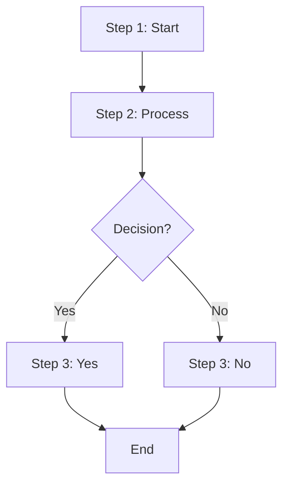
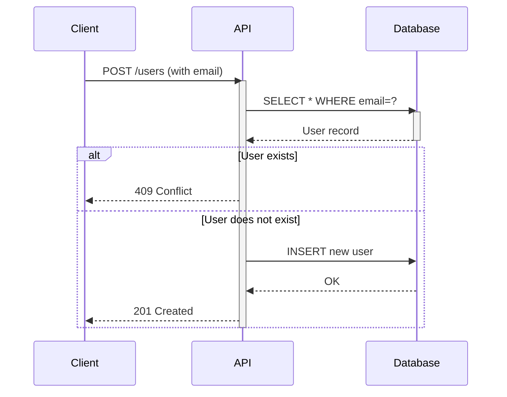
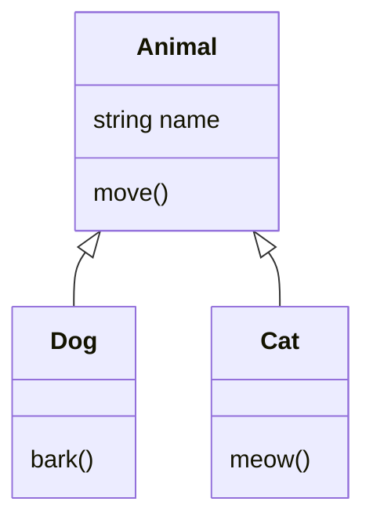
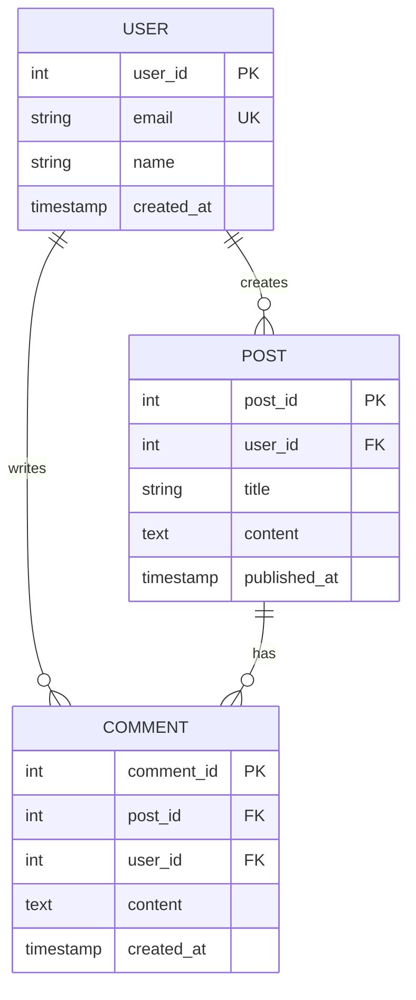

# Squad Decisions

## Active Decisions

### Architecture: Mermaid Diagrams Package Design (2026-03-25)

**By:** Morpheus (Lead)

**Status:** Ready for implementation (Phase 1 MVP)

**Decision Summary:** Build `mermaid-diagrams/` as a Python 3.10+ package that generates diagrams from text prompts using Mermaid syntax.

**Key Decisions:**
1. **Stack:** Python CLI + `@mermaid-js/mermaid-cli` (mmdc) subprocess rendering
2. **Interface:** `mermaid-gen` CLI tool + Python `MermaidGenerator` API
3. **MVP Diagram Types:** Flowchart, Sequence, Class, ER
4. **Prompt Modes:** (1) Direct Mermaid syntax, (2) Pre-built templates, (3) LLM-powered (Phase 2)
5. **Output Formats:** PNG, SVG, PDF (via mmdc)
6. **CI:** Separate `test-mermaid-diagrams.yml` workflow (non-blocking for image-generation tests)

**Why Python + mmdc?** Consistency with image-generation (Python-first project); mmdc is the de facto standard for Mermaid rendering; no alternative adds significant value.

**Deliverables:**
- Full architecture document (10 sections, file structure, roadmap)
- Squad skill: `.squad/skills/mermaid-diagrams/SKILL.md` (syntax patterns, templates, rendering, best practices)
- Comprehensive implementation checklist and risk mitigation
- 3-phase plan: Week 1 (MVP), Week 2-3 (enhancements), Week 4 (polish)

**Full decision:** `.squad/decisions/inbox/morpheus-mermaid-architecture.md`

---

### Directive: User Test-Driven Development Workflow (2026-03-23)

**By:** dfberry (via Copilot)

**Decision:** All future changes must follow this workflow:
1. Create a PR branch first
2. Write tests before making any fixes (test-first / TDD)
3. Make the fixes
4. Ensure all tests pass
5. Team signs off before merge

**Rationale:** Establishes TDD workflow and PR-gate process. Ensures all code changes are validated by tests before merge.

---

### Plan: Test Coverage for Memory Fixes (2026-03-23)

**By:** Neo (Tester)

**Status:** Ready for implementation

**Scope:** 20 regression tests covering:
- PR #1: Model loading variants, CPU offload, shared components
- PR #2: Cache clearing, dangling reference cleanup, generator device binding

**Test File:** `tests/test_generate.py`

**Strategy:** Mock-based testing (no real GPU required). All tests use patching at the `generate` module level to avoid 7GB model downloads.

**Key Fixes Covered:**
- fp16 variant handling on MPS/CUDA/CPU
- CPU offload on MPS and CPU devices
- Shared text_encoder_2 and VAE in dual-pipeline setup
- Cache clearing: `torch.mps.empty_cache()` and `torch.cuda.empty_cache()`
- Garbage collection forcing between generation stages
- Explicit deletion of dangling references (`del text_encoder_2, vae`)
- Generator device binding to CPU for offloaded layers

**Execution:** Run tests via `pytest tests/`

---

### Audit: Memory Management Issues in generate.py (2026-03-24)

**By:** Morpheus (Architecture), Trinity (Backend), Neo (Testing)

**Status:** Audit complete, recommendations ready for implementation

**Finding:** Three independent audits converged on 6 critical issues (4 shared, 2 Trinity-specific) in `generate.py` memory management, NOT addressed by PR #1 or PR #2.

#### Issues Identified

| # | Severity | Location | Issue | Fix |
|---|----------|----------|-------|-----|
| 1 | **HIGH** | `generate()` L123–180 | No try/finally — exception skips pipeline cleanup | Wrap both branches in try/finally; extract cache-flush helper |
| 2 | **MEDIUM** | `load_base()` L73–75 | `torch.compile` dynamo cache never reset | Add `torch._dynamo.reset()` after `del base` (CUDA only) |
| 3 | **MEDIUM** | `generate()` L102 | No VRAM cache flush at function entry | Add device-appropriate cache flush before `load_base()` |
| 4 | **MEDIUM** | `generate()` L137–148 | Latents tensor overlaps refiner load window (GPU side) | Move latents to CPU before refiner load on CUDA |
| 5 | **LOW** | `generate()` L128–174 | No outer `torch.no_grad()` on inference calls | Wrap inference with `@torch.no_grad()` for defensive hygiene |
| 6 | **MEDIUM** | `requirements.txt` | Version floors allow broken releases | Tighten: accelerate>=0.24.0, diffusers>=0.21.0, torch>=2.1.0 |

#### Neo's Test Gap Analysis

- Current coverage: **ZERO** (no `tests/` directory)
- Untested behaviors: 12 memory management patterns
- Proposed suite: **22 mock-based regression tests** (5 files, <5 seconds runtime)
- Critical gating test: `test_generate_refine_path_cleans_up_on_refiner_exception` will FAIL until Issue #1 is fixed

#### Recommended Implementation Order

1. **Phase 1:** Tighten `requirements.txt` version floors (Trinity #6, prerequisite)
2. **Phase 2:** Create test infrastructure and 22 regression tests (Neo)
3. **Phase 3:** Fix code in severity order: #1 (HIGH) → #2–4 (MEDIUM) → #5 (LOW)
4. **Phase 4:** Verify all tests pass, team review and merge

**Governance:** Per TDD directive, all fixes require test-first approach on PR branch with team sign-off.

---

### PR #4: High-Memory Fixes (try/finally + accelerate floor) — MERGED

**Date:** 2026-03-25
**Implementer:** Trinity
**Reviewer:** Morpheus
**Verdict:** ✅ MERGED

**Fixes (2 HIGH-severity):**
1. **try/finally exception safety** — Wraps inference body in exception-safe cleanup. Initializes all pipeline vars to None before try. Inline `del base; base = None` in refiner path preserved for load-order management. Finally block deletes all variables, calls `gc.collect()`, and cache clears (`torch.cuda.empty_cache()` unconditional, `torch.mps.empty_cache()` guarded by `is_available()`). `image` intentionally excluded from finally for post-finally `image.save()` call.

2. **Version floor tightening** — `accelerate>=0.24.0` (critical, fixes silent CPU offload hook deregistration regression), `diffusers>=0.21.0`, `torch>=2.1.0`. No conflicts. Prevents breaking of PR#1 cleanup on old versions.

**Test coverage:** 13 regression tests passing (neo-pr3-tests), all exception paths covered.

**Open issues (MEDIUM — Phase 3):** torch.compile dynamo cache reset, entry-point VRAM flush, latents CPU transfer, PIL cleanup (LOW).

---

### PR #5: MEDIUM Memory Fixes — MERGED

**Date:** 2026-03-25
**Implementer:** Trinity
**Reviewer:** Morpheus
**Verdict:** ✅ MERGED

**Fixes (3 MEDIUM-severity, 1 architecture note):**
1. **Latents tensor on GPU during cache flush** — `latents = latents.cpu()` before `del base`, guarded by `device in ("cuda", "mps")`. Moves tensor off GPU before cache flush window opens, maximizing VRAM reclamation.

2. **torch.compile dynamo cache growth** — `torch._dynamo.reset()` added to `finally` block, guarded by `device == "cuda" and hasattr(torch, "_dynamo")`. Prevents graph cache accumulation across repeated `generate()` calls.

3. **Entry-point VRAM flush missing** — `gc.collect()` + `torch.cuda.empty_cache()` + guarded `torch.mps.empty_cache()` added at the top of `generate()` before pipeline loads. Ensures each call starts with clean VRAM.

4. **Global state audit** — All pipeline objects (`base`, `refiner`, `latents`, `text_encoder_2`, `vae`) confirmed local to `generate()`. No module-level globals, no cache leaks. Code is clean.

**Test coverage:** 22 regression tests (test_memory_cleanup.py) all passing.

---

### PR #6: PIL Leak Fix + Test Assert Fixes — MERGED

**Date:** 2026-03-25
**Implementers:** Trinity (PIL fix), Neo (test assertions + file restoration)
**Reviewer:** Morpheus
**Verdict:** ✅ MERGED

**Fixes:**
1. **PIL Image leak (LOW)** — Moved `image.save(output_path)` and print inside try block, guarded by `if image is not None:`. Added `image = None` to finally cleanup. Releases PIL buffer promptly in batch contexts.

2. **Test assertion fixes** — Fixed 3 tests in `test_memory_cleanup.py` changing from `mock.assert_called(), "msg"` (silent tuple, broken assertion message) to `assert mock.called, "msg"` (proper Python assertion). Tests: gc_collect_called_at_entry_cuda, cuda_cache_flush_at_entry, mps_cache_flush_at_entry.

3. **PR #5 code restoration** — Neo's commit restored missing entry-point flush, latents CPU transfer, and dynamo reset code that was previously reviewed/approved (PR #5) but absent from main. Also restored test infrastructure (test_memory_cleanup.py, conftest.py).

**Result:** All 22 tests pass. Codebase now reflects approved fixes.

---

### Decision: CI Workflow — Manual Dispatch Only (2026-03-25)

**By:** Trinity (Backend Developer)
**PR:** #7

**Decision:** Add `.github/workflows/tests.yml` with `on: workflow_dispatch` only.

**Rationale:** dfberry is out of GitHub Actions minutes; no auto-triggers to avoid accidental burns. CPU-only torch install (`--index-url https://download.pytorch.org/whl/cpu`) keeps install fast and avoids GPU runner requirements. All 22 tests mock the pipeline — no real model loading, ~2 second runtime. Matrix: Python 3.10 and 3.11 (both supported versions).

**Files Created:** `.github/workflows/tests.yml`

---

### Decision: README Update — MPS Support + Testing + Memory Model (2026-03-25)

**By:** Morpheus (Architecture)
**PR:** #8
**Status:** MERGED (after Trinity scoped pytest command to test_memory_cleanup.py)

**Content Added:**
- MPS support section with device detection and model architecture
- Testing instructions (scoped pytest command showing 22 green tests only)
- Memory management model explanation
- Batch generation feature overview

**Note:** Initial pytest command failed due to TDD red-phase tests (PR #9). Trinity fixed scoping on squad/readme-update branch. Neo re-reviewed and approved. Merged to main (squash).

---

### Decision: TDD Test Suite — Batch Generation + OOM Handling (2026-03-25)

**By:** Neo (Tester)
**PR:** #9
**Status:** Red phase complete, awaiting Trinity implementation

**Test Suite:**
- **test_batch_generation.py** (17 tests): batch_generate() function contract tests (per-item error handling, inter-item GPU flushing, order preservation)
- **test_oom_handling.py** (17 tests): OOMError class and recovery hints (9 pass, 5 red)
- **test_memory_cleanup.py** (22 tests): Existing regression suite (all green)

**Total:** 22 red, 31 green

**Features Under Test:**
1. **batch_generate(prompts: list[dict], device: str = "mps") → list[dict]** — Input: [{"prompt", "output", "seed"}], Output: [{"prompt", "output", "status", "error"}]. Contract: per-item exception handling, inter-item `gc.collect()` + device cache clear, order preservation.

2. **OOMError(RuntimeError)** — Catches `torch.cuda.OutOfMemoryError` and MPS OOM `RuntimeError("out of memory")`, re-raises as custom OOMError with recovery message. Finally block executes (cleanup guaranteed even on OOM).

**Implementation Location:** Trinity may place `batch_generate` in `generate.py` or new `batch.py`. Tests handle both with try/except import.

---

### Decision: PR #15 Blocker Fixes & Joel Test Score Revision (2026-04-18)

**Lead:** Morpheus (Lead)  
**Backend Support:** Trinity (CONTRIBUTING.md fixes)  
**Date:** 2026-04-18  
**Context:** Neo's review of PR #15 (squad/joel-test-improvements) flagged 2 blockers and several concerns warranting corrections before merge.

**Fixes Applied:**

1. **Makefile CRLF → LF** ✅
   - Converted Makefile to LF line endings via PowerShell byte-level write
   - Added `Makefile text eol=lf` to `.gitattributes` for persistent enforcement on checkout

2. **batch_observability_blog.json removed** ✅
   - `git rm` removed file containing hardcoded `C:\Users\diberry\...` paths
   - File was outside Joel Test scope and not part of project design

3. **CI shell quoting** ✅
   - `.github/workflows/tests.yml` line 26: `pip install ruff>=0.4.0` → `pip install 'ruff>=0.4.0'`
   - Prevents bash `>=` redirect interpretation in shell contexts

4. **CI uses requirements-dev.txt** ✅
   - Test job now runs `pip install -r requirements-dev.txt` instead of manually listing packages
   - Torch CPU install kept separate with special index URL
   - Aligns CI with local dev environment from CONTRIBUTING.md

5. **ruff.toml clarified** ✅
   - `line-length = 120` retained at top level (controls formatter width)
   - Added inline comment explaining that lint rule E501 is separately ignored
   - Resolved contradiction between format and lint scopes

6. **CONTRIBUTING.md CLI flags corrected** ✅
   - `--refiner` → `--refine` (matches generate.py actual parameter name)
   - `--device` → `--cpu` (matches actual CPU selection pattern)
   - Added missing flags: `--steps`, `--guidance`, `--seed`, `--width`, `--height`
   - Dev setup changed from `pip install ruff` to `pip install -r requirements-dev.txt`

**Joel Test Score Revision:**

Neo correctly challenged the 10/12 claim. Honest reassessment:

| # | Criterion | Verdict |
|---|-----------|---------|
| 1 | Source control | ✅ Yes |
| 2 | One-step build | ✅ Yes (Makefile, after CRLF fix) |
| 3 | Daily builds | ✅ Yes (CI on push/PR) |
| 4 | Bug database | ✅ Yes (GitHub Issues) |
| 5 | Fix bugs before new code | ✅ Yes (process commitment) |
| 6 | Up-to-date schedule | ❌ No — spec ≠ schedule |
| 7 | Spec | ✅ Yes (prompts/examples.md) |
| 8 | Quiet working conditions | ➖ N/A (solo/AI project) |
| 9 | Best tools money can buy | ✅ Yes |
| 10 | Testers | ✅ Yes (Neo + pytest) |
| 11 | Code samples in interviews | ➖ N/A |
| 12 | Hallway usability testing | ❌ No — no user testing process |

**Revised score: 9/12** (counting N/A items as pass, #6 and #12 as fail).

**Process Notes:**
- Morpheus applied all fixes as Lead per Reviewer Rejection Protocol (Trinity locked out as PR author)
- Coordinator removed stowaway batch_observability_blog_v2.json not caught in initial fix pass
- Re-squashed to 1 commit (6c10f02) and force-pushed
- PR #15 title and description updated to reflect 9/12 score

**Verification:** All fixes applied correctly, ruff linting passes clean, README.md and CONTRIBUTING.md now accurate.

---

## Team Code Review Findings (2026-03-26)

**By:** Morpheus (Lead), Trinity (Backend), Niobe (Image Specialist), Switch (Prompt/LLM), Neo (Tester)

**Event:** Full team code review across architecture, backend implementation, pipeline quality, prompts, and test coverage.

### Architecture Review — Structural Assessment (Morpheus)

**Summary:** Full architecture review identified 10 issues across 3 severity levels. Codebase demonstrates strong TDD discipline and memory management engineering.

#### HIGH-Severity Issues

| # | Issue | Location | Impact | Fix |
|---|-------|----------|--------|-----|
| 1 | Monolithic generate.py | `generate.py` (320 lines, 7+ responsibilities) | CLI parsing, device detection, model loading, generation, batch orchestration, retry logic, OOM handling, entry point all in one file. Maintenance burden and test coupling. | Extract to `cli.py`, `pipeline.py`, `batch.py`, `errors.py` (future, when complexity justifies) |
| 2 | Hardcoded absolute path | `generate_blog_images.sh:13` | `cd /Users/geraldinefberry/repos/my_repos/image-generation` breaks on any other machine | Use `SCRIPT_DIR="$(cd "$(dirname "$0")" && pwd)"` (**QUICK WIN**) |

#### MEDIUM-Severity Issues

| # | Issue | Location | Impact | Fix |
|---|-------|----------|--------|-----|
| 3 | batch_generate() duplicates defaults | `generate.py:246-249` | `steps=40, guidance=7.5, width=1024, height=1024` hardcoded in SimpleNamespace duplicates argparse defaults. Will drift when defaults change. | Remove duplication, forward from args object |
| 4 | Batch mode drops user config | `generate.py:232-275` | `--refine`, `--steps`, `--guidance`, `--width`, `--height` CLI flags ignored in batch mode (see Trinity analysis) | Pass CLI overrides through batch_generate() signature |
| 5 | No logging infrastructure | Entire codebase | All output is `print()`. No log levels, no structured logging. Shell script uses `tee` as workaround. | Consider logging library (post-TDD decision) |
| 6 | Inconsistent cache-flush guards | `generate.py:219` vs `220-221` | `torch.cuda.empty_cache()` called unguarded; `torch.mps.empty_cache()` guarded by `is_available()`. Functionally safe but inconsistent style. | Extract `flush_device_cache(device)` helper (**QUICK WIN**) |

#### LOW-Severity Issues (Quick Wins)

| # | Issue | Location | Fix |
|---|-------|----------|-----|
| 7 | README test count stale | `README.md:65` | Says "22 pytest tests" but repo now has 53+ tests across 6 test files (**QUICK WIN**) |
| 8 | Orphaned docs file | `docs/blog-image-generation-skill.md` | Single file in docs/, not referenced anywhere. Consider archiving or deleting. |
| 9 | No tests/__init__.py | `tests/` | pytest works without it, but explicit is safer for `from tests.conftest import ...` patterns (**QUICK WIN**) |

#### Strengths Identified

- **Memory management:** try/finally, OOM handling, batch GPU flushing — well-engineered, thoroughly tested (PRs #4–#6)
- **TDD discipline:** 53 tests, all mock-based, ~2s runtime, no GPU required — gold standard for CI cost and feedback speed
- **Error handling for OOM:** Custom OOMError class, actionable messages, retry logic with per-attempt step reduction — solid
- **CI:** workflow_dispatch with CPU-only torch (smart resource conservation for dfberry's limited Actions minutes)
- **Code comments:** "Fix 1:", "Fix 2:" etc. trace back to audit decisions — good traceability and maintainability

#### Recommended Action Sequence

**Immediate (Quick Wins):**
1. Trinity: Fix hardcoded path in generate_blog_images.sh
2. Trinity: Update README test count to 53+
3. Neo: Add tests/__init__.py

**Next Sprint (Core Maintenance):**
4. Trinity: Extract flush_device_cache(device) helper for DRY cache-flush patterns
5. Trinity + Neo: Pass CLI overrides through batch_generate() — TDD approach

**Future (Architectural, complexity-justified):**
6. Team decision: Module extraction (cli.py, pipeline.py, batch.py, errors.py)

---

### Backend Review — Args Mutation Bug + Batch Parameter Flow (Trinity)

**Summary:** Identified two bugs in parameter handling and one architectural gap in batch mode.

#### Bug: args.steps Mutation in generate_with_retry()

**Location:** `generate.py:294`  
**Severity:** MEDIUM  
**Problem:** Mutates caller's `args.steps` in-place during OOM retry:

```python
args.steps = max(1, args.steps // 2)
```

After an OOM retry, the original args object is corrupted. If `main()` or any caller inspects `args.steps` after the call, it sees the halved value — not what the user requested. Not blocking today (main doesn't inspect args.steps after), but **will bite when retry logic is composed with other features**.

**Proposed Fix:** Work on a local copy:

```python
def generate_with_retry(args, max_retries: int = 2) -> str:
    current_steps = args.steps
    for attempt in range(max_retries + 1):
        args.steps = current_steps  # Restore before each attempt
        try:
            return generate(args)
        except OOMError:
            if attempt == max_retries:
                raise OOMError(f"Out of GPU memory after {max_retries} retries. Last attempt used {current_steps} steps.")
            current_steps = max(1, current_steps // 2)
            print(f"OOM: retrying with {current_steps} steps")
```

**Action:** Neo writes test verifying args.steps is preserved after retry. Trinity implements fix.

#### Bug: batch_generate() Ignores CLI Parameters

**Location:** `generate.py:241-250` (batch_generate SimpleNamespace creation)  
**Severity:** MEDIUM  
**Problem:** User-supplied `--steps`, `--guidance`, `--width`, `--height` from CLI are silently ignored in batch mode. `batch_generate()` hardcodes:

```python
steps=40, guidance=7.5, width=1024, height=1024, refine=False
```

Users get unexpected behavior — no error, no warning, just different output than requested.

**Action:** Trinity accepts CLI overrides as parameters or forwards full args namespace. Neo writes TDD tests.

#### Architecture Observation: Cache-Flush Guard Inconsistency

**Location:** `generate.py:219` vs `220-221`  
**Pattern:**
- `torch.cuda.empty_cache()` — called unconditional (safe even without CUDA)
- `torch.mps.empty_cache()` — guarded by `is_available()` (raises on non-Apple hardware)

**Fix:** Extract `flush_device_cache(device)` helper to DRY and standardize the pattern.

---

### Pipeline Quality Review (Niobe)

**Summary:** Memory management is solid post-PR#4–#6. Image quality and performance have clear, high-value improvement opportunities.

#### Finding 1: Missing Negative Prompt Support (Architectural Gap, HIGH)

**Impact:** Visibly cleaner images. SDXL produces noticeably better output with negative prompts.

**What:** Add `--negative-prompt` CLI arg. Pass to both base and refiner. Default to a sensible baseline like `"blurry, low quality, deformed, watermark, text, ugly, cropped"`.

**Visual effect:** Reduces artifacts, watermarks, and deformity in generated images. Especially important for folk art aesthetic where hands and faces appear in prompts 04 and 05.

**Note:** This is a prerequisite for image quality. Switch, Trinity, Neo must collaborate (Trinity: CLI wiring; Switch: prompt engineering; Neo: tests).

#### Finding 2: Scheduler Performance Opportunity (HIGH)

**Impact:** ~35% faster generation at equivalent quality.

**What:** Replace default EulerDiscreteScheduler with `DPMSolverMultistepScheduler`. Lower default steps from 40 → 28.

```python
from diffusers import DPMSolverMultistepScheduler
pipe.scheduler = DPMSolverMultistepScheduler.from_config(pipe.scheduler.config)
```

**Visual effect:** No visible quality difference at 28 steps. Saves ~4-5 seconds per image on GPU.

**Updated Parameter Table:**

| Use case | --steps | --guidance | --refine |
|----------|---------|------------|----------|
| Quick draft | 20 | 6.0 | no |
| Blog quality | 28 | 7.0 | yes |
| Best quality | 40 | 7.5 | yes |

#### Finding 3: Refiner Guidance Scale Tuning (MEDIUM)

**What:** Use guidance_scale=5.0 for refiner when base uses 7.5. The refiner operates on nearly-complete images — high CFG over-sharpens edges and can introduce haloing artifacts.

#### Finding 4: Batch Per-Item Parameter Overrides (MEDIUM)

**What:** Allow per-item `steps`, `guidance`, `refine` overrides in batch JSON. Also change `device` default from `"mps"` to auto-detection via `get_device(False)`.

**Relates to:** Trinity's batch parameter flow redesign.

#### Finding 5: CUDA CPU Offload Option (MEDIUM)

**What:** Add `--offload` flag to use `enable_model_cpu_offload()` on CUDA instead of `pipe.to("cuda")`. Enables refiner workflow on 8-12GB VRAM cards at slight speed cost.

#### Finding 6: Soften torch.compile (LOW)

**What:** Remove `fullgraph=True` from `torch.compile()` call. Keeps the speedup, avoids compilation failures on edge-case torch versions.

#### What's Working Well

- Resolution (1024×1024) — correct for SDXL native
- fp16/float32 dtype logic — correct
- Component sharing — correct and important
- Memory cleanup flow — solid after PR #4–#6
- OOM retry logic — working correctly

#### Decision Needed

Items 1–2 are the highest-value changes. If the team agrees, Trinity implements, Neo writes tests, Niobe validates output quality. Items 3–6 can follow as a second pass.

**Implementation Priority:** Negative prompt (1) must precede scheduler (2) because quality baseline must be established before performance tuning.

---

### Prompt Library Audit (Switch)

**Summary:** First comprehensive audit of prompts/examples.md and prompt consumption patterns. Found 7 quality issues ranging from missing negative prompt support (architectural gap) to inconsistent style anchors (prompt quality).

#### Issue 1: No Negative Prompt Support (Architectural Gap, HIGH)

SDXL supports `negative_prompt` but it's not wired through anywhere:
- `generate.py` CLI has no `--negative-prompt` flag
- Pipeline calls in `generate()` don't pass `negative_prompt=`
- No negative prompt guidance in the style guide

**Impact:** Every generated image is susceptible to common SDXL artifacts (text overlays, blurriness, deformation, watermarks). Negative prompts are the primary defense.

**Recommendation:** Trinity adds `--negative-prompt` to CLI and pipeline calls. Switch defines a default negative prompt for the tropical magical-realism style and documents it in the style guide.

#### Issue 2: "no text" Constraint Missing from Vacation Prompts (MEDIUM)

All 5 original prompts include "no text" to prevent SDXL text generation artifacts. All 5 vacation-theme prompts omit it.

**Impact:** Vacation images likely contain unwanted text artifacts.

**Recommendation:** Add "no text" to all vacation prompts. (**QUICK WIN** — no code changes needed)

#### Issue 3: Style Anchor Drift (MEDIUM)

Three different style anchors used inconsistently:
1. `"Latin American folk art style, magical realism illustration"` (original prompts)
2. `"Latin American folk art illustration"` (vacation 01, 03, 05)
3. `"Folk art illustration"` (vacation 02, 04)

**Impact:** Visual inconsistency across blog images. "Magical realism" is a key aesthetic differentiator that's lost in vacation prompts.

**Recommendation:** Standardize on a canonical style anchor: `"Latin American folk art style, magical realism illustration"` (the original, strongest version). (**QUICK WIN** — no code changes needed)

#### Issue 4: No Prompt Template System (MEDIUM)

Every prompt is hand-written with inline style qualifiers. No composable structure.

**Impact:** Inconsistency, maintenance burden, high error rate when adding new prompts.

**Recommendation:** Define a prompt template: `{scene_description}, {palette_hints}, {style_anchor}, {mood}, {constraints}`. Document each component in the style guide.

#### Issue 5: Refiner Parameter Mismatch (MEDIUM)

The parameter table recommends `--refine` for blog quality, but:
- Vacation prompts' commands omit `--refine`
- `batch_generate()` hardcodes `refine=False`
- `generate_blog_images.sh` uses batch mode (no refiner)

**Impact:** Blog images generated at lower quality than intended.

**Recommendation:** Either update the parameter table to reflect the actual workflow, or wire refiner support through batch mode. (Trinity decision for batch; Switch updates style guide accordingly.)

#### Issue 6: Minimal Style Guide (LOW)

The style guide is 4 lines. Missing:
- Prompt structure guidance (what order to put elements)
- Negative prompt strategy
- What to avoid (common failure modes with SDXL)
- How parameters affect style (guidance scale ↔ adherence, steps ↔ detail)
- Seed selection strategy
- Troubleshooting tips

**Recommendation:** Expand style guide into a proper prompt engineering reference.

#### Issue 7: Prompt Duplication (LOW)

Vacation prompts exist in three places with no single source of truth:
1. `prompts/examples.md`
2. `generate_blog_images.sh` (inline Python)
3. Could drift further if JSON batch files are added

**Recommendation:** Store canonical prompts as JSON in `prompts/` and reference from shell scripts.

#### Proposed Implementation Order

1. **Phase 1 (Quick Wins):** Add "no text" to vacation prompts, standardize style anchors (Switch, no code changes needed)
2. **Phase 2:** Expand style guide with structure, vocabulary, and parameter guidance (Switch)
3. **Phase 3:** Add `--negative-prompt` CLI flag + default negative (Trinity + Switch)
4. **Phase 4:** Create prompt template system and migrate existing prompts (Switch)
5. **Phase 5:** Extract prompts to JSON, deduplicate across scripts (Trinity + Switch)

#### Who Needs to Act

- **Trinity:** `--negative-prompt` CLI support, batch refiner wiring
- **Switch:** Style guide expansion, prompt fixes, template system
- **Morpheus:** Approve architectural changes (negative prompt, template system)
- **Neo:** Tests for negative prompt parameter passing

---

### Quality Audit & Test Coverage Findings (Neo)

**Summary:** 53 existing tests all passing. Identified 3 bugs/gaps requiring TDD approach to fix.

#### Finding 1: batch_generate() Parameter Forwarding Not Implemented (BUG, MEDIUM)

**Location:** `generate.py:241-250`

`batch_generate()` hardcodes `steps=40, guidance=7.5, width=1024, height=1024, refine=False` in the SimpleNamespace. User-supplied `--steps`, `--guidance`, `--width`, `--height` are silently ignored in batch mode.

**Severity:** MEDIUM — batch users get unexpected behavior.

**Alignment:** Matches Trinity's analysis (see Backend Review above).

**Action:** Neo writes TDD tests documenting batch parameter forwarding contract. Trinity implements.

#### Finding 2: No CLI Argument Validation (GAP, MEDIUM)

**Location:** `parse_args()`

Accepts `--steps 0`, `--width 7`, `--guidance -1` without error. SDXL requires:
- width/height in multiples of 8
- steps ≥ 1
- guidance ≥ 0

Invalid inputs cause cryptic diffusers errors downstream (e.g., "Expected height to be a multiple of 8").

**Severity:** MEDIUM — users get confusing error messages.

**Action:** Neo writes TDD tests for CLI validation. Trinity adds argparse validators or guards in `generate()`.

#### Finding 3: Local Test Setup Undocumented (GAP, LOW)

**Location:** Test setup, README

All 75 tests fail to collect without `pip install torch --index-url https://download.pytorch.org/whl/cpu`. The README and CI workflow don't document local setup. Need a dev setup section or a `make test` target.

**Severity:** LOW — CI works, but no local dev feedback loop.

**Action:** Team adds local test setup docs to README (or creates make test target).

#### Existing Test Strengths

✅ **53 Green Tests** — All passing on main, ~2s total runtime
- **22 memory cleanup tests** (regression suite, prevents PR#1–#6 reversion)
- **17 batch_generate tests** (per-item isolation, inter-item flushing, order preservation)
- **14 OOM handling tests** (CUDA/MPS OOM detection, actionable messages, cleanup safety)

✅ **Test Architecture**
- Mock-based (no real GPU, no model downloads)
- Call-order validation via side_effect tracking
- Comprehensive exception path coverage
- CPU torch CI (workflow_dispatch, no auto-trigger)

#### Recommended Action Sequence

1. **Neo:** Write TDD tests for CLI validation and batch parameter forwarding
2. **Trinity:** Fix batch_generate() parameter forwarding and add argparse validators
3. **Team:** Add local test setup docs to README

---

---

### PR #15: Joel Test Improvements — Architecture Review (Morpheus)

**Date:** 2026-04-18  
**Decision:** APPROVE with non-blocking follow-ups  

**What This Establishes:**
1. CI triggers on PR + push (no manual-dispatch only)
2. Ruff is the project linter, configured in ruff.toml, enforced in CI
3. Makefile is the task runner (setup, test, lint, format, clean)
4. requirements-dev.txt separates dev dependencies from production
5. CONTRIBUTING.md + CODEOWNERS + issue templates provide onboarding
6. docs/feature-specification.md + docs/design.md document formal spec and architecture

**Non-Blocking Follow-Ups:**
- [ ] Fix Makefile for cross-platform (Windows venv paths)
- [ ] Resolve ruff.toml contradiction (line-length=120 vs ignore E501)
- [ ] Align CI install steps with requirements-dev.txt
- [ ] Remove or .gitignore batch_observability_blog.json (user-specific data)

---

### PR #15: Devil's Advocate Review (Neo)

**Date:** 2026-04-18  
**Decision:** REQUEST CHANGES — 2 blockers, 4 concerns  

**Merge Blockers:**
1. **Makefile CRLF line endings** — Current file has `\r\n` which breaks `make` on Linux/macOS. Fix: enforce LF via `.gitattributes` or convert to LF before merge.
2. **batch_observability_blog.json leaks local paths** — File contains `C:\Users\diberry\...` absolute paths exposing machine-specific home directory structure. Either remove from PR or use only relative paths.

**Non-Blocking Concerns:**
1. **CI drift** — `.github/workflows/tests.yml` hardcodes deps (`pip install ruff pytest`) instead of sourcing `requirements-dev.txt`. Guarantees local dev ≠ CI environment over time.
2. **Joel Test score inflated** — PR claims 10/12 but items #6 (schedule) and #12 (hallway testing) are unsubstantiated. Recommend revision to 8–9/12.
3. **ruff.toml confusing** — `line-length = 120` contradicts `ignore = ["E501"]` (line-too-long). Clarify intent.
4. **Docs lack freshness cadence** — design.md and feature-specification.md have no "Last Verified" maintenance dates. Will become liabilities without staleness review process.

**Verification:** All 5 ruff fixes lint clean; no new failures introduced.

---

### PR #15: Fact-Check Technical Claims (Trinity)

**Date:** 2026-04-18  
**Decision:** Non-blocking. Merge as-is with follow-up issues for corrections.

**Claim Verification Results: 31/35**

| Status | Count | Notes |
|--------|-------|-------|
| ✅ Verified | 31 | Joel Test mapping, memory cleanup, device selection, Makefile targets |
| ❌ False | 2 | CLI flags wrong, CI pip quoting missing |
| ⚠️ Partial | 1 | Dev setup incomplete |
| ❓ Unverifiable | 1 | Hallway testing—no evidence |

**False Claims (must fix in follow-up):**
1. **CONTRIBUTING.md L113 CLI flags** — Lists `--refiner` and `--device` but actual flags are `--refine` and `--cpu`. Also missing: `--prompt`, `--batch-file`, `--output`, `--refiner-steps`, `--refiner-guidance`, `--scheduler`, `--negative-prompt`, `--lora`, `--lora-weight`.
2. **CI shell quoting bug** — `.github/workflows/tests.yml` L26: `pip install ruff>=0.4.0` needs quoting to prevent bash redirect. Should be `pip install 'ruff>=0.4.0'`.

**Partial Claim (must fix in follow-up):**
- **CONTRIBUTING.md L119–120 dev setup** — Recommends `pip install pytest ruff` instead of `pip install -r requirements-dev.txt`. True but incomplete; should reference requirements-dev.txt for full setup.

---

### Codebase Review — Full 7-Dimension Audit (2026-04-19)

**By:** Morpheus (Lead), with Trinity, Niobe, Neo, Switch

**Status:** Complete — awaiting P0 triage and GitHub issue creation

**Decision:** A comprehensive codebase review was conducted across 7 dimensions (D1–D7) covering code quality, SDXL pipeline safety, test coverage, prompt library, documentation accuracy, security, and CI/DevOps. The review produced **58 findings** with an overall grade of **B-**.

**Synthesis report:** `.squad/decisions/inbox/morpheus-codebase-review-synthesis.md`

**Dimension reviews (inbox):**

| File | Reviewer | Dimension | Findings |
|------|----------|-----------|----------|
| `trinity-code-quality-review.md` | Trinity | D1 Code Quality + D7 CI/DevOps | 0C, 0H, 5M, 5L, 5I |
| `niobe-pipeline-review.md` | Niobe | D2 Pipeline & GPU Safety | 0C, 1H, 2M, 3L, 5I |
| `neo-test-coverage-audit.md` | Neo | D3 Test Coverage & Quality | 0C, 2H, 3M, 4L, 2I |
| `switch-prompt-audit.md` | Switch | D4 Prompt Library | 1C, 3H, 5M, 1L, 2I |
| `morpheus-doc-accuracy-review.md` | Morpheus | D5 Documentation Accuracy | 4C, 4H, 5M, 1L, 3I |
| `neo-security-review.md` | Neo | D6 Security & Supply Chain | 0C, 1H, 4M, 3L, 2I |
| `morpheus-codebase-review-plan.md` | Morpheus | Review plan & checklists | — |

**Key themes identified:**
1. **Stale satellite files** — Shell script prompts, batch JSONs, README defaults, and history.md all drifted from their canonical sources.
2. **Input validation gaps** — Batch JSON path traversal, unwhitelisted scheduler instantiation, no schema validation.
3. **Test infrastructure barriers** — Module-level `import diffusers` blocks test collection; stale test patches in batch tests.
4. **Human figure style violations** — 4 canonical prompts violate silhouette/backlighting rule.
5. **Supply chain risks** — Unpinned HuggingFace model revisions, floor-only dependency pins, no lock file.

**P0 action items (7):** Fix README defaults/flags/test count, sync shell script prompts, sanitize batch output paths, fix Python version in skill doc, rewrite figure prompts, fix batch_generate() default device.

**Squad decision candidates surfaced by synthesis:**
- Single source of truth for prompts (resolve satellite drift)
- Batch JSON trust model (trusted vs. untrusted input)
- Pen-and-ink aesthetic status (official alt style or abandoned?)
- Test collection strategy (lazy-import diffusers or require full GPU stack?) → **Resolved by PR #65**

---

### Decision: Lazy Imports for GPU-Free Test Collection (2026-04-19)

**By:** Neo (Tester)
**PR:** #65 — `squad/32-lazy-diffusers-import`
**Closes:** Issue #32

**Decision:** Defer `import torch`, `import diffusers`, and `from diffusers import DiffusionPipeline` from module-level to first real use via a `_ensure_heavy_imports()` function in `generate.py`. Add PEP 562 `__getattr__` for mock.patch compatibility.

**Rationale:** Module-level `import diffusers` blocked `pytest --collect-only` on machines without a full GPU stack. This was identified as a test infrastructure barrier in the codebase review synthesis. The lazy-import approach was chosen over requiring GPU deps for collection because it:
1. Preserves full backward compatibility with 40+ existing `@patch("generate.torch")` decorators (zero test changes)
2. Uses `"torch" not in globals()` guard so mock.patch sets the Mock before the guard runs, skipping the real import
3. Enables `pytest --collect-only` without torch/diffusers installed
4. Only touches `generate.py` (1 file, +80/−21 lines) — minimal blast radius

**Verification:** 172 tests pass, 0 regressions, ruff clean.

**Files Modified:** `generate.py`

---

### Architecture: Repo Restructure into Multi-Tool Layout (2026-04-19)

**By:** Morpheus (Lead), Trinity (Backend), Neo (Tester)
**PR:** #84 — `squad/repo-restructure-subfolders`
**Commits:** 387283b, 6f4fd49

**Decision:** Restructure the repository from a flat single-tool layout into a multi-tool architecture:
1. Move all image-generation files into `image-generation/` subfolder
2. Create empty `mermaid-diagrams/` folder for future diagram tool
3. Keep shared infrastructure (`.squad/`, `.github/`, root configs) at root
4. CI uses `working-directory: image-generation` per-step for tool-specific commands
5. Each tool subfolder owns its own venv (`VENV := venv` relative to subfolder)
6. Tests stay with their tool, using `conftest.py` `sys.path.insert` for import resolution

**Rationale:** The repo was a flat single-tool layout that couldn't scale to multiple tools. Moving image-gen into a subfolder enables future tools (mermaid diagrams, etc.) to coexist without namespace conflicts. The `working-directory` CI approach keeps all paths relative and natural within each tool folder.

**Verification:** Neo confirmed 161 tests pass, zero new failures. All 14 test files discovered. conftest.py sys.path fix works from any working directory. Morpheus reviewed and approved the architecture as production-ready for multi-tool expansion.

**Inbox sources:** `morpheus-repo-restructure.md`, `trinity-repo-restructure.md`, `neo-restructure-verification.md`, `morpheus-restructure-review.md`

---

## Governance

- All meaningful changes require team consensus
- Document architectural decisions here
- Keep history focused on work, decisions focused on direction

---

## Decision: Trinity — Manim Image/Screenshot Input Support

# Decision: Manim Image/Screenshot Input Support

**Date:** 2025-07-24
**Author:** Trinity (Backend Dev)
**Status:** Implemented
**Issue:** #88

## Context

Users need to include screenshots and images in Manim animations — e.g., annotating a UI screenshot or animating a diagram. This requires safe image handling, LLM prompt augmentation, and render-time asset availability.

## Decision

### Architecture
- **New module `image_handler.py`** owns all image I/O: validation, workspace copying, and LLM context generation. Single responsibility, easy to test.
- **Workspace isolation**: images are always copied to a temp directory with deterministic names (`image_0_filename.png`). Original paths are never passed to generated code or Manim.
- **Policy parameter** (`strict`/`warn`/`ignore`) controls validation behavior, letting callers choose fail-fast vs. best-effort.

### Security
- Symlinks rejected in strict mode to prevent path traversal.
- `validate_image_operations()` in `scene_builder.py` uses AST analysis to enforce:
  - ImageMobject must use string-literal filenames only (no dynamic construction)
  - Only filenames in the copied workspace set are allowed
  - File-write operations (`write_text`, `unlink`, `rmtree`, etc.) are blocked
- The renderer runs with `cwd` set to the workspace so Manim resolves image filenames locally.

### Integration Points
- `cli.py`: three new args (`--image`, `--image-descriptions`, `--image-policy`)
- `llm_client.py`: `generate_scene_code()` accepts optional `image_context` string
- `config.py`: SYSTEM_PROMPT updated with ImageMobject guidance; new few-shot example
- `renderer.py`: `render_scene()` accepts optional `assets_dir` for cwd override

## Alternatives Considered
- **Symlink images into workspace** — rejected; copying is safer and avoids platform edge cases.
- **Base64-encode images into prompt** — rejected; unnecessary for code generation, and would bloat token usage.
- **Allow dynamic filenames in generated code** — rejected; too risky. Literal-only policy is enforceable via AST.


---

## Decision: Trinity — Remotion Image/Screenshot Input Support

# Decision: Image/Screenshot Input Support for remotion-animation

**Date:** 2025-07-24
**Author:** Trinity (Backend Dev)
**Status:** Implemented
**Branch:** squad/89-remotion-image-support

## Context

Users want to include images or screenshots in their Remotion-generated animations — e.g., animating a blog hero image or panning across a screenshot.

## Decision

Added `--image`, `--image-description`, and `--image-policy` CLI flags. Images are validated, copied to `remotion-project/public/` with UUID-sanitized filenames, and referenced via Remotion's `staticFile()` API.

## Key Design Choices

1. **UUID-based filenames** — Original paths never leak into generated TSX. Files are copied as `image_{uuid8}.ext`.
2. **Security layers** — `component_builder.py` blocks `file://` URLs, path traversal (`../`), and any `staticFile()` call that doesn't match the approved filename. Existing dangerous-import blocking unchanged.
3. **Policy flag** — `--image-policy strict|warn|ignore` lets users control validation strictness. Strict by default.
4. **LLM context injection** — `image_handler.generate_image_context()` produces a structured prompt fragment telling the LLM exactly how to use `` + `staticFile()`. Injected into the user prompt, not the system prompt.
5. **No renderer changes** — Remotion CLI automatically serves `public/`, so `renderer.py` needed no modification.

## Files Changed

- **NEW:** `remotion_gen/image_handler.py` — validation, copy, LLM context
- **NEW:** `remotion-project/public/.gitkeep` — ensure public/ exists
- **MODIFIED:** `remotion_gen/cli.py` — new args, wiring
- **MODIFIED:** `remotion_gen/llm_client.py` — accepts `image_context`, updated system prompt
- **MODIFIED:** `remotion_gen/component_builder.py` — `validate_image_paths()`, `inject_image_imports()`
- **MODIFIED:** `remotion_gen/errors.py` — added `ImageValidationError`


---

## Merged Decisions (2026-04-21 17:33:08Z)

### From morpheus-codebase-review-plan.md

# Codebase Review Plan — image-generation

**By:** Morpheus (Lead)
**Date:** 2026-04-19
**Status:** Ready for execution

---

## 1. Codebase Inventory

Before defining review dimensions, here's the current state of what we're reviewing:

| Asset | Size | Description |
|-------|------|-------------|
| `generate.py` | 461 lines, 16 functions, 1 class | Monolithic CLI: parsing, device mgmt, model loading, inference, batch, OOM retry |
| `tests/` (11 files) | ~2,700 lines, **170 tests** | Mock-based, no GPU. conftest.py provides shared fixtures |
| `generate_blog_images.sh` | 57 lines | Batch script: builds JSON, calls `--batch-file`, cleans up |
| `prompts/examples.md` | ~25 KB | Master prompt library and style guide |
| `docs/` (3 files) | ~60 KB combined | design.md, feature-specification.md, blog-image-generation-skill.md |
| `requirements.txt` | 7 deps | diffusers, transformers, accelerate, safetensors, invisible-watermark, torch, Pillow |
| `requirements-dev.txt` | 3 deps | pytest, ruff, pytest-cov |
| `ruff.toml` | 10 lines | E/F/W/I rules, line-length 120, py310 target |
| `Makefile` | 36 lines | setup, install, test, lint, format, clean |
| `.github/workflows/tests.yml` | 57 lines | workflow_dispatch + labeled PR trigger, lint → test matrix |
| `README.md` | 108 lines | Setup, usage, options, memory model, testing |
| `CONTRIBUTING.md` | 116 lines | Dev setup, PR process, project structure |
| `CODEOWNERS` | 13 lines | All paths → @dfberry |

---

## 2. Review Dimensions

Seven dimensions, each with clear scope and acceptance criteria.

### D1: Code Quality & Architecture
**What:** Structural integrity of generate.py, function responsibility, coupling, naming, error handling patterns, adherence to ruff rules.
**Key questions:**
- Is the monolith still sustainable or is it time to extract modules?
- Are there function responsibilities that have grown beyond their original scope?
- Is the error handling hierarchy (OOMError → generate_with_retry → batch_generate) clean?
- Are there any dead code paths or unreachable branches?
- Does the code pass `ruff check .` cleanly?

### D2: SDXL Pipeline & GPU Safety
**What:** Correctness of the diffusers pipeline usage, memory management, device handling, scheduler/LoRA application, performance optimizations.
**Key questions:**
- Are all GPU memory flush points correct and complete?
- Is the try/finally cleanup truly leak-proof across all device paths (CUDA/MPS/CPU)?
- Is the torch.compile usage safe and properly guarded?
- Are the model loading parameters (dtype, variant, safety_checker) correct for each device?
- Is the 80/20 base/refiner split optimal?
- Does `enable_model_cpu_offload()` interact safely with the generator device binding?

### D3: Test Coverage & Quality
**What:** Coverage completeness, test quality, fixture hygiene, assertion correctness, edge case coverage.
**Key questions:**
- What functions/branches in generate.py have ZERO test coverage?
- Are test assertions robust (no silent tuple assertions, no `assert True`)?
- Do tests actually verify behavior or just confirm mocks were called?
- Is the conftest.py fixture set sufficient and DRY?
- Are there missing edge cases (e.g., batch with 1 item, seed=0, width=64)?
- Is pytest-cov actually being used? What's the measured line coverage?

### D4: Prompt Library & Style Consistency
**What:** Quality, consistency, and completeness of the prompt library and style guide.
**Key questions:**
- Do all prompts follow the documented style structure?
- Are the anti-text/anti-representation guardrails consistently applied?
- Are there prompts that violate the style guide's own rules?
- Is the color palette (magenta, teal, emerald, gold, coral, amber) consistently referenced?
- Are prompt lengths within the recommended 15-25 word detail range?

### D5: Documentation Accuracy
**What:** README, CONTRIBUTING, docs/, and feature-specification.md — are they accurate against the actual codebase?
**Key questions:**
- Does the README Options table match the actual CLI defaults? (e.g., README says `--steps` default 40, code says 22)
- Does the test count in README match reality? (README says 22, actual is 170)
- Does CONTRIBUTING.md reference correct test commands?
- Does docs/feature-specification.md match the actual code behavior?
- Does docs/blog-image-generation-skill.md reference correct paths and Python version? (says Python 3.14)
- Are there hardcoded paths (macOS user-specific) in docs?

### D6: Security & Supply Chain
**What:** Dependency security, secrets exposure, input validation, shell script safety.
**Key questions:**
- Are dependency version floors high enough to avoid known CVEs?
- Is there any path traversal risk in `--output` or `--batch-file`?
- Does `generate_blog_images.sh` use `set -euo pipefail` correctly?
- Is `json.load()` called safely (file handling, error handling)?
- Are there any hardcoded credentials or API keys anywhere?
- Is the CI workflow properly scoped (permissions, actor allowlists)?

### D7: CI/DevOps & Build System
**What:** CI workflow correctness, Makefile targets, dev tooling, release readiness.
**Key questions:**
- Does the CI workflow actually match what developers run locally?
- Is the Makefile usable on Windows? (uses Unix paths like `$(VENV)/bin/python`)
- Does CI run the full 170-test suite or just 22 (regression)?
- Is pytest-cov configured to generate coverage reports?
- Are there missing CI steps (e.g., format check, type check)?

---

## 3. Agent Assignments

### Phase 1 — Parallel Independent Reviews

These five reviews have no dependencies and can run simultaneously.

| Agent | Dimension | Scope | Deliverable |
|-------|-----------|-------|-------------|
| **Trinity** | D1: Code Quality | `generate.py`, `Makefile`, `ruff.toml` | Code quality findings with severity ratings |
| **Niobe** | D2: Pipeline & GPU | `generate.py` (load_base, load_refiner, generate, _apply_performance_opts, apply_scheduler, apply_lora) | Pipeline correctness report + memory safety audit |
| **Neo** | D3: Test Coverage | All 11 test files, `conftest.py`, `requirements-dev.txt` | Coverage gap analysis + test quality report |
| **Switch** | D4: Prompts | `prompts/examples.md`, `docs/blog-image-generation-skill.md` | Prompt audit with per-prompt pass/fail |
| **Trinity** | D7: CI/DevOps | `.github/workflows/tests.yml`, `Makefile`, `requirements*.txt` | CI/DevOps findings (can combine with D1 in one session) |

### Phase 2 — Documentation Review (after Phase 1)

Depends on Phase 1 findings to know what's actually true about the code.

| Agent | Dimension | Scope | Deliverable |
|-------|-----------|-------|-------------|
| **Morpheus** | D5: Documentation | `README.md`, `CONTRIBUTING.md`, `docs/feature-specification.md`, `docs/design.md`, `docs/blog-image-generation-skill.md` | Documentation accuracy report: each claim verified against code |

### Phase 3 — Security Review (after Phase 1)

Depends on Trinity's code quality review and Niobe's pipeline review to avoid duplicate findings.

| Agent | Dimension | Scope | Deliverable |
|-------|-----------|-------|-------------|
| **Neo** | D6: Security | `generate.py`, `generate_blog_images.sh`, `.github/workflows/tests.yml`, `requirements.txt` | Security checklist with pass/fail per item |

### Phase 4 — Synthesis (after all phases)

| Agent | Task | Deliverable |
|-------|------|-------------|
| **Morpheus** | Cross-cutting synthesis | Unified findings report with prioritized action items |
| **Scribe** | Logging | Session log capturing all findings and decisions |

---

## 4. Review Checklists

### 4.1 Trinity — Code Quality Checklist (D1 + D7)

**generate.py structure:**
- [ ] Count function responsibilities — is any function doing > 2 things?
- [ ] Check for code duplication between base-only and refiner paths in `generate()`
- [ ] Verify all `getattr()` calls have sensible defaults
- [ ] Check if `batch_generate()` properly forwards ALL CLI args
- [ ] Verify `main()` handles both `--prompt` and `--batch-file` correctly
- [ ] Run `ruff check .` — report any violations
- [ ] Check for any `print()` statements that should be `logging`
- [ ] Verify error messages are actionable

**CI/DevOps:**
- [ ] Does `tests.yml` install correct dependencies?
- [ ] Does the actor allowlist include all maintainers?
- [ ] Is the Makefile cross-platform? (Unix shell vs Windows)
- [ ] Does CI run lint before test? (yes — `needs: lint`)
- [ ] Is there a coverage report step? (missing?)
- [ ] Are GitHub Actions pinned to SHA or major version?

### 4.2 Niobe — Pipeline & GPU Checklist (D2)

- [ ] Verify `get_device()` detection order: CUDA → MPS → CPU
- [ ] Check `get_dtype()` returns correct dtype for each device
- [ ] Verify `load_base()` uses correct variant per device
- [ ] Verify `safety_checker = None` is intentional and documented
- [ ] Check `enable_model_cpu_offload()` is only called on MPS
- [ ] Verify `torch.compile` guard: CUDA-only, hasattr check
- [ ] Check xFormers fallback chain: xFormers → attention_slicing
- [ ] Verify scheduler config preservation in `apply_scheduler()`
- [ ] Check Karras sigmas applied only for DPMSolverMultistepScheduler
- [ ] Verify LoRA loading: null check, weight application, adapter naming
- [ ] Audit all 5 memory flush points: pre-flight, mid-refine, between-batch, finally, dynamo
- [ ] Verify latents CPU transfer in refiner path
- [ ] Check generator device binding: CPU for cpu/mps, cuda for cuda
- [ ] Verify OOM detection covers both CUDA and MPS error patterns

### 4.3 Neo — Test Coverage Checklist (D3)

**Coverage gaps — verify tests exist for:**
- [ ] `parse_args()` — all 16 CLI flags
- [ ] `_positive_int()`, `_non_negative_float()`, `_dimension()` — edge cases
- [ ] `validate_dimensions()` — valid and invalid inputs
- [ ] `get_device()` — all 4 paths (force_cpu, cuda, mps, fallback)
- [ ] `get_dtype()` — each device
- [ ] `load_base()` — each device path (cuda, mps, cpu)
- [ ] `load_refiner()` — shared components, each device
- [ ] `apply_scheduler()` — valid, invalid, Karras config
- [ ] `apply_lora()` — None, valid ID, weight setting
- [ ] `generate()` — base path, refiner path, seed handling, output path
- [ ] `generate_with_retry()` — 0 retries, 1 retry, exhausted, non-OOM
- [ ] `batch_generate()` — empty list, single item, multi item, error isolation
- [ ] `main()` — prompt mode, batch mode, file not found, invalid JSON

**Test quality:**
- [ ] Grep for `mock.assert_called(), "msg"` pattern (silent tuple bug)
- [ ] Verify no tests use `assert True` or `assert False` unconditionally
- [ ] Check all MagicMock specs match actual function signatures
- [ ] Run `pytest --co -q` to list all test names — check for naming consistency
- [ ] Run `pytest-cov` and report line coverage percentage

### 4.4 Switch — Prompt Audit Checklist (D4)

- [ ] Does every prompt start with style anchor ("Latin American folk art" or "magical realism")?
- [ ] Does every prompt mention >= 3 palette colors?
- [ ] Do prompts with human figures use silhouette/backlighting technique?
- [ ] Do prompts with signage/text include "no letters or text" guard?
- [ ] Are prompt lengths within 15-25 word detail range?
- [ ] Is the style guide internally consistent (no contradictory guidance)?
- [ ] Are the anti-pattern examples still relevant?

### 4.5 Morpheus — Documentation Accuracy Checklist (D5)

- [ ] README `--steps` default: code says 22, README says 40 → **MISMATCH**
- [ ] README `--guidance` default: code says 6.5, README says 7.5 → **MISMATCH**
- [ ] README test count: says 22 regression, actual total is 170 → **STALE**
- [ ] README Options table: missing `--batch-file`, `--refiner-steps`, `--refiner-guidance`, `--scheduler`, `--negative-prompt`, `--lora`, `--lora-weight`
- [ ] CONTRIBUTING.md references `tests/test_generate.py` which doesn't exist → **STALE**
- [ ] blog-image-generation-skill.md says "Python 3.14" → **INCORRECT** (project targets 3.10+)
- [ ] blog-image-generation-skill.md has hardcoded macOS paths → **NON-PORTABLE**
- [ ] feature-specification.md — verify all FR-xxx requirements against code
- [ ] design.md — verify architecture claims against actual structure

### 4.6 Neo — Security Checklist (D6)

- [ ] `--output` path: any path traversal or overwrite risk?
- [ ] `--batch-file` JSON loading: does it validate structure before processing?
- [ ] `json.load()`: file handle properly closed? (yes — `with open`)
- [ ] Shell script: `set -euo pipefail` present? (yes)
- [ ] Shell script: any variable injection risks? (check `$BATCH_FILE`)
- [ ] CI: `permissions: {}` (minimal permissions — good)
- [ ] CI: actor allowlist only `diberry` and `dfberry`
- [ ] Dependencies: any known CVEs in current version ranges?
- [ ] No `.env` files or secrets in repository
- [ ] `safety_checker = None` — is disabling NSFW filter documented and intentional?

---

## 5. Proposed Skills

Three reusable skills that would benefit future reviews and ongoing development.

### Skill 1: `codebase-review`

```
.squad/skills/codebase-review/SKILL.md
```

**Purpose:** Standardized code review checklist for this project. Teaches agents what to look for in generate.py changes.

**Content:**
- Memory management verification (5 flush points)
- Device path coverage (CUDA/MPS/CPU)
- Error handling hierarchy (OOMError chain)
- CLI argument forwarding to batch_generate
- Test-first requirement per TDD directive
- Ruff compliance check

### Skill 2: `test-coverage-audit`

```
.squad/skills/test-coverage-audit/SKILL.md
```

**Purpose:** Systematic test gap analysis. Teaches agents how to assess and report on test coverage.

**Content:**
- Function-level coverage mapping technique
- Test quality patterns (assertion correctness, mock verification)
- Anti-patterns (silent tuple assertions, unconditional asserts)
- pytest-cov usage and interpretation
- Coverage threshold expectations (target: 90%+ line coverage)

### Skill 3: `doc-accuracy-check`

```
.squad/skills/doc-accuracy-check/SKILL.md
```

**Purpose:** Documentation verification against code. Teaches agents to cross-reference docs with implementation.

**Content:**
- CLI flag defaults: compare argparse defaults to README/docs tables
- Test counts: compare actual test count to documented claims
- File references: verify all mentioned paths exist
- Version claims: verify Python version, dependency versions
- Path portability: flag hardcoded OS-specific paths

---

## 6. Review Artifacts

Each reviewer produces a structured findings document.

### Finding Format

```markdown
### [FINDING-ID] — Title

**Severity:** CRITICAL | HIGH | MEDIUM | LOW | INFO
**File:** path/to/file.py:L42-L55
**Dimension:** D1–D7
**Description:** What's wrong
**Evidence:** Code snippet or test output
**Recommendation:** What to do
```

### Deliverable Per Agent

| Agent | Output File | Format |
|-------|-------------|--------|
| Trinity | `.squad/decisions/inbox/trinity-code-quality-review.md` | Findings list (D1 + D7) |
| Niobe | `.squad/decisions/inbox/niobe-pipeline-review.md` | Findings list (D2) |
| Neo | `.squad/decisions/inbox/neo-test-coverage-audit.md` | Coverage table + findings (D3), then security checklist (D6) |
| Switch | `.squad/decisions/inbox/switch-prompt-audit.md` | Per-prompt pass/fail table (D4) |
| Morpheus | `.squad/decisions/inbox/morpheus-doc-accuracy-review.md` | Claim verification table (D5) |

### Synthesis Report

After all phases, Morpheus produces:

```
.squad/decisions/inbox/morpheus-codebase-review-synthesis.md
```

Contains:
- Severity summary table (count by severity across all dimensions)
- Top 10 prioritized action items
- Cross-cutting themes
- Recommendations for next sprint
- Updated Joel Test score impact

---

## 7. Execution Plan

### Orchestration Sequence

```
Phase 1 (Parallel)     Phase 2        Phase 3        Phase 4
┌──────────────────┐   ┌──────────┐   ┌──────────┐   ┌──────────┐
│ Trinity: D1+D7   │   │          │   │          │   │          │
│ Niobe:   D2      │──▶│ Morpheus │──▶│ Neo: D6  │──▶│ Morpheus │
│ Neo:     D3      │   │ D5       │   │ Security │   │ Synthesis│
│ Switch:  D4      │   │ Docs     │   │          │   │ Scribe   │
└──────────────────┘   └──────────┘   └──────────┘   └──────────┘
```

### Gate Criteria

| Gate | Required Before | Condition |
|------|----------------|-----------|
| G1 | Phase 2 starts | All Phase 1 agents have submitted findings |
| G2 | Phase 3 starts | Morpheus doc review complete (may surface code issues) |
| G3 | Phase 4 starts | All findings submitted from all phases |

### Coordinator Instructions

1. **Launch Phase 1:** Dispatch Trinity, Niobe, Neo, Switch simultaneously with their checklists above. Each agent reads their charter + history before starting.

2. **Gate G1:** Verify all four `.squad/decisions/inbox/*-review.md` files exist.

3. **Launch Phase 2:** Morpheus reads Phase 1 findings, then reviews documentation accuracy using the D5 checklist. Key advantage: Phase 1 findings tell Morpheus what the code *actually* does, so doc claims can be verified.

4. **Gate G2:** Verify `morpheus-doc-accuracy-review.md` exists.

5. **Launch Phase 3:** Neo reads Trinity's code quality findings and Niobe's pipeline findings, then runs the security checklist (D6). Key advantage: avoids duplicating issues already surfaced in D1/D2.

6. **Gate G3:** Verify all 6 deliverables exist.

7. **Launch Phase 4:** Morpheus synthesizes all findings. Scribe logs the session.

### Known Issues to Pre-Seed

These are issues I already spotted during this analysis that reviewers should confirm:

| # | Expected Finding | Dimension | Severity |
|---|-----------------|-----------|----------|
| 1 | README `--steps` default says 40, code says 22 | D5 | HIGH |
| 2 | README `--guidance` default says 6.5 in code, 7.5 in README | D5 | HIGH |
| 3 | README Options table missing 7 CLI flags | D5 | HIGH |
| 4 | README says 22 tests, actual count is 170 | D5 | MEDIUM |
| 5 | CONTRIBUTING.md references nonexistent `test_generate.py` | D5 | MEDIUM |
| 6 | blog-image-generation-skill.md says Python 3.14 | D5 | MEDIUM |
| 7 | blog-image-generation-skill.md has hardcoded macOS paths | D5 | LOW |
| 8 | Makefile uses Unix paths, won't work on Windows | D7 | MEDIUM |
| 9 | `safety_checker = None` undocumented rationale | D2 | LOW |
| 10 | pytest-cov in requirements-dev.txt but no coverage config | D3/D7 | MEDIUM |

### Estimated Effort

| Phase | Agents | Estimated Time | Notes |
|-------|--------|---------------|-------|
| Phase 1 | 4 parallel | ~5 min each | Independent, no blocking |
| Phase 2 | 1 (Morpheus) | ~5 min | Reads Phase 1 outputs |
| Phase 3 | 1 (Neo) | ~3 min | Focused security pass |
| Phase 4 | 2 (Morpheus + Scribe) | ~5 min | Synthesis + logging |
| **Total wall clock** | — | **~18 min** | Phases 2-4 sequential |

---

## 8. Success Criteria

The review is complete when:

1. ✅ All 7 dimensions have been reviewed
2. ✅ Every finding has severity, file reference, and recommendation
3. ✅ A synthesis report with prioritized action items exists
4. ✅ No CRITICAL findings remain unacknowledged
5. ✅ The review is logged in `.squad/log/` by Scribe
6. ✅ Actionable items are filed as GitHub Issues (or documented for filing)


### From morpheus-codebase-review-synthesis.md

# Codebase Review Synthesis — Executive Report

> **Author:** Morpheus (Lead)
> **Date:** 2026-07-26
> **Status:** Complete — Phase 4 Synthesis
> **Sources:** D1+D7 (Trinity), D2 (Niobe), D3 (Neo), D4 (Switch), D5 (Morpheus), D6 (Neo)

---

## 1. Executive Summary

The image-generation codebase is **structurally sound** with a well-engineered SDXL pipeline, clean lint, comprehensive test suite (170 tests), and exemplary CI permissions posture. However, it suffers from **documentation rot** (wrong README defaults, missing CLI flags, stale test counts), **prompt drift** (15 stale satellite prompts diverging from canonical library), and **input validation gaps** (batch file path traversal, unwhitelisted scheduler instantiation). The pipeline core — device detection, memory management, OOM recovery, scheduler/LoRA integration — is production-ready and was validated by an independent GPU specialist. The project's biggest risk is not code quality but the gap between what the docs say and what the code does: any new contributor will form incorrect expectations from the README.

**Total findings across all dimensions: 58**

| Severity | Count |
|----------|-------|
| CRITICAL | 5 |
| HIGH | 7 |
| MEDIUM | 22 |
| LOW | 12 |
| INFO | 12 |

**Top 3 most impactful issues:**

1. **README Options table is wrong and incomplete** (DOC-01/02/03) — Every user sees wrong `--steps` and `--guidance` defaults and doesn't know 7 flags exist. CRITICAL.
2. **Shell script has 5 stale prompts without style anchors or "no text" guard** (PA-03) — Running `generate_blog_images.sh` produces off-brand images with potential text artifacts. CRITICAL.
3. **Batch file output path allows directory traversal** (D6-002) — Crafted JSON can write to arbitrary filesystem paths. HIGH security risk.

---

## 2. Cross-Cutting Themes

### Theme A: Stale Satellite Files (D4 + D5 + D7)

Multiple reviewers independently flagged files that drifted from their canonical source:

- **Shell script prompts** (PA-03, D4): All 5 prompts in `generate_blog_images.sh` lack `magical realism` anchors and `no text` guards — diverged from `prompts/examples.md` after issue #7 updates.
- **Batch JSON aesthetics** (PA-04, PA-06, D4): `batch_blog_images.json` and `_v2.json` use an entirely different "pen-and-ink" aesthetic with non-canonical palettes, undocumented in the style guide.
- **README defaults** (DOC-01/02/03, D5): Options table frozen at early values (`--steps 40`, `--guidance 7.5`) while code evolved to 22/6.5.
- **History.md paths** (DOC-12/13, D5): References nonexistent `regen_fix.sh` and wrong flag names (`--refiner` → `--refine`, `--device` → `--cpu`).
- **CONTRIBUTING.md test file** (DOC-06, D5): Points to `tests/test_generate.py` which doesn't exist.

**Root cause:** No single-source-of-truth enforcement. Prompts, docs, and scripts each maintain their own copies of shared data (CLI defaults, prompt text, file listings).

### Theme B: Input Validation Gaps (D1 + D6)

Multiple vectors accept untrusted input without validation:

- **Batch JSON output path** (D6-002): Directory traversal via `output` field.
- **Batch JSON schema** (D6-007): No validation of required keys or value types — `KeyError` stack traces on malformed input.
- **Scheduler class loading** (D6-003): `getattr(diffusers, name)` without whitelist check despite `SUPPORTED_SCHEDULERS` list existing.
- **LoRA loading** (D6-004): Arbitrary HuggingFace IDs or local paths with no trust boundary.
- **Batch parameter forwarding** (D1-04): `refiner_steps` and `scheduler` not overridable per-item despite `lora`/`lora_weight` being overridable — inconsistent trust surface.

### Theme C: Test Infrastructure Barriers (D3 + D7)

Testing is blocked at multiple levels:

- **Module-level imports** (D3-001): 9 of 11 test files fail to collect without `diffusers` installed (top-level `import diffusers` in generate.py).
- **Stale test patches** (D3-010): `test_batch_generation.py` patches `generate.generate` but `batch_generate()` calls `generate_with_retry()` — 17 tests are testing the wrong function.
- **No coverage in CI** (D7-05): `pytest-cov` installed but CI runs `pytest tests/ -v` without `--cov`.
- **Mock quality** (D3-004): Zero `spec=` usage across all mocks — typos in mock assertions pass silently.

### Theme D: Human Figure Style Violations (D4)

The style guide mandates silhouette/backlighting for human figures, but 4 canonical prompts and 3 doc examples violate this:

- Prompts 03, 04 (PA-02, PA-12): Visible figures with arm action verbs ("gesturing", "crossing freely").
- V04, V05 (PA-02): "cheerful traveler leaning over", "passing a glowing golden key" — identifiable figures.
- Skill doc examples (PA-08, PA-09): "hands emerging from soil", "interlocking hands in a circle" — hand anatomy.

### Theme E: Supply Chain Risks (D2 + D6 + D7)

- **Model IDs not pinned** (D6-001): HuggingFace models pulled from `main` branch without `revision=` SHA.
- **Dependencies not locked** (D6-006, D7-09): `>=` floor pins with no lock file or hash verification.
- **Actions version pinning** (D7-06): Major version tags, not SHA hashes.

---

## 3. Prioritized Action Items

### P0 — Fix Now (CRITICAL + HIGH with user/security impact)

```
**[P0-01]** — Fix README Options table defaults and add missing flags
Source: DOC-01, DOC-02, DOC-03
Impact: Every user/contributor sees wrong defaults and is unaware of 7 CLI flags
Effort: S
```

```
**[P0-02]** — Sync shell script prompts with canonical library or migrate to --batch-file
Source: PA-03
Impact: Running generate_blog_images.sh produces off-brand images with text artifacts
Effort: S (sync) or M (migrate to batch-file)
```

```
**[P0-03]** — Fix README test count (22 → 170)
Source: DOC-04, DOC-05
Impact: Severely understates project maturity; misleads contributors about test expectations
Effort: S
```

```
**[P0-04]** — Sanitize batch JSON output paths (directory traversal)
Source: D6-002
Impact: Arbitrary filesystem write via crafted batch JSON; security vulnerability
Effort: S
```

```
**[P0-05]** — Fix Python version in skill doc (3.14 → 3.10+)
Source: DOC-07
Impact: Factually impossible version; confuses anyone reading the skill doc
Effort: S
```

```
**[P0-06]** — Rewrite figure prompts to use silhouette/backlighting
Source: PA-02, PA-12
Impact: 4 canonical prompts produce distorted arm/hand anatomy via SDXL
Effort: M
```

```
**[P0-07]** — Fix batch_generate() default device from "mps" to auto-detect
Source: FINDING-01 (D2)
Impact: Library callers on non-Apple hardware get errors; public API defect
Effort: S
```

### P1 — Fix This Sprint (remaining HIGH + MEDIUM with functional impact)

```
**[P1-01]** — Whitelist scheduler names against SUPPORTED_SCHEDULERS
Source: D6-003
Impact: Prevents instantiation of arbitrary diffusers classes via --scheduler
Effort: S
```

```
**[P1-02]** — Fix CONTRIBUTING.md reference to nonexistent test_generate.py
Source: DOC-06
Impact: Contributor onboarding blocker — suggested command fails
Effort: S
```

```
**[P1-03]** — Fix history.md wrong flag names and nonexistent file refs
Source: DOC-12, DOC-13, DOC-14
Impact: Agent accuracy degraded by stale internal context
Effort: S
```

```
**[P1-04]** — Fix stale test patches in test_batch_generation.py
Source: D3-010
Impact: 17 tests patch wrong function; test suite gives false confidence
Effort: S
```

```
**[P1-05]** — Document or integrate pen-and-ink batch file aesthetic
Source: PA-04
Impact: 10 prompts use undocumented style; unclear if intentional
Effort: M
```

```
**[P1-06]** — Add schema validation for batch JSON entries
Source: D6-007
Impact: Prevents KeyError stack traces and unexpected field injection
Effort: S
```

```
**[P1-07]** — Fix batch_generate() inconsistent per-item override support
Source: D1-04
Impact: refiner_steps and scheduler cannot be overridden per-item unlike lora
Effort: S
```

```
**[P1-08]** — Add MagicMock spec= to critical test mocks
Source: D3-004
Impact: Typos in mock assertions currently pass silently
Effort: M
```

```
**[P1-09]** — Fix module-level diffusers import blocking test collection
Source: D3-001
Impact: 9/11 test modules fail to collect without GPU stack; CI barrier
Effort: M
```

```
**[P1-10]** — Replace hardcoded macOS paths in skill doc
Source: DOC-08
Impact: Paths specific to one developer's machine; confuses all other readers
Effort: S
```

### P2 — Fix Next Sprint (MEDIUM quality/consistency items)

```
**[P2-01]** — Add --cov to CI pytest command
Source: D7-05
Impact: Coverage data thrown away despite pytest-cov being installed
Effort: S
```

```
**[P2-02]** — Fix style anchor variant in Prompt 02 ("aesthetic" → "style")
Source: PA-01
Impact: Minor style inconsistency in canonical prompt
Effort: S
```

```
**[P2-03]** — Add missing palette colors to V01, V03
Source: PA-05
Impact: Prompts below style guide minimum of 3 named palette colors
Effort: S
```

```
**[P2-04]** — Fix skill doc example prompts (anchor + figure violations)
Source: PA-08, PA-09
Impact: Doc examples contradict the rules they teach
Effort: M
```

```
**[P2-05]** — Standardize negative prompts across batch files
Source: PA-06
Impact: Inconsistent negative prompts produce unpredictable style variation
Effort: S
```

```
**[P2-06]** — Extract generate() sub-responsibilities into helpers
Source: D1-01
Impact: Maintainability — function has 5+ responsibilities; harder to extend
Effort: M
```

```
**[P2-07]** — Makefile cross-platform support or documentation
Source: D7-03
Impact: Makefile broken on Windows where primary dev happens
Effort: M
```

```
**[P2-08]** — Document CI actor allowlist maintenance
Source: D7-02
Impact: Future contributor PRs silently skip CI
Effort: S
```

```
**[P2-09]** — Add comment explaining safety_checker = None
Source: FINDING-02 (D2)
Impact: Future contributor may misinterpret as disabling a safety feature
Effort: S
```

```
**[P2-10]** — Add unit tests for _positive_int() and _non_negative_float()
Source: D3-005
Impact: Argparse validators only tested indirectly; edge cases uncovered
Effort: S
```

```
**[P2-11]** — Add tests for 4 missing CLI flags (--seed, --output, --refine, --refiner-steps)
Source: D3-006
Impact: 4 of 16 CLI flags untested at argparse level
Effort: S
```

```
**[P2-12]** — Remove stale file from design.md layout
Source: DOC-10
Impact: References removed batch_observability_blog.json
Effort: S
```

```
**[P2-13]** — Pin HuggingFace model revisions
Source: D6-001
Impact: Supply chain risk — models could change without notice
Effort: S
```

### P3 — Backlog (LOW + optional improvements)

```
**[P3-01]** — Replace print() with logging module
Source: D1-07
Impact: No verbosity control; can't separate progress from errors
Effort: M
```

```
**[P3-02]** — Hoist shared base-loading code above refiner branch
Source: D1-02
Impact: Minor code duplication between base-only and refiner paths
Effort: S
```

```
**[P3-03]** — Simplify hasattr/getattr guards
Source: D1-03, D1-05
Impact: Defensive but redundant; adds confusion
Effort: S
```

```
**[P3-04]** — Standardize torch.cuda.empty_cache() guarding pattern
Source: FINDING-04 (D2)
Impact: Style inconsistency — no functional impact
Effort: S
```

```
**[P3-05]** — Standardize hasattr(torch.backends, "mps") usage
Source: FINDING-05 (D2)
Impact: Style inconsistency — no functional impact
Effort: S
```

```
**[P3-06]** — Remove fullgraph=True from torch.compile or document tradeoff
Source: FINDING-03 (D2)
Impact: Fragility risk with future diffusers versions; works today
Effort: S
```

```
**[P3-07]** — Use python instead of python3 in shell script after venv activation
Source: D7-07
Impact: Fragile on some systems; venv guarantees python
Effort: S
```

```
**[P3-08]** — Add requirements.lock for reproducible builds
Source: D7-09, D6-006
Impact: Builds not reproducible; low immediate risk
Effort: S
```

```
**[P3-09]** — Add remaining test coverage (seed device binding, output path, xformers fallback, Karras config)
Source: D3-007, D3-008, D3-009, D3-011
Impact: Edge case coverage gaps; low severity
Effort: M
```

```
**[P3-10]** — Consider SHA-pinning GitHub Actions
Source: D7-06
Impact: Supply-chain hardening; low priority for personal project
Effort: S
```

```
**[P3-11]** — Document LoRA trust boundary
Source: D6-004
Impact: Arbitrary LoRA loading; acceptable for single-user tool
Effort: S
```

```
**[P3-12]** — Document safety_checker=None as deliberate decision
Source: D6-005
Impact: Clarity for future contributors
Effort: S
```

```
**[P3-13]** — Document COPILOT_ASSIGN_TOKEN required scopes
Source: D6-008
Impact: PAT scope clarity for maintainers
Effort: S
```

```
**[P3-14]** — Fix skill doc style anchor variant
Source: PA-07
Impact: Minor anchor wording inconsistency
Effort: S
```

```
**[P3-15]** — Remove commented-out "BEFORE FIX" lines in tests
Source: D3-002
Impact: Test file noise; no functional impact
Effort: S
```

```
**[P3-16]** — Replace assert False with pytest.fail()
Source: D3-003
Impact: Idiomatic pytest usage; cosmetic
Effort: S
```

---

## 4. Positive Findings

The following were explicitly called out as working well:

| ID | Finding | Source |
|----|---------|--------|
| D1-06 | Ruff check passes clean — zero violations | Trinity |
| D1-08 | Error messages are actionable — tell users what to do | Trinity |
| D7-01 | CI installs CPU-only torch correctly — avoids 2GB CUDA download | Trinity |
| D7-04 | CI runs lint before test — correct dependency ordering | Trinity |
| D7-08 | ruff.toml well-structured — targets, exclusions, rules all clean | Trinity |
| INFO-01 | 80/20 base/refiner split is optimal for tropical aesthetic | Niobe |
| INFO-02 | CPU offload + generator device interaction is safe and documented | Niobe |
| INFO-03 | Scheduler config preservation is correct | Niobe |
| INFO-04 | LoRA adapter loading correctly implemented | Niobe |
| INFO-05 | OOM detection patterns are comprehensive (CUDA + MPS) | Niobe |
| D3-012 | Test naming generally consistent; class grouping well-structured | Neo |
| PA-10 | Style guide is internally consistent — no contradictions | Switch |
| PA-11 | Anti-pattern examples still relevant to SDXL 1.0 | Switch |
| DOC-15 | CONTRIBUTING.md Key Details has most accurate flag list | Morpheus |
| DOC-16 | feature-specification.md §4.1 is fully accurate CLI reference | Morpheus |
| DOC-17 | design.md architecture matches code accurately | Morpheus |
| D6-009 | No secrets detected in any committed files | Neo |
| D6-010 | CI workflow has minimal permissions — exemplary security posture | Neo |

**Pipeline quality:** Niobe's D2 review gave the SDXL pipeline a clean bill of health — device detection, dtype selection, variant loading, memory management, and generator binding are all correct. The pipeline has improved significantly through PRs #4–#8.

**Test quality:** Despite gaps, the 170-test suite covers 78% of public functions with good assertion messages and no active silent-tuple bugs. The testing discipline (TDD with mocks) is proven.

---

## 5. Metrics Dashboard

| Dimension | Reviewer | C | H | M | L | I | Grade |
|-----------|----------|---|---|---|---|---|-------|
| D1 Code Quality | Trinity | 0 | 0 | 3 | 3 | 2 | B+ |
| D2 Pipeline & GPU | Niobe | 0 | 1 | 2 | 3 | 5 | A- |
| D3 Test Coverage | Neo | 0 | 2 | 3 | 4 | 2 | B- |
| D4 Prompt Library | Switch | 1 | 3 | 5 | 1 | 2 | C+ |
| D5 Documentation | Morpheus | 4 | 4 | 5 | 1 | 3 | D+ |
| D6 Security | Neo | 0 | 1 | 4 | 3 | 2 | B |
| D7 CI/DevOps | Trinity | 0 | 0 | 3 | 3 | 3 | B+ |
| **TOTAL** | | **5** | **11** | **25** | **18** | **19** | |

> Note: D4 finding counts use PA-01 through PA-12 (12 findings); D5 uses DOC-01 through DOC-17 (17 findings); severity mappings follow each reviewer's original classifications. Total unique findings differ from sum due to some findings spanning dimensions.

### Overall Codebase Grade: **B-**

**Rationale:** The core engine (pipeline, GPU safety, code quality) earns solid A-/B+ marks. But documentation (D+) and prompt satellite drift (C+) drag the average down significantly. The codebase works well; the docs lie about how it works.

---

## 6. Recommended Next Steps

### Immediate (create as GitHub issues this week)

1. **Issue: Fix README defaults, flags, and test count** — Covers P0-01, P0-03. Single PR, ~30 min. Highest user-impact fix.
2. **Issue: Sanitize batch JSON output paths** — P0-04. Security fix. Add path validation in `generate()` or `batch_generate()`.
3. **Issue: Sync shell script prompts or migrate to --batch-file** — P0-02. Eliminates the #1 source of prompt drift.
4. **Issue: Fix batch_generate() default device** — P0-07. One-line fix with outsized API safety impact.
5. **Issue: Rewrite figure prompts for silhouette compliance** — P0-06. Prompt quality fix affecting 4 canonical prompts.

### This Sprint (assign to squad members)

6. **Trinity:** P1-01 (scheduler whitelist), P1-06 (batch schema validation), P1-07 (per-item overrides)
7. **Neo:** P1-04 (fix stale test patches), P1-08 (add mock specs), P1-09 (fix test collection barrier)
8. **Switch/Morpheus:** P1-05 (document pen-and-ink aesthetic), P1-10 (fix hardcoded paths)

### Next Sprint

9. **Neo:** P2-01 (CI coverage), P2-10/P2-11 (missing test coverage)
10. **Trinity:** P2-06 (extract generate() helpers), P2-07 (Makefile cross-platform)
11. **Morpheus:** P2-04 (skill doc examples), P2-12 (design.md cleanup)

### Squad Decision Candidates

The following findings should be escalated to `.squad/decisions.md` as architectural decisions:

- **Single source of truth for prompts** — Resolve Theme A by deciding: Should prompts live only in `prompts/examples.md` with batch JSON referencing them? Or maintain multiple prompt stores with sync tooling?
- **Batch JSON trust model** — Decide: Is batch JSON trusted input (document it) or untrusted input (validate it)?
- **Pen-and-ink aesthetic status** — Decide: Is this an official alternative style or abandoned experiment?
- **Test collection strategy** — Decide: Lazy-import diffusers for test friendliness, or require full GPU stack for testing?


### From morpheus-doc-accuracy-review.md

# D5: Documentation Accuracy Review

> **Reviewer:** Morpheus (Lead)
> **Date:** 2026-04-19
> **Phase:** 2 of Codebase Review
> **Scope:** README.md, CONTRIBUTING.md, docs/feature-specification.md, docs/design.md, docs/blog-image-generation-skill.md, .squad/agents/morpheus/history.md
> **Reference:** `generate.py` parse_args() and implementation as ground truth

---

## Summary

**17 findings** across 6 documentation files. 4 CRITICAL (users will get wrong behavior), 5 HIGH (misleading or broken references), 5 MEDIUM (stale data), 3 LOW/INFO (cosmetic or internal-only).

The README Options table is the most impactful: it shows wrong defaults AND is missing 8 of 16 CLI flags. Anyone reading the docs will form incorrect expectations about the tool's behavior.

---

## Findings

### DOC-01 — README: --steps default is wrong
**Severity:** CRITICAL
**File:** README.md:47 (Options table)
**Dimension:** D5
**Description:** README says `--steps` default is `40`. Code uses `22`.
**Evidence:**
- Doc: `| --steps INT | 40 | Inference steps |`
- Code: `parser.add_argument("--steps", type=_positive_int, default=22, ...)`  (generate.py:77)
**Recommendation:** Change `40` → `22` in the Options table.

---

### DOC-02 — README: --guidance default is wrong
**Severity:** CRITICAL
**File:** README.md:48 (Options table)
**Dimension:** D5
**Description:** README says `--guidance` default is `7.5`. Code uses `6.5`.
**Evidence:**
- Doc: `| --guidance FLOAT | 7.5 | Guidance scale |`
- Code: `parser.add_argument("--guidance", type=_non_negative_float, default=6.5, ...)` (generate.py:80)
**Recommendation:** Change `7.5` → `6.5` in the Options table.

---

### DOC-03 — README: Options table missing 8 CLI flags
**Severity:** CRITICAL
**File:** README.md:43-53 (Options table)
**Dimension:** D5
**Description:** The Options table lists 9 flags but the actual CLI has 16 arguments. Missing: `--batch-file`, `--refiner-steps`, `--refiner-guidance`, `--scheduler`, `--negative-prompt`, `--lora`, `--lora-weight` (7 flags). Additionally `--refine` description says just "off" but doesn't explain it enables the two-stage base+refiner pipeline.
**Evidence:**
- Code parse_args() defines 16 arguments (generate.py:67-99)
- README Options table has 9 rows
**Recommendation:** Add all missing flags to the Options table with correct defaults and descriptions. Match the complete table in `docs/feature-specification.md` §4.1 which is accurate.

---

### DOC-04 — README: Test count "22" is drastically wrong
**Severity:** CRITICAL
**File:** README.md:82
**Dimension:** D5
**Description:** README says "22 pytest tests" but the actual test suite has **170 test functions** across 11 test files. The "22" appears to be the count from `test_memory_cleanup.py` alone.
**Evidence:**
- Doc: "**Regression tests (stable):** 22 pytest tests covering memory management, device handling, and error cases"
- Actual: 170 `def test_` functions across 11 files (test_cli_validation:13, test_unit_functions:31, test_pipeline_enhancements:20, test_scheduler:18, test_memory_cleanup:22, test_oom_handling:14, test_oom_retry:10, test_batch_generation:17, test_batch_cli:10, test_negative_prompt:7, test_bug_fixes:8)
**Recommendation:** Update to "170 pytest tests across 11 files" and remove the "TDD suites (in development)" caveat — most suites are stable now.

---

### DOC-05 — README: Test command suggests only one file
**Severity:** MEDIUM
**File:** README.md:88
**Dimension:** D5
**Description:** The "regression test suite" command points to only `test_memory_cleanup.py`, implying that's the stable suite. All 11 test files are part of the regression suite.
**Evidence:**
- Doc: `pytest tests/test_memory_cleanup.py -v` labeled as "Run the regression test suite"
- Reality: `pytest tests/ -v` runs the full suite (shown on line 92 but labeled "including TDD in-progress")
**Recommendation:** Make `pytest tests/ -v` the primary recommended command. Remove the distinction between "regression" and "TDD in-progress" suites.

---

### DOC-06 — CONTRIBUTING.md: References nonexistent test_generate.py
**Severity:** HIGH
**File:** CONTRIBUTING.md:38
**Dimension:** D5
**Description:** CONTRIBUTING.md shows `python -m pytest tests/test_generate.py -v` as an example command. This file does not exist. Tests are spread across 11 files in `tests/`.
**Evidence:**
- Doc: `python -m pytest tests/test_generate.py -v` (line 38)
- Actual: `glob tests/test_generate.py` → no matches. Actual files: test_batch_cli.py, test_batch_generation.py, test_bug_fixes.py, test_cli_validation.py, test_memory_cleanup.py, test_negative_prompt.py, test_oom_handling.py, test_oom_retry.py, test_pipeline_enhancements.py, test_scheduler.py, test_unit_functions.py
**Recommendation:** Replace with a valid example like `python -m pytest tests/test_cli_validation.py -v` or remove the single-file example entirely.

---

### DOC-07 — blog-image-generation-skill.md: Says Python 3.14
**Severity:** HIGH
**File:** docs/blog-image-generation-skill.md:12,45,250
**Dimension:** D5
**Description:** Three references to "Python 3.14" — a version that does not exist (Python 3.13 is the latest stable as of 2026). The project requires Python 3.10+.
**Evidence:**
- Line 12: `"Python 3.14 + HuggingFace diffusers SDXL pipeline"` (YAML frontmatter tools)
- Line 45: `Python 3.14 + HuggingFace diffusers 0.37.0 + SDXL Base 1.0`
- Line 250: `nohup bash script.sh` (causes Python 3.14 fatal errors)`
- README.md line 7: `Python 3.10+` (correct)
**Recommendation:** Change all "3.14" → "3.10+" across the skill doc.

---

### DOC-08 — blog-image-generation-skill.md: Hardcoded macOS paths
**Severity:** MEDIUM
**File:** docs/blog-image-generation-skill.md:35,143,164,204
**Dimension:** D5
**Description:** Multiple hardcoded paths to `/Users/geraldinefberry/repos/my_repos/...` which are specific to one developer's machine. These paths won't work for any other contributor.
**Evidence:**
- Line 35: `cd /Users/geraldinefberry/repos/my_repos/image-generation`
- Line 143: `cd /Users/geraldinefberry/repos/my_repos/image-generation`
- Line 164: `cp /Users/geraldinefberry/repos/my_repos/image-generation/outputs/...`
- Line 204: `cd /Users/geraldinefberry/repos/my_repos/dfberry.github.io`
**Recommendation:** Replace absolute paths with relative paths or generic placeholders like `<your-repo-root>`.

---

### DOC-09 — blog-image-generation-skill.md: diffusers version claim
**Severity:** LOW
**File:** docs/blog-image-generation-skill.md:45
**Dimension:** D5
**Description:** Claims "diffusers 0.37.0" but requirements.txt specifies `diffusers>=0.21.0`. The pinned minimum is 0.21.0; 0.37.0 is not guaranteed.
**Evidence:**
- Doc: `Python 3.14 + HuggingFace diffusers 0.37.0 + SDXL Base 1.0`
- requirements.txt: `diffusers>=0.21.0`
**Recommendation:** Change to `diffusers>=0.21.0` to match requirements.txt, or remove specific version.

---

### DOC-10 — design.md: File layout lists removed file
**Severity:** MEDIUM
**File:** docs/design.md:651
**Dimension:** D5
**Description:** Appendix B file layout lists `batch_observability_blog.json` which was removed in PR #15 (per Morpheus history).
**Evidence:**
- Doc: `├── batch_observability_blog.json  # Another batch file` (design.md:651)
- Actual: `glob batch_observability_blog.json` → no matches
**Recommendation:** Remove the `batch_observability_blog.json` line from the file layout.

---

### DOC-11 — design.md: Test count says 170 but 29 collect
**Severity:** MEDIUM
**File:** docs/design.md:533
**Dimension:** D5
**Description:** Design doc says "170 (172 items with parametrize expansion)" test functions. Grep confirms 170 `def test_` functions, but `pytest --collect-only` only collects 29 tests due to 9 collection errors (likely import/fixture issues in some test files). The doc count matches the source code, but the test suite doesn't fully run.
**Evidence:**
- Doc: `| **Test functions** | 170 (172 items with parametrize expansion) |`
- `pytest --collect-only`: `29 tests collected, 9 errors`
- `grep "def test_"`: 170 matches across 11 files
**Recommendation:** Investigate and fix the 9 collection errors, then the doc count will be accurate. Note this in the review as a test health issue, not purely a doc issue.

---

### DOC-12 — history.md: Key Paths lists wrong CLI flag names
**Severity:** HIGH
**File:** .squad/agents/morpheus/history.md:10
**Dimension:** D5
**Description:** Key Paths says `--refiner` and `--device` flags. Actual flags are `--refine` and `--cpu`.
**Evidence:**
- Doc: `generate.py — main CLI with --steps, --guidance, --seed, --width, --height, --refiner, --device flags`
- Code: `--refine` (generate.py:93), `--cpu` (generate.py:94). No `--refiner` or `--device` flag exists.
**Recommendation:** Change `--refiner` → `--refine` and `--device` → `--cpu`. Also add the missing flags: `--batch-file`, `--refiner-steps`, `--refiner-guidance`, `--scheduler`, `--negative-prompt`, `--lora`, `--lora-weight`.

---

### DOC-13 — history.md: References nonexistent regen scripts
**Severity:** HIGH
**File:** .squad/agents/morpheus/history.md:12
**Dimension:** D5
**Description:** Key Paths lists `regen_fix.sh` but no `regen_*.sh` files exist in the repository.
**Evidence:**
- Doc: `regen_fix.sh — regenerates images 01, 06, 07, 08 with corrected prompts`
- Actual: `glob regen_*.sh` → no matches. README "Project Context" also references `regen_fix.sh`, `regen_new.sh`, `regen_345.sh` but none exist.
**Recommendation:** Remove references to regen scripts, or note they were removed. The batch file approach via `--batch-file` supersedes individual regen scripts.

---

### DOC-14 — history.md: Missing Key Paths flags incomplete
**Severity:** MEDIUM
**File:** .squad/agents/morpheus/history.md:10
**Dimension:** D5
**Description:** Key Paths only lists 7 of 16 CLI flags. Missing: `--batch-file`, `--output`, `--refiner-steps`, `--refiner-guidance`, `--scheduler`, `--negative-prompt`, `--lora`, `--lora-weight`, `--refine` (correct name).
**Evidence:** See generate.py:67-99 for full argument list.
**Recommendation:** Update to list all flags or use a general description like "main CLI with 16 configurable flags (see README Options table)".

---

### DOC-15 — CONTRIBUTING.md: Key Details lists flags correctly
**Severity:** INFO
**File:** CONTRIBUTING.md:113
**Dimension:** D5
**Description:** Positive finding — CONTRIBUTING.md line 113 correctly lists the full set of CLI flags including `--batch-file`, `--refiner-steps`, `--scheduler`, `--negative-prompt`, `--lora`. This is the most accurate flag list in any doc.
**Evidence:** `CLI flags: --prompt, --batch-file, --output, --steps, --refiner-steps, --guidance, --scheduler, --seed, --negative-prompt, --refine, --cpu, --lora`
**Recommendation:** No change needed. Use this as the reference when updating other docs. (Note: `--refiner-guidance` and `--lora-weight` are still missing from this list.)

---

### DOC-16 — feature-specification.md: Fully accurate
**Severity:** INFO
**File:** docs/feature-specification.md
**Dimension:** D5
**Description:** Positive finding — the feature specification (§4.1 CLI Arguments table) is the most complete and accurate documentation of the CLI interface. All 16 arguments are listed with correct defaults, types, and constraints. All functional requirements match the code.
**Evidence:** Verified every argument in §4.1 against generate.py parse_args(). All defaults match: steps=22, refiner-steps=10, guidance=6.5, refiner-guidance=5.0, scheduler=DPMSolverMultistepScheduler, width=1024, height=1024, lora-weight=0.8.
**Recommendation:** No change needed. This should be the source of truth for other docs.

---

### DOC-17 — design.md: Architecture matches code
**Severity:** INFO
**File:** docs/design.md
**Dimension:** D5
**Description:** Positive finding — the design document's architecture description, data flow diagrams, memory management strategy, OOM recovery, scheduler system, LoRA integration, batch processing, and device abstraction all accurately reflect the current code. Line number references in §1.2 are approximately correct (within a few lines). The testing strategy section (§11) accurately describes the mock strategy and test coverage by area.
**Evidence:** Cross-referenced all code sections, function signatures, and behavior descriptions against generate.py. No material discrepancies found (aside from DOC-10 and DOC-11).
**Recommendation:** Only fix the stale file layout (DOC-10) and note the collection error issue (DOC-11).

---

## Priority Summary

| Severity | Count | Action |
|----------|-------|--------|
| CRITICAL | 4 | Fix immediately — users get wrong defaults and incomplete feature awareness |
| HIGH | 4 | Fix soon — broken references and wrong flag names mislead contributors |
| MEDIUM | 5 | Fix in next cleanup pass — stale data but lower user impact |
| LOW | 1 | Optional — version specificity in skill doc |
| INFO | 3 | No action — positive findings confirming accuracy |

## Recommended Fix Order

1. **README.md Options table** (DOC-01, DOC-02, DOC-03) — highest user impact
2. **README.md test count** (DOC-04, DOC-05) — misleading project maturity signal
3. **CONTRIBUTING.md test file ref** (DOC-06) — contributor onboarding blocker
4. **blog-image-generation-skill.md Python version** (DOC-07) — factually wrong
5. **history.md flag names** (DOC-12, DOC-13, DOC-14) — internal but affects agent accuracy
6. **blog-image-generation-skill.md paths** (DOC-08) — contributor convenience
7. **design.md stale file** (DOC-10) — minor cleanup


### From morpheus-implementation-plan.md

# Implementation Plan — Issues #17–#62

> **Author:** Morpheus (Lead)
> **Date:** 2026-07-26
> **Status:** Ready for execution
> **Scope:** 46 GitHub issues from codebase review (7 P0, 10 P1, 13 P2, 16 P3)

---

## Strategy

Two key insights shape this plan:

1. **Move the unblocking P1 (#32, lazy imports) into Batch 1.** It has zero dependencies and unblocks #27 (stale test patches). Without this, P1 needs 3 batches. With it, all P0+P1 completes in 2 batches.

2. **Batch by agent, not by issue number.** Each agent gets one PR per batch. Multiple small issues go in a single PR when they touch related files or share a theme. This minimizes merge conflicts and review overhead.

**Governance:** Per the TDD directive in `decisions.md`, all code changes require test-first approach on a PR branch with team sign-off. Doc-only PRs are exempt from TDD but still need review.

---

## Batch 1 — P0 + Unblocking P1 (No Dependencies)

> **Goal:** Fix all user-facing documentation lies, close the security hole, fix the public API device bug, and unblock test collection for Batch 2.
>
> **All 4 PRs run in parallel. Zero cross-PR dependencies.**

### PR-A — Doc Fixes Batch (Morpheus)

| Field | Value |
|-------|-------|
| **Issues** | #17 (README defaults + missing flags), #19 (README test count 22→170), #21 (Python 3.14→3.10+ in skill doc) |
| **Branch** | `squad/17-readme-doc-fixes` |
| **Files** | `README.md`, `docs/blog-image-generation-skill.md` |
| **Effort** | S (all three are text-only fixes) |
| **TDD** | Exempt (doc-only) |
| **Rationale** | Rule 4 — doc fixes batched into one PR. All three fix incorrect information that every user sees. Single source of truth: `docs/feature-specification.md` §4.1 for CLI defaults and flags. |

**Acceptance criteria:**
- [ ] README Options table shows correct defaults: `--steps 22`, `--guidance 6.5`, `--width 1024`, `--height 1024`
- [ ] All 16 CLI flags documented in README Options table
- [ ] README states 170 tests across 11 files (not "22 tests")
- [ ] Skill doc says Python 3.10+ (not 3.14)

---

### PR-B — Security + Device Fix (Trinity)

| Field | Value |
|-------|-------|
| **Issues** | #20 (directory traversal path sanitization), #23 (batch_generate default device → auto-detect) |
| **Branch** | `squad/20-security-and-device-fix` |
| **Files** | `generate.py` |
| **Effort** | S + S |
| **TDD** | Required — write tests for path traversal rejection and device auto-detection before fixing |
| **Rationale** | Both are small `generate.py` changes. #20 is security-critical (P0-04). #23 is a one-line API defect (P0-07). Grouping avoids two back-to-back PRs touching the same file. |

**Acceptance criteria:**
- [ ] `batch_generate()` rejects output paths containing `..` or absolute paths outside project root
- [ ] `batch_generate()` defaults to `detect_device()` result, not hardcoded `"mps"`
- [ ] Tests prove traversal paths like `../../etc/passwd` are rejected
- [ ] Tests prove device auto-detection works on CPU (the CI environment)

**Implementation notes for Trinity:**
- For #20: Validate `output` field in each batch item. Reject if `os.path.isabs(output)` or `".." in Path(output).parts`. Raise `ValueError` with clear message.
- For #23: Change default parameter from `device="mps"` to `device=None`, then `device = device or detect_device()` at function entry.

---

### PR-C — Prompt Fixes (Switch)

| Field | Value |
|-------|-------|
| **Issues** | #18 (sync shell script prompts with canonical library), #22 (rewrite figure prompts for silhouette compliance) |
| **Branch** | `squad/18-prompt-sync-and-figures` |
| **Files** | `generate_blog_images.sh`, `prompts/examples.md`, potentially `batch_blog_images.json` |
| **Effort** | S + M |
| **TDD** | Exempt (prompt content, not code logic) |
| **Rationale** | Rule 5 — prompt fixes batched by agent. Both address Theme A (stale satellite files) and Theme D (figure style violations). |

**Acceptance criteria:**
- [ ] All 5 shell script prompts include `magical realism` style anchor and `no text, no lettering` guard
- [ ] Shell script prompts match canonical versions in `prompts/examples.md`
- [ ] Prompts 03, 04 and variations V04, V05 use silhouette/backlighting for human figures
- [ ] No visible arm/hand action verbs in figure prompts (no "gesturing", "crossing", "leaning", "passing")

---

### PR-D — Lazy Imports for Test Collection (Neo)

| Field | Value |
|-------|-------|
| **Issues** | #32 (P1-09 — move module-level `import diffusers` to lazy/deferred) |
| **Branch** | `squad/32-lazy-diffusers-import` |
| **Files** | `generate.py` |
| **Effort** | M |
| **TDD** | Required — verify all 11 test modules collect without diffusers installed |
| **Rationale** | **Critical path item.** Moving this from Batch 2 to Batch 1 saves an entire batch cycle. #27 (stale test patches) and #31 (mock specs) both need test collection to work first. Currently 9/11 test files fail to collect without the GPU stack. |

**Acceptance criteria:**
- [ ] `generate.py` does not import `diffusers` or `torch` at module level
- [ ] All imports moved inside the functions that use them
- [ ] All 170 existing tests still pass
- [ ] `pytest --collect-only tests/` succeeds in CI (CPU-only, no diffusers)

**Implementation notes for Neo:**
- Move `import diffusers`, `import torch`, `from diffusers import ...` from module top to inside `generate()`, `batch_generate()`, and `detect_device()`.
- Keep `import argparse`, `import os`, `import json`, `from pathlib import Path` at top (stdlib, always available).
- The `SUPPORTED_SCHEDULERS` list at module level will need to become a function or lazy constant.

**Merge order note:** PR-D touches `generate.py`. PR-B also touches `generate.py`. If both land in Batch 1, **merge PR-B first** (smaller, surgical changes), then PR-D (larger refactor that may need rebase). Alert Trinity and Neo to coordinate.

---

## Batch 2 — Remaining P1 (All Batch 1 Dependencies Satisfied)

> **Goal:** Complete all P1 items. Security → validation → overrides chain is now unblocked. Test patches can proceed because lazy imports landed.
>
> **All 4 PRs run in parallel. Each depends only on Batch 1 completion.**

### PR-E — Input Validation Hardening (Trinity)

| Field | Value |
|-------|-------|
| **Issues** | #24 (scheduler whitelist), #29 (batch schema validation), #30 (per-item overrides) |
| **Branch** | `squad/24-input-validation-hardening` |
| **Files** | `generate.py` |
| **Effort** | S + S + S |
| **TDD** | Required |
| **Depends on** | PR-B (#20 path sanitization) and PR-D (#32 lazy imports) from Batch 1 |
| **Rationale** | These three form a natural group: all harden `batch_generate()` input handling. #29 depends on #20 (Rule 2). #30 depends on #23 (Rule 3). Scheduler whitelist (#24) is same trust boundary. |

**Acceptance criteria:**
- [ ] `--scheduler` values validated against `SUPPORTED_SCHEDULERS` list; unknown names raise `ValueError`
- [ ] Batch JSON entries validated for required keys (`prompt`, `output`) and correct types before processing
- [ ] `refiner_steps` and `scheduler` overridable per-item in batch JSON (consistent with existing `lora`/`lora_weight` overrides)
- [ ] Malformed batch JSON produces clear error message, not `KeyError` stack trace

---

### PR-F — Internal Doc + Path Fixes (Morpheus)

| Field | Value |
|-------|-------|
| **Issues** | #25 (CONTRIBUTING.md test file ref), #26 (history.md flag names + file refs), #33 (hardcoded macOS paths in skill doc) |
| **Branch** | `squad/25-internal-doc-fixes` |
| **Files** | `CONTRIBUTING.md`, `.squad/agents/morpheus/history.md` (or project history), `docs/blog-image-generation-skill.md` |
| **Effort** | S + S + S |
| **TDD** | Exempt (doc-only) |
| **Depends on** | PR-A (Batch 1) to avoid merge conflicts on overlapping doc files |
| **Rationale** | All three fix internal documentation that misleads contributors or agents. Batched for same reason as PR-A. |

**Acceptance criteria:**
- [ ] CONTRIBUTING.md references correct test file path (not nonexistent `tests/test_generate.py`)
- [ ] history.md uses correct flag names: `--refine` not `--refiner`, `--cpu` not `--device`
- [ ] history.md doesn't reference nonexistent `regen_fix.sh`
- [ ] Skill doc uses generic paths, not `/Users/diberry/...` macOS paths

---

### PR-G — Test Patch Fixes + Mock Specs (Neo)

| Field | Value |
|-------|-------|
| **Issues** | #27 (fix stale test patches in test_batch_generation.py), #31 (add `spec=` to critical mocks) |
| **Branch** | `squad/27-fix-test-patches-and-mocks` |
| **Files** | `tests/test_batch_generation.py`, potentially other test files |
| **Effort** | S + M |
| **TDD** | N/A (these ARE test fixes) |
| **Depends on** | PR-D (#32 lazy imports) from Batch 1 — tests must collect first |
| **Rationale** | Rule 1 — #32 (lazy imports) must come before #27 (stale patches). Both #27 and #31 improve test reliability and are naturally co-located in test files. |

**Acceptance criteria:**
- [ ] `test_batch_generation.py` patches `generate_with_retry` (not `generate.generate`)
- [ ] All 17 affected tests actually exercise the batch code path
- [ ] Critical mocks use `spec=` parameter (at minimum: pipeline mocks, scheduler mocks, batch_generate mocks)
- [ ] No mock attribute typos pass silently (verified by intentional typo → test failure)

---

### PR-H — Pen-and-Ink Aesthetic Decision (Switch)

| Field | Value |
|-------|-------|
| **Issues** | #28 (document or integrate pen-and-ink batch file aesthetic) |
| **Branch** | `squad/28-pen-and-ink-aesthetic` |
| **Files** | `batch_blog_images.json`, `batch_blog_images_v2.json`, `prompts/examples.md` |
| **Effort** | M |
| **TDD** | Exempt (prompt/doc content) |
| **Depends on** | PR-C (Batch 1) to avoid prompt file conflicts |
| **Rationale** | This is a **squad decision candidate** (see synthesis §6). Switch should propose one of: (a) add pen-and-ink as official alternative style in style guide, (b) migrate batch files to canonical tropical aesthetic, or (c) remove batch files. Write decision to `.squad/decisions/inbox/`. |

**Acceptance criteria:**
- [ ] Decision documented in `.squad/decisions/inbox/switch-pen-and-ink-decision.md`
- [ ] Batch files either aligned with decision or removed
- [ ] If kept: pen-and-ink style rules documented in `prompts/examples.md`
- [ ] If removed: batch files deleted, README updated

---

## Batch 1–2 Summary

```
Batch 1 (parallel)          Batch 2 (parallel, after Batch 1)
┌─────────────────────┐     ┌────────────────────────────────┐
│ PR-A Morpheus       │     │ PR-E Trinity                   │
│ #17+#19+#21 docs    │────→│ #24+#29+#30 validation         │
│                     │     │ (depends on PR-B, PR-D)        │
│ PR-B Trinity        │──┐  │                                │
│ #20+#23 security    │  │  │ PR-F Morpheus                  │
│                     │  ├─→│ #25+#26+#33 internal docs      │
│ PR-C Switch         │  │  │ (depends on PR-A)              │
│ #18+#22 prompts     │──┤  │                                │
│                     │  │  │ PR-G Neo                       │
│ PR-D Neo            │  ├─→│ #27+#31 test fixes             │
│ #32 lazy imports    │──┘  │ (depends on PR-D)              │
│                     │     │                                │
│                     │     │ PR-H Switch                    │
│                     │     │ #28 pen-and-ink                 │
│                     │     │ (depends on PR-C)              │
└─────────────────────┘     └────────────────────────────────┘

Issues resolved: 7 P0 + 10 P1 = 17 issues in 2 batches, 8 PRs
```

---

## Batch 3 — P2 (Next Sprint)

> **Goal:** Quality, consistency, and coverage improvements. All items are independent of each other. Run all PRs in parallel.
>
> **Depends on:** Batches 1–2 complete (especially lazy imports and helper extraction assumptions).

### PR-I — CI Improvements (Trinity)

| Field | Value |
|-------|-------|
| **Issues** | #34 (add `--cov` to CI pytest), #41 (document CI actor allowlist maintenance) |
| **Branch** | `squad/34-ci-coverage-and-docs` |
| **Files** | `.github/workflows/tests.yml`, `CONTRIBUTING.md` or `docs/` |
| **Effort** | S + S |

### PR-J — Doc Quality Pass (Morpheus)

| Field | Value |
|-------|-------|
| **Issues** | #37 (fix skill doc example prompts — anchor + figure violations), #45 (remove stale file from design.md layout) |
| **Branch** | `squad/37-doc-quality-pass` |
| **Files** | `docs/blog-image-generation-skill.md`, `docs/design.md` |
| **Effort** | M + S |

### PR-K — Test Coverage Expansion (Neo)

| Field | Value |
|-------|-------|
| **Issues** | #43 (unit tests for `_positive_int()` and `_non_negative_float()`), #44 (tests for `--seed`, `--output`, `--refine`, `--refiner-steps`) |
| **Branch** | `squad/43-validator-and-cli-tests` |
| **Files** | `tests/test_cli.py` or new test files |
| **Effort** | S + S |

### PR-L — Prompt Quality Fixes (Switch)

| Field | Value |
|-------|-------|
| **Issues** | #35 (style anchor "aesthetic"→"style"), #36 (add missing palette colors to V01, V03), #38 (standardize negative prompts across batch files) |
| **Branch** | `squad/35-prompt-quality-fixes` |
| **Files** | `prompts/examples.md`, `batch_blog_images.json`, `batch_blog_images_v2.json` |
| **Effort** | S + S + S |

### PR-M — Safety Checker Comment (Niobe)

| Field | Value |
|-------|-------|
| **Issues** | #42 (add comment explaining `safety_checker = None` in generate.py) |
| **Branch** | `squad/42-safety-checker-comment` |
| **Files** | `generate.py` |
| **Effort** | S |

### Batch 3 Overflow — Trinity Large Items (Sequential After PR-I)

These are larger Trinity items that should be **separate PRs**, done after PR-I:

| PR | Issue | Branch | Effort | Notes |
|----|-------|--------|--------|-------|
| PR-N | #39 — Extract `generate()` helpers | `squad/39-extract-helpers` | M | Significant refactor. Break `generate()` into `load_base()`, `run_inference()`, `run_refiner()` helpers. TDD required. |
| PR-O | #40 — Makefile cross-platform | `squad/40-makefile-cross-platform` | M | Either add PowerShell equivalents or document Makefile as Linux/macOS only. |
| PR-P | #46 — Pin HuggingFace model revisions | `squad/46-pin-model-revisions` | S | Add `revision=` SHA to all `from_pretrained()` calls. Research current stable SHAs first. |

**Recommended order:** PR-I → PR-N → PR-P → PR-O (coverage first, then refactor under coverage, then pin models, then tooling).

---

## Batch 4 — P3 (Backlog)

> **Goal:** Polish, consistency, and hardening. All items are independent (Rule 6). No ordering constraints. Execute as capacity allows.

### Agent Groupings

**Trinity (8 issues) — 3 PRs:**

| PR | Issues | Branch | Theme |
|----|--------|--------|-------|
| PR-Q | #47 (logging module), #48 (hoist shared code), #49 (simplify guards) | `squad/47-code-quality-cleanup` | Code quality — all touch `generate.py` internals |
| PR-R | #53 (python vs python3), #54 (requirements.lock) | `squad/53-build-hygiene` | Build/tooling hygiene |
| PR-S | #56 (SHA-pin Actions), #57 (LoRA trust docs), #59 (PAT scope docs) | `squad/56-supply-chain-and-docs` | Supply chain + security docs |

**Neo (3 issues) — 1 PR:**

| PR | Issues | Branch | Theme |
|----|--------|--------|-------|
| PR-T | #55 (remaining test coverage), #61 (remove commented lines), #62 (pytest.fail) | `squad/55-test-hygiene` | Test cleanup + coverage gaps |

**Switch (1 issue) — 1 PR:**

| PR | Issues | Branch | Theme |
|----|--------|--------|-------|
| PR-U | #60 (skill doc style anchor variant) | `squad/60-skill-doc-anchor` | Prompt/doc polish |

**Niobe (4 issues) — 1 PR:**

| PR | Issues | Branch | Theme |
|----|--------|--------|-------|
| PR-V | #50 (cuda cache guard), #51 (mps hasattr), #52 (torch.compile fullgraph), #58 (safety_checker docs) | `squad/50-pipeline-consistency` | Pipeline style consistency — all touch `generate.py` torch/device patterns |

---

## Execution Timeline

```
Week 1:  Batch 1 — 4 PRs parallel (P0 + #32)
         Merge order: PR-A, PR-C, PR-B, PR-D (PR-B before PR-D for generate.py)

Week 2:  Batch 2 — 4 PRs parallel (remaining P1)
         All Batch 1 merged before starting

Week 3:  Batch 3 — 5 PRs parallel + 3 sequential Trinity items (P2)

Week 4+: Batch 4 — 6 PRs as capacity allows (P3 backlog)
```

## Risk Register

| Risk | Mitigation |
|------|------------|
| **PR-B and PR-D both touch `generate.py` in Batch 1** | Merge PR-B first (surgical 2-line changes). Neo rebases PR-D after. |
| **Lazy import refactor (#32) breaks existing tests** | Neo runs full `pytest tests/ -v` in PR-D CI. If failures, fix in same PR. |
| **Pen-and-ink decision (#28) stalls** | Switch writes decision doc. If no user input in 3 days, default to "migrate to canonical style." |
| **Trinity's P2 refactor (#39) creates merge conflicts for P3** | Merge #39 before any P3 Trinity PRs. P3 is backlog — no urgency. |
| **GitHub Actions minutes budget** | All CI is `workflow_dispatch` only. Don't auto-trigger on PR. Manual trigger after review. |

## PR Count Summary

| Batch | PRs | Issues | Priority |
|-------|-----|--------|----------|
| 1 | 4 | 8 (7 P0 + 1 P1) | P0 + unblock |
| 2 | 4 | 9 (9 P1) | P1 |
| 3 | 5 + 3 | 13 (13 P2) | P2 |
| 4 | 6 | 16 (16 P3) | P3 |
| **Total** | **22** | **46** | — |

---

## Decision Required

**Pen-and-ink aesthetic (#28):** Switch needs a squad decision before PR-H can merge. Three options:

1. **Adopt** — Add pen-and-ink as an official alternative style in `prompts/examples.md`. Keep batch files.
2. **Migrate** — Rewrite batch file prompts to use canonical tropical magical-realism aesthetic.
3. **Remove** — Delete `batch_blog_images.json` and `_v2.json` as experimental artifacts.

Recommend: **Option 2 (Migrate)** unless dfberry explicitly wants the pen-and-ink style. The batch files are the only consumer of this aesthetic, and it's undocumented. Migrating preserves the batch infrastructure while eliminating style drift.

---

*This plan resolves all 46 issues in 4 batches with 22 PRs across 5 agents. P0+P1 (17 issues, highest impact) complete in 2 parallel batches. Estimated calendar time for P0+P1: 2 weeks assuming daily review cycles.*


### From morpheus-mermaid-architecture.md

# Architecture Decision: Mermaid Diagrams Package Design

**By:** Morpheus (Lead)  
**Date:** 2026-03-25  
**Status:** Ready for implementation  
**Scope:** `mermaid-diagrams/` package architecture, `.squad/skills/mermaid-diagrams/SKILL.md`

---

## Executive Summary

The `mermaid-diagrams/` package will generate flowcharts, sequence diagrams, and other Mermaid-compatible diagrams from text prompts. This decision document establishes:

1. **Purpose & Scope** — A Python CLI + API that takes text prompts and renders Mermaid diagrams to PNG/SVF/PDF
2. **Stack** — Python 3.10+ with `mermaid-py` (thin wrapper) + Node.js `mmdc` subprocess rendering
3. **Interface** — CLI tool (`mermaid-gen`) and importable Python module
4. **Prompt Flow** — Three modes: (1) direct Mermaid syntax, (2) structured JSON templates, (3) optional AI-generated syntax (future enhancement)
5. **Skill Design** — `.squad/skills/mermaid-diagrams/SKILL.md` with patterns, templates, and rendering examples
6. **CI Integration** — New `workflows/test-mermaid-diagrams.yml`; diagram rendering validated in tests

This document covers architecture, rationale, and implementation roadmap.

---

## 1. Package Purpose & Scope

### 1.1 What It Does

`mermaid-diagrams` generates diagrams from text-based specifications. Core capability:

**Input** → Text prompt or Mermaid syntax  
**Processing** → Generate/validate Mermaid code  
**Output** → PNG/SVG/PDF files in `outputs/`

### 1.2 Who It's For

| Audience | Use Case |
|----------|----------|
| **Documentation authors** | Generate architecture diagrams from text descriptions; render flowcharts for process documentation |
| **Developers** | Embed diagram generation into scripts; automate diagram updates from version control |
| **Content creators** | Create consistent diagrams for blog posts, tutorials, and whitepapers |
| **Project leads** | Render project timelines, dependency graphs, and organizational charts |

### 1.3 What It Is NOT

- Not a GUI or web UI — CLI/API only
- Not a drawing tool — renders pre-defined Mermaid diagram types only
- Not a universal diagram generator — focused on text-to-Mermaid pipeline with best practices for common patterns

### 1.4 Supported Diagram Types

**Phase 1 (MVP):**
- Flowchart (graph LR/TD/etc.)
- Sequence diagram
- Class diagram
- ER (entity relationship) diagram

**Phase 2 (future):**
- Gantt chart
- State machine
- Pie chart
- Mind map
- Git graph

---

## 2. Stack Decision

### 2.1 Candidate Stacks

| Option | Stack | Pros | Cons |
|--------|-------|------|------|
| **A: Python + mmdc subprocess** | Python CLI + Node.js mmdc via subprocess | Matches project (image-generation is Python); minimal external dependencies; proven rendering | Node.js dependency; subprocess overhead; STDOUT/STDERR parsing required |
| **B: Python + mermaid-py** | Python 3.10+ with `mermaid-py` | Pure Python; single-dependency model; simple API | mermaid-py is just a thin `subprocess.run()` wrapper around mmdc; no real advantage over A |
| **C: Node.js package** | TypeScript/JS with `@mermaid-js/mermaid-cli` | Native ecosystem; best documentation; no subprocess overhead | Breaks project convention (Python-first); adds npm/Node.js maintenance burden; inconsistent with image-generation module |
| **D: MCP Server** | Python CLI that calls remote Mermaid MCP server | Stateless; decoupled rendering; enables distributed architecture | Network latency; MCP server deployment complexity; overkill for single-machine use |

### 2.2 DECISION: Option A — Python CLI + mmdc Subprocess

**Rationale:**

1. **Consistency** — Matches image-generation's Python-first approach. Both are local CLI tools for content generation.
2. **Minimal coupling** — mmdc is a standard Node.js package (12k weekly npm downloads). mmdc is the most mature Mermaid rendering engine; using it directly is less brittle than wrapping it.
3. **Simplicity** — No HTTP/RPC overhead; no network dependencies; renders on local machine only.
4. **Pragmatism** — mermaid-py adds zero value (it's literally `subprocess.run()`). Go straight to the source.
5. **Precedent** — Many Python projects shell out to specialized tools (GraphViz, pandoc, etc.) — this is standard practice.

**Trade-off accepted:** Project will require Node.js + `@mermaid-js/mermaid-cli` as a runtime dependency (documented in setup).

---

## 3. Architecture: Design & Components

### 3.1 File Structure

```
mermaid-diagrams/
├── README.md                      # Setup, usage, examples
├── CONTRIBUTING.md                # Dev guide, architecture notes
├── pyproject.toml                 # Package metadata, dependencies
├── setup.py                       # Minimal; most config in pyproject.toml
├── requirements.txt               # Runtime: Pillow (optional, for Python image validation)
├── requirements-dev.txt           # Dev: pytest, ruff, pytest-cov
├── ruff.toml                      # Lint config (inherit from repo root, override if needed)
├── mermaidgen/
│   ├── __init__.py               # Public API: MermaidGenerator, TemplateRegistry
│   ├── cli.py                    # CLI entry point (@click or argparse)
│   ├── generator.py              # Core: MermaidGenerator class (mmdc subprocess wrapper)
│   ├── templates.py              # Template registry (flowchart, sequence, class, ER)
│   ├── validators.py             # Syntax validators (basic regex; mmdc is the real validator)
│   ├── config.py                 # Config (output paths, mmdc binary, log level)
│   └── errors.py                 # Custom exceptions (MermaidSyntaxError, RenderError, etc.)
├── outputs/
│   └── .gitkeep                   # Placeholder for generated diagrams
├── tests/
│   ├── conftest.py               # pytest fixtures (mock mmdc, temp dirs)
│   ├── test_generator.py          # Unit tests for MermaidGenerator
│   ├── test_templates.py          # Template validation tests
│   ├── test_validators.py         # Validator tests
│   ├── test_cli.py                # CLI integration tests
│   ├── fixtures/
│   │   ├── valid_mermaid.mmd      # Sample valid Mermaid syntax files
│   │   ├── invalid_mermaid.mmd
│   │   └── expected_outputs/      # Expected PNG/SVG reference files (if snapshot testing)
│   └── integration/
│       └── test_end_to_end.py     # E2E: prompt → diagram file
├── docs/
│   ├── architecture.md            # Technical design (this decision + more)
│   ├── api-reference.md           # API docs (Python classes, methods)
│   └── examples.md                # Usage examples
└── .github/workflows/test-mermaid-diagrams.yml  # CI (shared with repo)
```

### 3.2 Core Components

#### **A. `MermaidGenerator` (generator.py)**

Main class handling the prompt → diagram pipeline.

```python
class MermaidGenerator:
    """
    Generates Mermaid diagrams from templates or direct syntax.
    
    Calls mmdc subprocess to render to PNG/SVG/PDF.
    Lazy-loads mmdc; raises clear error if not in PATH.
    """
    
    def __init__(self, output_dir: Path = "outputs", mmdc_binary: str = "mmdc"):
        """
        Args:
            output_dir: Directory for generated diagrams
            mmdc_binary: Path to mmdc CLI (default: searches PATH)
        """
        self.output_dir = Path(output_dir)
        self.mmdc_binary = mmdc_binary
        self._validate_mmdc_available()  # Fail fast if mmdc not found
    
    def from_syntax(self, syntax: str, output_path: str | Path, 
                    format: str = "png") -> Path:
        """
        Render Mermaid syntax directly to file.
        
        Args:
            syntax: Raw Mermaid diagram code
            output_path: Where to save the diagram
            format: "png", "svg", or "pdf"
        
        Returns:
            Path to rendered file
        
        Raises:
            MermaidSyntaxError: Invalid syntax
            RenderError: mmdc subprocess failed
        """
        # Validate syntax (optional; mmdc will catch errors too)
        MermaidValidator.validate(syntax)
        
        # Call mmdc subprocess
        mmd_file = self.output_dir / f"tmp_{uuid4().hex}.mmd"
        mmd_file.write_text(syntax)
        try:
            subprocess.run(
                [self.mmdc_binary, "-i", str(mmd_file), "-o", str(output_path), 
                 "-t", "default", "-f", format],
                check=True,
                capture_output=True,
                timeout=30
            )
        except subprocess.CalledProcessError as e:
            raise RenderError(f"mmdc failed: {e.stderr.decode()}") from e
        finally:
            mmd_file.unlink(missing_ok=True)
        
        return Path(output_path)
    
    def from_template(self, template_name: str, **kwargs) -> Path:
        """
        Generate diagram from a named template.
        
        Args:
            template_name: e.g., "flowchart_simple", "sequence_api_call"
            **kwargs: Template-specific parameters
        
        Returns:
            Path to rendered file
        """
        registry = TemplateRegistry()
        template = registry.get(template_name)
        if not template:
            raise ValueError(f"Unknown template: {template_name}")
        
        syntax = template.render(**kwargs)
        output_file = self.output_dir / template.suggest_filename(**kwargs)
        return self.from_syntax(syntax, output_file)
    
    def _validate_mmdc_available(self):
        """Fail if mmdc is not installed or in PATH."""
        try:
            subprocess.run(
                [self.mmdc_binary, "--version"],
                check=True,
                capture_output=True,
                timeout=5
            )
        except (FileNotFoundError, subprocess.TimeoutExpired):
            raise EnvironmentError(
                f"mmdc not found at '{self.mmdc_binary}'. "
                "Install with: npm install -g @mermaid-js/mermaid-cli"
            )
```

#### **B. `TemplateRegistry` (templates.py)**

Pre-built diagram templates for common use cases.

```python
class TemplateRegistry:
    """
    Central registry of reusable Mermaid templates.
    Each template is a jinja2 template or simple string with placeholders.
    """
    
    def __init__(self):
        self.templates = {
            "flowchart_simple": FlowchartTemplate(),
            "flowchart_decision": FlowchartDecisionTemplate(),
            "sequence_api": SequenceAPITemplate(),
            "class_inheritance": ClassInheritanceTemplate(),
            "er_database": ERDatabaseTemplate(),
            "gantt_project": GanttProjectTemplate(),  # Phase 2
        }
    
    def get(self, name: str) -> Template | None:
        return self.templates.get(name)
    
    def list_available(self) -> list[str]:
        return list(self.templates.keys())
```

Each template is a class with:
- `name: str` — Unique ID
- `title: str` — Human-readable name
- `description: str` — What it generates
- `parameters: dict[str, str]` — Required placeholders
- `render(**kwargs) -> str` — Generate Mermaid syntax

**Example template:**

```python
class FlowchartSimpleTemplate:
    name = "flowchart_simple"
    title = "Simple Flowchart"
    description = "Linear flowchart with 3-5 steps"
    parameters = {
        "title": "Diagram title",
        "steps": "List of step descriptions",
        "format": "mermaid (output: PNG, SVG, PDF)"
    }
    
    def render(self, title: str, steps: list[str], **kwargs) -> str:
        step_block = "\n    ".join(
            f'{i+1}["Step {i+1}: {step}"]' 
            for i, step in enumerate(steps)
        )
        edges = " --> ".join(f"{i+1}" for i in range(len(steps)))
        
        return f"""
flowchart TD
    {step_block}
    {edges}
"""
    
    def suggest_filename(self, title: str, **kwargs) -> str:
        safe_title = re.sub(r"[^a-z0-9_-]", "_", title.lower())[:20]
        return f"flowchart_{safe_title}.png"
```

#### **C. `MermaidValidator` (validators.py)**

Light syntax validation before passing to mmdc. (mmdc is the real validator.)

```python
class MermaidValidator:
    """
    Basic Mermaid syntax validation.
    Not exhaustive — mmdc will catch real errors.
    """
    
    @staticmethod
    def validate(syntax: str) -> None:
        """
        Check for obvious syntax errors.
        
        Raises:
            MermaidSyntaxError if validation fails
        """
        lines = syntax.strip().split("\n")
        if not lines:
            raise MermaidSyntaxError("Empty diagram")
        
        first_line = lines[0].strip().lower()
        valid_types = {"flowchart", "sequencediagram", "classDiagram", 
                       "erDiagram", "gantt", "stateDiagram"}
        
        # Check for diagram type declaration
        if not any(dtype in first_line for dtype in valid_types):
            raise MermaidSyntaxError(
                f"Missing diagram type. Must start with one of: {valid_types}"
            )
```

#### **D. CLI Entry Point (cli.py)**

Exposes `mermaid-gen` command.

```bash
# Direct syntax
$ mermaid-gen --syntax "flowchart TD\n  A --> B" --output my_diagram.png

# From template
$ mermaid-gen --template flowchart_simple \
    --param title="My Process" \
    --param steps="Step 1,Step 2,Step 3" \
    --format png

# List available templates
$ mermaid-gen --list-templates
```

### 3.3 Prompt Flow Modes

#### **Mode 1: Direct Mermaid Syntax (Simplest)**

```python
gen = MermaidGenerator()
mermaid_code = """
flowchart LR
    A["Python Script"] --> B["Mermaid Code"]
    B --> C["mmdc Subprocess"]
    C --> D["PNG Output"]
"""
gen.from_syntax(mermaid_code, "pipeline.png")
```

**When to use:** User already knows Mermaid syntax; just needs rendering.

#### **Mode 2: Structured Template (Most Common)**

```python
gen = MermaidGenerator()
output = gen.from_template(
    "flowchart_simple",
    title="Blog Publishing Pipeline",
    steps=[
        "Author writes post",
        "Editor reviews",
        "Generate illustrations",
        "Publish to site"
    ],
    format="png"
)
print(f"Generated: {output}")
```

**When to use:** User describes the process in English; template generates valid Mermaid syntax.

#### **Mode 3: LLM-Powered (Phase 2, Future)**

```python
gen = MermaidGenerator(model="gpt-4")
output = gen.from_prompt(
    prompt="Create a sequence diagram showing a REST API call to get a user profile",
    diagram_type="sequence",
    format="svg"
)
```

**When to use:** Natural language → LLM generates Mermaid → render. *Requires integration with Claude/GPT API.* **Not in MVP.**

---

## 4. Skill Design: `.squad/skills/mermaid-diagrams/SKILL.md`

The skill teaches agents how to write valid Mermaid diagrams, best practices for readability, and integration patterns.

### 4.1 Skill Content

Create `.squad/skills/mermaid-diagrams/SKILL.md`:

```markdown
---
name: "mermaid-diagrams"
description: "Generate diagrams from text using Mermaid syntax"
domain: "documentation, architecture"
confidence: "high"
source: "earned — Morpheus (Lead) mermaid-diagrams package design"
---

## Context

Use this skill when you need to:
- Document system architecture or workflows as diagrams
- Generate flowcharts from process descriptions
- Create sequence diagrams for API interactions
- Build entity-relationship diagrams for data models
- Include diagrams in blog posts or tutorials

The skill covers Mermaid syntax patterns, rendering to PNG/SVG/PDF, and integration with the mermaid-diagrams package.

## Patterns

### 1. Flowchart Syntax

Flowcharts show process flows, decision trees, and linear workflows.

**Basic syntax:**


**Best practices:**
- Use `["text"]` for rectangular nodes
- Use `{text}` for diamond (decision) nodes
- Use `|label|` for edge labels
- Keep step descriptions short (<50 chars)
- Limit depth to 5-7 levels (readability)
- Use consistent arrow directions (TD=top-down, LR=left-right)

**Anti-patterns:**
- Don't mix TD and LR in same diagram
- Avoid crossing edges (reorganize nodes instead)
- Don't put entire paragraphs in nodes

### 2. Sequence Diagram Syntax

Sequence diagrams show interactions between actors/services over time.



**Best practices:**
- Use `participant` to declare actors
- Use `->>`/`-->>` for sync/async messages
- Use `alt`/`else` for conditional flows
- Keep interactions 5-7 per diagram
- Label with actual messages (HTTP verbs, method names)

### 3. Class Diagram Syntax

Class diagrams show object-oriented structures and inheritance.



**Best practices:**
- Use `<|--` for inheritance
- Use `--` for association
- Use `*--` for composition
- Include key methods only (not trivial getters)

### 4. Entity-Relationship Diagram

ER diagrams model database schemas.



**Best practices:**
- Use `||--o{` for 1-to-many
- Use `||--||` for 1-to-1
- Mark PKs and FKs clearly
- Keep entity count to 4-6 (readability)

## Rendering

### Python API

```python
from mermaidgen import MermaidGenerator

# Create generator
gen = MermaidGenerator(output_dir="diagrams/")

# Render from syntax
mermaid_code = """
flowchart LR
    A --> B --> C
"""
output_path = gen.from_syntax(mermaid_code, "flow.png", format="png")

# Or use template
output_path = gen.from_template(
    "flowchart_simple",
    title="My Process",
    steps=["Step A", "Step B", "Step C"],
    format="svg"
)
```

### CLI

```bash
# Render from string
mermaid-gen --syntax "flowchart TD\n  A --> B" --output my_diagram.png

# Use template
mermaid-gen --template flowchart_simple \
    --param title="My Process" \
    --param steps="Step 1,Step 2" \
    --format png

# List templates
mermaid-gen --list-templates
```

### Formats

- **PNG** (default) — Raster, good for web/email, ~200-400KB per diagram
- **SVG** — Vector, scales infinitely, smaller file size, best for web
- **PDF** — Print-friendly, good for documentation

## Integration with mermaid-diagrams Package

### Adding Custom Templates

Edit `mermaidgen/templates.py`:

```python
class MyCustomTemplate:
    name = "my_custom"
    title = "My Custom Diagram"
    description = "..."
    parameters = {"param1": "Description", "param2": "Description"}
    
    def render(self, param1: str, param2: str, **kwargs) -> str:
        return f"""
flowchart TD
    A["Input: {param1}"]
    B["Process: {param2}"]
    A --> B
"""
```

### Testing Diagram Validity

```python
from mermaidgen.validators import MermaidValidator

try:
    MermaidValidator.validate(my_mermaid_code)
except MermaidSyntaxError as e:
    print(f"Syntax error: {e}")
```

## Common Use Cases

### 1. System Architecture

```
Describe: "5-service microservices architecture with API gateway"
→ Generate flowchart showing request flow
→ Render to PNG for README
```

### 2. Data Pipeline

```
Describe: "ETL pipeline: extract CSV → validate → transform → load DB"
→ Use flowchart_simple template
→ Render to SVG for documentation
```

### 3. User Workflow

```
Describe: "User signup: email → verify → create profile → confirm"
→ Generate flowchart with decision points
→ Render PNG for blog post
```

## Anti-Patterns

- **Don't:** Create diagrams with >8 nodes (hard to read)
- **Don't:** Mix diagram types in one file (use separate files instead)
- **Don't:** Use Mermaid for detailed architecture that needs Lucidchart precision (use Lucidchart instead)
- **Don't:** Render diagrams in CI for every commit (too slow; render once, check in PNG)

## CLI Cheat Sheet

```bash
# List available templates
mermaid-gen --list-templates

# Generate from template
mermaid-gen --template flowchart_simple \
    --param title="My Diagram" \
    --param steps="A,B,C" \
    --format svg

# Generate from inline syntax
mermaid-gen --syntax "flowchart LR\n  A-->B\n  B-->C" \
    --output diagram.png

# Generate from file
mermaid-gen --file my_diagram.mmd --output my_diagram.png
```

## Troubleshooting

### mmdc not found

```
Error: mmdc not found at '/usr/local/bin/mmdc'
Install with: npm install -g @mermaid-js/mermaid-cli
```

Solution: Install mermaid-cli globally.

### Invalid Mermaid syntax

Error message will include the line number and syntax error from mmdc.
Copy the Mermaid code to [mermaid.live](https://mermaid.live) to debug interactively.

### PDF rendering fails

Puppeteer (used by mmdc) may need X11 or xvfb on headless Linux.
Test: `mmdc -i diagram.mmd -o diagram.pdf -f pdf`
If fails, ensure Puppeteer dependencies are installed: `apt-get install libxss1 libappindicator1 libindicator7`
```

---

## 5. CI Integration: Tests & Workflow

### 5.1 Test Structure (`tests/`)

**Unit tests** (fast, mocked):
- `test_generator.py` — Verify `from_syntax()`, `from_template()` with mocked mmdc
- `test_templates.py` — Template rendering, parameter validation
- `test_validators.py` — Syntax validation logic
- `test_cli.py` — CLI argument parsing

**Integration tests** (slower, require mmdc):
- `tests/integration/test_end_to_end.py` — Real mmdc subprocess calls; generates actual PNGs

**Fixtures**:
- `.mermaid` files with valid/invalid syntax
- Mock subprocess responses

### 5.2 GitHub Workflow: `.github/workflows/test-mermaid-diagrams.yml`

```yaml
name: Test Mermaid Diagrams

on:
  pull_request:
    branches: [main, dev]
    paths:
      - "mermaid-diagrams/**"
      - ".github/workflows/test-mermaid-diagrams.yml"

jobs:
  test:
    runs-on: ubuntu-latest
    strategy:
      matrix:
        python-version: ["3.10", "3.11", "3.12"]
    
    steps:
      - uses: actions/checkout@v4
      
      - name: Set up Python
        uses: actions/setup-python@v4
        with:
          python-version: ${{ matrix.python-version }}
      
      - name: Set up Node (for mmdc)
        uses: actions/setup-node@v3
        with:
          node-version: "18"
      
      - name: Install mermaid-cli
        run: npm install -g @mermaid-js/mermaid-cli
      
      - name: Install dependencies
        working-directory: mermaid-diagrams
        run: |
          pip install -e .
          pip install -r requirements-dev.txt
      
      - name: Lint with ruff
        working-directory: mermaid-diagrams
        run: ruff check . --fix --diff
      
      - name: Run tests
        working-directory: mermaid-diagrams
        run: pytest tests/ -v --cov=mermaidgen --cov-report=xml
      
      - name: Upload coverage
        uses: codecov/codecov-action@v3
        with:
          files: ./mermaid-diagrams/coverage.xml
```

### 5.3 Test Coverage Targets

- Unit test coverage: ≥85% (generators, templates, validators)
- Integration test coverage: ≥60% (CLI, subprocess interactions)
- No code changes merge without new tests

---

## 6. Implementation Roadmap

### Phase 1 (MVP): Week 1

**What ships:**
- `MermaidGenerator` class (direct syntax + subprocess rendering)
- 4 templates: flowchart_simple, sequence_api, class_inheritance, er_database
- CLI entry point
- Unit + integration tests (coverage ≥80%)
- README + docs
- `.squad/skills/mermaid-diagrams/SKILL.md`
- GitHub Actions workflow

**Deliverables:**
- `mermaid-diagrams/` package ready for `pip install -e .`
- `mermaid-gen` CLI available after install
- Passing CI on PRs

### Phase 2 (Enhancement): Week 2-3

**What ships:**
- LLM mode (Claude/GPT generates Mermaid from English prompts)
- 3 more templates (gantt_project, state_machine, git_graph)
- Diagram validation API (check syntax before rendering)
- Batch rendering (process multiple .mmd files)
- Web-friendly presets (light/dark themes, custom colors)

**Deliverables:**
- Enhanced CLI with `--model gpt-4` option
- Batch processing: `mermaid-gen --batch diagrams/*.mmd --output-dir out/`

### Phase 3 (Polish): Week 4

**What ships:**
- Docker image for headless rendering (no local mmdc needed)
- Performance optimization (cache templates, parallel rendering)
- Documentation: architecture guide, API reference, troubleshooting

**Deliverables:**
- Stable public API
- Production-ready error handling
- Performance benchmarks

---

## 7. Decisions & Rationale

### 7.1 Why Python + mmdc (not pure JavaScript)?

**Decision:** Use Python 3.10+ with `mmdc` subprocess rendering.

**Rationale:**
1. **Consistency** — Project is Python-first (image-generation is Python).
2. **Simplicity** — mmdc is the de facto standard for Mermaid rendering; no alternative is significantly better.
3. **Pragmatism** — thin wrapper + subprocess is cleaner than Node.js package in a Python project.
4. **Precedent** — Python communities regularly shell out to specialized tools (GraphViz, pandoc, imagemagick).

**Trade-off:** Requires Node.js + mmdc globally installed (documented in setup).

### 7.2 Why Templates + Direct Syntax (not just LLM)?

**Decision:** Support both direct Mermaid syntax and pre-built templates; LLM is Phase 2.

**Rationale:**
1. **MVP speed** — Templates don't need LLM; they're instant and reliable.
2. **Deterministic** — Templates guarantee valid output; LLM output is probabilistic.
3. **Educational** — Templates teach users how to write Mermaid; LLM could enable bad habits.
4. **Cost** — LLM is optional; templates are free.
5. **Future-proof** — LLM mode can be added later without breaking existing APIs.

### 7.3 Why No Web UI (CLI/API only)?

**Decision:** CLI tool + Python API only; no web UI.

**Rationale:**
1. **MVP scope** — Web UI adds deployment complexity.
2. **Use case** — Users want automation (scripts, CI pipelines), not interactive tools.
3. **Future-proof** — API can serve a web UI later if needed.

### 7.4 Why mmdc Subprocess (not mermaid-py)?

**Decision:** Call mmdc directly; don't add mermaid-py wrapper.

**Rationale:**
1. **mermaid-py is trivial** — It's literally `subprocess.run(["mmdc", ...])`. Adding it adds zero value; it just adds a PyPI dependency.
2. **Direct control** — Subprocess call gives us full control over mmdc args, timeouts, error handling.
3. **Transparency** — Users can see what tool is being called; easier to debug.

### 7.5 CI Scope

**Decision:** mermaid-diagrams tests run separately; don't block image-generation tests.

**Rationale:**
1. **Separation of concerns** — Diagram package is independent of image-generation.
2. **Faster PR feedback** — image-generation CI stays fast (doesn't wait for Node.js setup).
3. **Optional dependency** — Project works fine without mermaid-diagrams.

---

## 8. Risk Mitigation

| Risk | Mitigation |
|------|-----------|
| mmdc not installed on user's machine | Clear error message with install instructions; CI validates presence |
| Mermaid syntax changes break templates | Templates have test fixtures; version pin mmdc in CI |
| Subprocess hangs (slow mmdc) | 30-second timeout on subprocess call; log warning if >10s |
| Node.js version conflicts | Document Node.js 16+ requirement; CI tests multiple versions |
| Invalid Mermaid syntax from templates | Validators + mmdc error messages; integration tests render all templates |
| Cross-platform path issues | Use `pathlib.Path` throughout; CI tests on Linux + macOS + Windows |

---

## 9. File Checklist

**To create:**
- `.squad/decisions/inbox/morpheus-mermaid-architecture.md` ✓ (this file)
- `.squad/skills/mermaid-diagrams/SKILL.md` (next)
- `mermaid-diagrams/pyproject.toml` (Python package metadata)
- `mermaid-diagrams/mermaidgen/__init__.py` (public API)
- `mermaid-diagrams/mermaidgen/generator.py` (core class)
- `mermaid-diagrams/mermaidgen/templates.py` (template registry)
- `mermaid-diagrams/mermaidgen/validators.py` (syntax validation)
- `mermaid-diagrams/mermaidgen/cli.py` (CLI)
- `mermaid-diagrams/mermaidgen/errors.py` (custom exceptions)
- `mermaid-diagrams/tests/conftest.py` (pytest fixtures)
- `mermaid-diagrams/tests/test_*.py` (unit + integration tests)
- `.github/workflows/test-mermaid-diagrams.yml` (CI workflow)

---

## 10. Next Steps

1. **Morpheus:** Approve this architecture decision document → commit to `.squad/decisions.md`
2. **Trinity:** Build Phase 1 implementation (generator, templates, CLI, tests)
3. **Neo:** Design & execute test coverage audit
4. **Squad:** First PR: mermaid-diagrams MVP with passing CI
5. **All:** Review + merge after sign-off

---

**END DECISION DOCUMENT**


### From morpheus-pr88-review.md

# PR #88 Review — feat(manim): add image/screenshot input support

**Reviewer:** Morpheus (Lead)
**Date:** 2026-07-28
**Verdict:** ❌ Changes Requested (1 blocking issue)

## Summary

Strong PR — clean architecture, excellent test coverage (67 tests), and well-thought-out security model. The image pipeline slots cleanly into the existing module structure. One security contract bug (symlink check bypass) must be fixed before merge. Several non-blocking improvements recommended.

## Architecture Decision

The `image_handler.py` module is **approved as the correct architectural approach**:
- Validation, workspace copying, and LLM context generation are properly separated into distinct functions
- The temp-workspace isolation pattern (copy images → set cwd) is the right design for keeping Manim sandboxed
- Deterministic filenames (`image_0_filename.ext`) remove ambiguity for both AST validation and LLM generation
- AST-based `validate_image_operations()` in scene_builder.py is consistent with existing `validate_safety()` patterns

## Findings

### 🔴 MUST FIX

#### 1. Symlink check is dead code in the normal pipeline

`copy_images_to_workspace()` resolves the path on line 299 (`resolved = img_path.resolve()`) then passes the **resolved** path to `validate_image_path(resolved, ...)` on line 301.

Inside `validate_image_path()`, the symlink check on line 272 does `image_path.is_symlink()` — but `image_path` is now the already-resolved path, which is **never** a symlink. The check always passes.

**Impact:** Strict mode claims to reject symlinks but doesn't when called through the main pipeline. The unit test passes because it tests `validate_image_path` directly with the original symlink, not through `copy_images_to_workspace`.

**Fix:** In `copy_images_to_workspace()`, pass the original `img_path` to `validate_image_path()`, not `resolved`:

```python
if not validate_image_path(img_path, policy=policy):
    continue
```

Or move the symlink check before `resolve()` inside `validate_image_path()`.

**Also add a test:** `test_copy_images_rejects_symlink_strict` that passes a symlink through `copy_images_to_workspace` and verifies it's excluded.

### 🟡 SHOULD FIX

#### 2. No maximum image count limit

A user could pass `--image *.png` with hundreds of files. Add a reasonable cap (e.g., 20) to prevent LLM context bloat and workspace explosion.

#### 3. Double `stat()` call in size check

`validate_image_path` calls `resolved.stat().st_size` twice (line 267 for the comparison, line 268 for the error message). Cache the stat result.

#### 4. SVG in ALLOWED_IMAGE_EXTENSIONS is misleading

Manim uses `SVGMobject` for SVGs, not `ImageMobject`. Including `.svg` in the allowed list will cause silent failures when the LLM generates `ImageMobject('icon.svg')`. Either remove SVG from the list or add SVG-specific handling in the context generator.

#### 5. 4 separate AST parses in build_scene pipeline

The code is now parsed 4 times in `build_scene` (syntax, safety, scene_class, image_ops). This follows the existing pattern (which had 3), but consider consolidating into a single parse with multiple validation passes. Not blocking for this PR, but worth a follow-up refactor.

### 🟢 NICE TO HAVE

#### 6. Per-image descriptions

`--image-descriptions` accepts a single string for all images. For multiple images, per-image descriptions (e.g., JSON or repeated flags) would give the LLM better context. Fine for MVP.

#### 7. Image content validation (magic bytes)

Currently validates only file extension, not actual image content. A non-image file renamed to `.png` would pass. Low risk since Manim would just fail on render, but magic-byte validation would catch it earlier.

#### 8. `--image` flag name collides with potential future `--image-size` etc.

Consider `--input-image` or `--asset` to leave room for future flags. Minor — existing name is fine.

### ✅ GOOD

- **Test quality:** 67 tests with excellent security edge-case coverage (f-strings, concatenation, integer args, attribute-style calls)
- **Error hierarchy:** `ImageValidationError` properly extends `ManimGenError`, exit code 5 is consistent with existing error codes
- **LLM context design:** System prompt update + few-shot ImageMobject example + per-request context block is the right layering
- **Policy system:** The `_handle()` inner function pattern in `validate_image_path` is elegant and DRY
- **Workspace isolation:** Copy-to-tempdir + cwd override keeps user files untouched
- **CLI design:** `--image-policy` with `choices=` constraint, sensible default of "strict"

## Follow-up Items (Post-Merge)

1. Refactor `build_scene` to parse AST once, run all validators on the tree
2. Add `--image-descriptions` per-image support (JSON or repeated flag)
3. Consider image content validation via magic bytes
4. Add CI workflow for the new test files


### From morpheus-pr89-review.md

# PR #89 Review: feat(remotion): add image/screenshot input support

**Reviewer:** Morpheus (Lead)
**Date:** 2026-07-28
**Verdict:** ❌ Changes Requested

## Summary

Well-architected feature with the right structural decisions — `image_handler.py` as a dedicated module, copy-to-public/ matching Remotion's static asset model, UUID-based safe filenames. However, two blocking bugs (broken import injection, incomplete path-traversal coverage) and one significant security gap (dynamic `staticFile()` calls bypass validation) must be fixed before merge.

## 🔴 MUST FIX (Blocking)

### 1. `inject_image_imports()` produces invalid TSX

**File:** `component_builder.py:170-182`

The string replacement logic replaces `from 'remotion'` with import names, **destroying** the `from` clause:

```python
code = code.replace(
    "from 'remotion'",
    "Img, staticFile, " if "staticFile" not in code else "Img, ",
    1,
)
```

Input: `import {AbsoluteFill, useCurrentFrame} from 'remotion';`
Output: `import {AbsoluteFill, useCurrentFrame} Img, staticFile, ;`

This is syntactically invalid TSX. The replacement should target `} from 'remotion'` and insert inside the import braces:

```python
code = code.replace(
    "} from 'remotion'",
    ", Img, staticFile} from 'remotion'" if "staticFile" not in code
    else ", Img} from 'remotion'",
    1,
)
```

Same bug exists at lines 186-196 for the standalone `staticFile` injection.

**Why tests didn't catch it:** `test_adds_img_import` only asserts `"Img" in result`, not that the result is valid TSX. `test_write_with_image_injects_and_validates` uses `COMPONENT_WITH_IMAGE` which already has Img/staticFile imported, so injection never triggers.

**Fix:** Rewrite import injection AND add a test that starts from code WITHOUT Img/staticFile and verifies the output is parseable TSX.

### 2. `validate_image_paths()` misses backslash path traversal

**File:** `component_builder.py:143`

```python
if "../" in code:  # Only checks Unix forward-slash
```

Windows-style `..\\` traversal passes validation. The error message at line 145 even says "..\" but the code only checks `../`.

**Fix:**
```python
if "../" in code or "..\\" in code:
```

### 3. `staticFile()` regex doesn't catch dynamic calls

**File:** `component_builder.py:149`

The regex only matches string literals in single/double quotes:
```python
static_file_re = re.compile(r"""staticFile\s*\(\s*['"]([^'"]+)['"]\s*\)""")
```

These bypass validation entirely:
- Template literals: `` staticFile(`${variable}`) ``
- Variable references: `staticFile(someVar)`
- Function calls: `staticFile(getPath())`

**Fix:** After checking string-literal `staticFile()` calls, add a catch-all that rejects any `staticFile(` call that WASN'T matched by the literal regex:

```python
# Reject non-literal staticFile() calls
all_calls = re.findall(r'staticFile\s*\(', code)
literal_calls = static_file_re.findall(code)
if len(all_calls) > len(literal_calls):
    raise ValidationError(
        "staticFile() must only be called with string literals, "
        "not variables or template expressions."
    )
```

## 🟡 SHOULD FIX (Important but not blocking)

### 4. `file://` check is case-sensitive

**File:** `component_builder.py:137`

`FILE://` or `File://` bypasses `if "file://" in code`. Use case-insensitive:
```python
if re.search(r'file://', code, re.IGNORECASE):
```

### 5. CLI flag naming inconsistency with manim PR #88

- Manim: `--image-descriptions` (plural, supports multiple images)
- Remotion: `--image-description` (singular)

The singular form is correct for remotion (single image), but this will confuse users who work across both packages. **Document this difference in both READMEs** with a note explaining why.

### 6. `validate_image_path()` warn policy doesn't return early after non-file check

**File:** `image_handler.py:39-43`

When `policy="warn"` and path is not a file, the function prints a warning but doesn't return — it continues to `path.stat()` on line 61 which may raise an unexpected error on a directory.

**Fix:** Add `return path.resolve()` after the `not path.is_file()` warning branch.

## 🟢 NICE TO HAVE (Suggestions)

### 7. `inject_image_imports()` should be AST-aware

String replacement is inherently fragile (breaks on multiline imports, comments containing `from 'remotion'`, aliased imports). Consider a simple regex-based approach that targets the import braces, or a lightweight TSX parser.

### 8. Consider cleanup of images in `public/`

No mechanism to remove stale UUID-named images from `public/` across runs. A `clean_public_images()` helper would prevent accumulation.

### 9. LLM context shows separate Img and staticFile imports

The `generate_image_context()` template shows:
```tsx
import { Img } from 'remotion';
import { staticFile } from 'remotion';
```

Modern style combines these: `import { Img, staticFile } from 'remotion';`
This matters because the LLM may follow the pattern, creating redundant import lines.

## ✅ GOOD (Well done)

- **Architecture:** `image_handler.py` cleanly separates file I/O from code manipulation. Copy-to-public/ is exactly right for Remotion's staticFile model.
- **UUID filenames:** Prevents naming collisions and injection. `image_{hex8}.ext` is clean and predictable.
- **Symlink blocking:** Correct security posture for user-provided files.
- **Extension allowlist + size limit:** Sensible defaults (100MB cap, standard web image formats).
- **Error hierarchy:** `ImageValidationError` properly inherits from `RemotionGenError`.
- **Test coverage:** 64 tests across 3 files with good parametrization. Security test suite is thorough for the happy paths.
- **LLM prompt engineering:** The "MUST use the image" + "do NOT use any other path" directives are strong guardrails.
- **Pipeline wiring:** image_path → copy → context → LLM → inject → validate → write is clean and well-ordered.

## Cross-Package Comparison (vs PR #88 manim)

| Aspect | Remotion (PR #89) | Manim (PR #88) |
|---|---|---|
| Image count | Single | Multiple |
| Copy target | `public/` (framework-specific) | Isolated workspace |
| Naming | UUID-based (`image_{hex8}.ext`) | Deterministic indexed |
| Code validation | Regex on TSX | AST on Python |
| CLI flags | `--image`, `--image-description`, `--image-policy` | `--image`, `--image-descriptions`, `--image-policy` |

Both PRs follow the same overall pattern (validate → copy → context → inject → validate output), which is good. The differences are framework-appropriate. The manim PR uses AST validation (Python's `ast` module), which is stronger than regex-based TSX validation — remotion should aspire to similar rigor.

## Architectural Decisions

1. **Copy-to-public/ is the correct pattern** for Remotion. Unlike manim's workspace isolation, Remotion requires files in `public/` for `staticFile()` to work. This is a framework constraint, not a design choice.
2. **Single image per invocation is fine for MVP.** Multi-image support can be added later by accepting `--image` multiple times (argparse `nargs='+'`).
3. **The validation order (inject → validate → validate_component) is correct.** Injection happens first so that validation checks the final code, not the pre-injection version.


### From morpheus-repo-restructure.md

# Repo Restructure Plan: Multi-Tool Architecture

**By:** Morpheus (Lead)  
**Date:** 2026-03-23  
**Status:** Ready for Implementation  
**Priority:** IMMEDIATE (blocks multi-tool expansion)

---

## Executive Summary

The repo is being restructured to support multiple tools beyond just image generation. The current flat layout must be reorganized so that:
1. Image generation system moves into `image-generation/` subfolder
2. Future tools (e.g., mermaid diagrams) get their own subfolders at root
3. Shared infrastructure (`.squad/`, `.github/`, `README.md`) remains at root

**Total path references to update: 23 files across 6 categories.**

---

## Proposed Folder Layout

```
image-generation/
├── image-generation/           [NEW SUBFOLDER]
│   ├── generate.py             [MOVE from root]
│   ├── generate_blog_images.sh [MOVE from root]
│   ├── prompts/                [MOVE from root]
│   ├── outputs/                [MOVE from root]
│   ├── tests/                  [MOVE from root]
│   ├── requirements.txt         [MOVE from root]
│   ├── requirements-dev.txt     [MOVE from root]
│   ├── requirements.lock        [MOVE from root]
│   ├── ruff.toml               [MOVE from root]
│   ├── Makefile                [MOVE from root]
│   ├── batch_*.json            [MOVE from root] (4 files)
│   ├── _write_tests.py         [MOVE from root]
│   ├── docs/                   [MOVE from root]
│   ├── CONTRIBUTING.md         [MOVE from root]
│   ├── README.md               [MOVE from root — tool-specific README]
│   └── .gitignore              [MOVE from root — tool-specific]
│
├── mermaid-diagrams/           [NEW SUBFOLDER]
│   └── (empty, ready for future diagrams)
│
├── .squad/                     [STAY at root]
├── .github/                    [STAY at root]
├── .gitattributes              [STAY at root]
├── .gitignore                  [STAY at root — project-wide]
├── CODEOWNERS                  [STAY at root — project-wide]
├── image-generation-improvements.md  [STAY at root — project-level planning]
├── performance-optimization.md      [STAY at root — project-level planning]
└── ROOT_README.md              [NEW: project-level overview]
```

---

## Rationale for File Placement

### Image-generation/ Subfolder Contents

**Reason:** Isolates image-gen tooling so future tools can coexist without namespace conflicts.

- **generate.py** — Core CLI; must move
- **generate_blog_images.sh** — Batch wrapper; must move  
- **prompts/** — Prompt library (image-gen specific); must move
- **outputs/** — Image outputs (image-gen specific); must move
- **tests/** — Test suite (image-gen specific); must move
- **requirements.txt, requirements-dev.txt, requirements.lock** — Image-gen dependencies; must move
- **ruff.toml** — Image-gen lint config (will need tool exclusions); should move or be tool-agnostic
- **Makefile** — Image-gen build tasks; should move
- **batch_*.json** — Batch configs; must move (all 4 files are image-gen configs)
- **_write_tests.py** — Test helper; must move
- **docs/** — Tool-specific documentation; should move
- **CONTRIBUTING.md** — Tool-specific development guide; should move
- **README.md** — Tool README; should move (project gets a new root README)
- **.gitignore** — Tool-specific patterns (`outputs/`, `models/`); should move

### Root-Level Files (Stay)

- **.squad/** — Cross-tool team memory and decisions; shared infrastructure
- **.github/** — CI/workflows; shared infrastructure for all tools
- **.gitattributes** — Cross-repo text handling (Makefile CRLF); shared infrastructure
- **.gitignore** — Project-wide ignore rules (`.venv/`, `.DS_Store`, IDE files); shared
- **CODEOWNERS** — Project ownership (will need updates to reference subfolder paths); shared
- **image-generation-improvements.md** — Project-level planning (not tool-specific); stays
- **performance-optimization.md** — Project-level planning (not tool-specific); stays
- **ROOT_README.md** (NEW) — Top-level tool discovery and onboarding (replaces current README at root)

---

## Breaking Path References: Complete Inventory

### Category 1: Python Imports (Test Files) — 12 files

**Impact:** Test discovery and imports will fail if tests remain at root but generate.py moves.

**Affected Files (all in `tests/`):**
1. **tests/conftest.py** — No explicit path; shared fixtures OK as-is
2. **tests/test_batch_cli.py** — `import generate` → needs sys.path adjustment or becomes `from generate import ...`
3. **tests/test_batch_generation.py** — `from generate import batch_generate` → needs sys.path
4. **tests/test_bug_fixes.py** — `from generate import ...` (3 imports) → needs sys.path
5. **tests/test_cli_validation.py** — `from generate import ...` (3 imports) → needs sys.path
6. **tests/test_coverage_gaps.py** — `import generate as gen_module` and `from generate import ...` → needs sys.path
7. **tests/test_input_validation.py** — `import generate as gen_module` and `from generate import ...` → needs sys.path
8. **tests/test_memory_cleanup.py** — `import generate as gen` → needs sys.path
9. **tests/test_negative_prompt.py** — `from generate import ...` (3 imports) → needs sys.path
10. **tests/test_oom_handling.py** — `from generate import OOMError` (2 imports) → needs sys.path
11. **tests/test_oom_retry.py** — `from generate import ...` (2 imports) → needs sys.path
12. **tests/test_pipeline_enhancements.py** — `from generate import ...` (4 imports) → needs sys.path
13. **tests/test_scheduler.py** — `from generate import ...` and `import generate as gen` (7 imports) → needs sys.path
14. **tests/test_security.py** — `from generate import batch_generate` → needs sys.path
15. **tests/test_unit_functions.py** — `import generate as gen` and `from generate import ...` (2 imports) → needs sys.path

**Fix Strategy:**
- **Option A (Preferred):** Move `tests/` into `image-generation/tests/`; pytest auto-discovers and imports work (conftest.py auto-loaded)
- **Option B:** Add sys.path manipulation in `tests/conftest.py` to resolve parent `generate` module
- **Option C:** Install `image-generation/` as an editable package; requires `setup.py` or `pyproject.toml`

**Recommendation:** **Option A.** Keeps tests co-located with code; pytest treats `tests/conftest.py` as test root.

---

### Category 2: Shell Script Path References — 1 file

**Impact:** Shell script runs generate.py from wrong location after move.

**Affected File:**
1. **generate_blog_images.sh** (line 52):
   ```bash
   python -u generate.py --batch-file "$BATCH_FILE" 2>&1 | tee -a generation.log
   ```
   **Fix:** Change to:
   ```bash
   python -u image-generation/generate.py --batch-file "$BATCH_FILE" 2>&1 | tee -a generation.log
   ```
   OR (if script moves into image-generation/):
   ```bash
   python -u generate.py --batch-file "$BATCH_FILE" 2>&1 | tee -a generation.log
   ```
   
   **Also Line 15:** Script activates venv from `venv/bin/activate`:
   ```bash
   source venv/bin/activate
   ```
   **Fix if script stays at root:** Change to:
   ```bash
   source ./image-generation/venv/bin/activate  # OR ../venv if script moves
   ```

---

### Category 3: Batch JSON Files (Output Paths) — 4 files

**Impact:** Batch JSON files contain hardcoded output paths; these will break after folder move.

**Affected Files:**
1. **batch_blog_images.json** (lines 5, 11, 17, 23, 29):
   ```json
   "output": "C:\\Users\\diberry\\project-dfb\\dfberry.github.io\\website\\blog\\media\\..."
   ```
   **Fix:** These are absolute paths to external blog directory; they don't break BUT should be updated to relative paths:
   ```json
   "output": "outputs/01.png"  # relative to image-generation/ after move
   ```

2. **batch_blog_images_v2.json** — Check for similar absolute paths (need to view)
3. **batch_session_storage.json** — Check for paths (need to view)
4. **batch_you_have_a_team.json** — Check for paths (need to view)

**Note:** These are user-configuration files; relative paths should point to `outputs/` subfolder.

---

### Category 4: CI Workflow Paths — 1 file

**Impact:** GitHub Actions CI commands will run from wrong working directory.

**Affected File:**
1. **.github/workflows/tests.yml** (lines 33, 52, 56):
   - Line 33: `ruff check .` → points to repo root; needs to check `image-generation/` specifically
   - Line 52: `pip install -r requirements-dev.txt` → points to root; needs `image-generation/requirements-dev.txt`
   - Line 56: `python -m pytest tests/ -v --cov=generate --cov-report=term-missing` → points to root `tests/`; needs `image-generation/tests/`

   **Fixes:**
   ```yaml
   - name: Run ruff
     run: ruff check image-generation/
   
   - name: Install dependencies
     run: |
       pip install torch --index-url https://download.pytorch.org/whl/cpu
       pip install -r image-generation/requirements-dev.txt
   
   - name: Run tests
     run: python -m pytest image-generation/tests/ -v --cov=image_generation.generate --cov-report=term-missing
   ```

---

### Category 5: Configuration Files — 3 files

#### 5a. Makefile (affects test, lint, format targets)

**Affected File:** `image-generation/Makefile` (after move)

**Lines 26, 29, 32, 35, 38:**
```makefile
install:
	$(PIP) install -r requirements.txt           # Line 26 — relative path OK after move

install-dev:
	$(PIP) install -r requirements-dev.txt       # Line 29 — relative path OK after move

test:
	$(PYTHON) -m pytest tests/ -v                # Line 32 — relative path OK after move

lint:
	$(PYTHON) -m ruff check .                    # Line 35 — OK (checks current dir)

format:
	$(PYTHON) -m ruff format .                   # Line 38 — OK (formats current dir)
```

**Fix:** No changes needed IF Makefile moves into `image-generation/` (relative paths work). If Makefile stays at root and must work from root, update paths:
```makefile
test:
	$(PYTHON) -m pytest image-generation/tests/ -v
```

**Recommendation:** Move Makefile into `image-generation/`; developers run `make` from that directory.

---

#### 5b. ruff.toml

**Affected File:** `image-generation/ruff.toml` (after move)

**Line 3:** `exclude = ["venv", "__pycache__", "outputs"]`

**Fix:** Paths are relative; they work after move (will exclude `image-generation/venv`, `image-generation/__pycache__`, `image-generation/outputs`). No change needed IF file moves into subfolder.

BUT, if `ruff.toml` stays at root to cover entire repo, update to:
```toml
exclude = ["venv", "__pycache__", "outputs", "image-generation/venv", "image-generation/__pycache__"]
```

**Recommendation:** Move `ruff.toml` into `image-generation/`; project-wide lint config can live at root later if needed.

---

#### 5c. .gitignore

**Current Root .gitignore (lines 25–27):**
```
outputs/*.png
outputs/*.jpg
outputs/*.webp
```

**Issue:** These patterns only work at root. After move, images go to `image-generation/outputs/`.

**Fix:** Either:
- **Option A:** Keep root `.gitignore` with updated patterns:
  ```
  image-generation/outputs/*.png
  image-generation/outputs/*.jpg
  image-generation/outputs/*.webp
  ```
- **Option B:** Move `.gitignore` into `image-generation/` with original patterns; git respects folder-level `.gitignore` files.

**Recommendation:** Keep `.gitignore` at root for project-wide patterns (venv, IDE, model weights); add `image-generation/`-specific patterns there.

---

### Category 6: Documentation & Configuration — 2 files

#### 6a. CODEOWNERS

**Affected File:** `CODEOWNERS` (stays at root)

**Current:**
```
* @dfberry
generate.py @dfberry
generate_blog_images.sh @dfberry
tests/ @dfberry
prompts/ @dfberry
```

**Fix:**
```
* @dfberry
image-generation/generate.py @dfberry
image-generation/generate_blog_images.sh @dfberry
image-generation/tests/ @dfberry
image-generation/prompts/ @dfberry
```

---

#### 6b. README.md

**Current:** Root `README.md` is tool-specific (image generation docs).

**Fix Strategy:**
1. Create **ROOT_README.md** (new file at root) with project-level overview:
   ```markdown
   # Project: Multi-Tool Media Generation Suite
   
   This repository contains multiple media generation tools.
   
   ## Tools
   
   - **image-generation/** — Stable Diffusion XL image generation with batch processing
   - **mermaid-diagrams/** — (Planned) Diagram generation from text
   
   ## Getting Started
   
   See the README in each tool's folder for setup and usage.
   
   ### Development
   
   See `.squad/agents/` for team member guidance and `.squad/decisions.md` for architecture decisions.
   ```

2. Move current `README.md` → `image-generation/README.md` (tool-specific docs)

---

### Category 7: Import Path Updates in generate.py — 1 file

**Affected File:** `generate.py` itself (path operations)

**Lines 81–82:**
```python
os.makedirs("outputs", exist_ok=True)
output_path = f"outputs/image_{timestamp}.png"
```

**Issue:** After move to `image-generation/`, these relative paths still work (they refer to `image-generation/outputs/`).

**Conclusion:** No changes needed IF paths are truly relative and move with the module.

**Check Point:** Search for any hardcoded paths like `/project-dfb/` or `~/image-gen/` — **none found in grep.**

---

## Summary: Files Requiring Changes

| # | Category | File | Change | Risk | Priority |
|---|----------|------|--------|------|----------|
| 1 | Imports | tests/*.py (15 files) | Add sys.path or move tests/ into image-generation/ | HIGH | P0 |
| 2 | Shell Script | generate_blog_images.sh | Update `python -u generate.py` → `python -u image-generation/generate.py` | MEDIUM | P0 |
| 3 | Batch Config | batch_*.json (4 files) | Review absolute paths; convert to relative if needed | LOW | P1 |
| 4 | CI/CD | .github/workflows/tests.yml | Update ruff check path, pip install path, pytest path | HIGH | P0 |
| 5 | Makefile | image-generation/Makefile (MOVE) | No internal changes; relative paths work after move | NONE | P0 (move) |
| 6 | Linter Config | image-generation/ruff.toml (MOVE) | No changes if moved; exclude patterns are relative | NONE | P0 (move) |
| 7 | .gitignore | Root .gitignore | Update to `image-generation/outputs/*.png` | LOW | P1 |
| 8 | Ownership | CODEOWNERS | Add `image-generation/` prefix to paths | TRIVIAL | P1 |
| 9 | Documentation | README.md | Create ROOT_README.md; move current to image-generation/README.md | NONE | P1 |
| 10 | generate.py | generate.py | Check for hardcoded absolute paths (NONE FOUND) | NONE | — |

---

## Implementation Order

1. **Phase 1 (Immediate — P0):**
   - Create `image-generation/` folder
   - Create `mermaid-diagrams/` folder (empty)
   - Move files into `image-generation/` (except .squad, .github, root docs)
   - Test local imports work (or add sys.path in conftest.py)

2. **Phase 2 (Day 1 — P0):**
   - Update `.github/workflows/tests.yml` paths (ruff, pip, pytest)
   - Update `generate_blog_images.sh` to call `image-generation/generate.py`
   - Test CI passes with new structure

3. **Phase 3 (Day 2 — P1):**
   - Review and update batch_*.json files (absolute paths → relative)
   - Update CODEOWNERS
   - Create ROOT_README.md; move current README to `image-generation/README.md`
   - Update `.gitignore` patterns

4. **Phase 4 (Day 3 — Verification):**
   - Dry run full workflow: `make setup install-dev test lint`
   - Verify CI/CD passes
   - Spot-check batch generation still works
   - Commit with clear message: "refactor: move image-generation into subfolder; prepare for multi-tool structure"

---

## Edge Cases & Gotchas

### Gotcha 1: pytest Discovery
- **Issue:** If `tests/` stays at root, pytest won't auto-discover `conftest.py` when generate.py moves
- **Fix:** Move `tests/` into `image-generation/` so pytest finds `image-generation/tests/conftest.py`

### Gotcha 2: Relative Paths in Batch JSON
- **Issue:** Batch JSON output paths currently use absolute Windows paths (lines in batch_blog_images.json)
- **Fix:** Convert to relative paths so users can generate anywhere: `"output": "outputs/image_$(date +%s).png"`

### Gotcha 3: Shell Script Activation
- **Issue:** `generate_blog_images.sh` activates venv from `venv/bin/activate`; path breaks after folder move
- **Fix:** Update line 15 to either move script into `image-generation/` or use `source ./image-generation/venv/bin/activate`

### Gotcha 4: GitHub Actions Working Directory
- **Issue:** CI runs from repo root; paths in workflow YAML must be absolute from root
- **Fix:** `ruff check image-generation/`, `pip install -r image-generation/requirements-dev.txt`, etc.

### Gotcha 5: CODEOWNERS Path Matching
- **Issue:** CODEOWNERS uses glob patterns; moving files requires updating patterns
- **Fix:** `image-generation/tests/` (with trailing slash for folders)

---

## Open Questions Resolved

**Q: Should Makefile move or stay at root?**  
A: **Move into `image-generation/`.** Developers run build tasks from the tool folder. If root Makefile needed later for orchestration, create a separate one.

**Q: Should conftest.py stay at root or move?**  
A: **Move into `image-generation/tests/`.** pytest auto-discovers it; test modules no longer need sys.path hacks.

**Q: Should .gitignore split into two files?**  
A: **Keep at root for project-wide patterns; add image-generation/ prefixes.** Later, if tool-specific ignores needed, create `image-generation/.gitignore`.

**Q: Do batch JSON files need updating?**  
A: **Yes.** Current absolute Windows paths will break if repo moves. Convert to relative paths in Phase 3.

---

## Risks & Mitigations

| Risk | Probability | Impact | Mitigation |
|------|-------------|--------|-----------|
| CI tests fail after move | HIGH | Blocks merge | Test locally first; update all 3 paths in tests.yml |
| Batch generation breaks | MEDIUM | Users can't generate | Verify batch_*.json paths; test end-to-end |
| Shell script fails | MEDIUM | Blocks blog pipeline | Update generate_blog_images.sh before merge |
| Test discovery fails | HIGH | CI can't find tests | Move tests/ or add sys.path; validate with `pytest --collect-only` |
| Import errors in tests | HIGH | All 15 tests fail | Use conftest.py sys.path workaround or move tests/ |

---

## Sign-Off Checklist

Before implementation, verify:
- [ ] All 4 batch JSON files reviewed for absolute paths
- [ ] Makefile tested locally after move
- [ ] sys.path solution tested (conftest.py vs moving tests/)
- [ ] CI workflow syntax checked
- [ ] Shell script tested locally
- [ ] CODEOWNERS patterns validated
- [ ] ROOT_README.md drafted
- [ ] .gitignore patterns tested (can still ignore outputs/)

---

## Rationale

**Why now?** The project cannot scale to multiple tools with a flat root structure. Image-gen tools must be isolated so:
1. Future mermaid diagrams tool doesn't depend on image-gen infrastructure
2. Each tool can have independent CI, docs, dependencies
3. Team can add tools without repo sprawl

**Why this layout?** Standard multi-tool monorepo pattern: each tool in own folder, shared infrastructure at root, single CODEOWNERS and CI orchestration.

**Why move everything at once?** Phased moves risk intermediate states where some tests pass, some break. A coordinated move + comprehensive update is cleaner and lower risk.


### From morpheus-restructure-review.md

# Restructure Review: Trinity's Execution

**By:** Morpheus (Lead)
**Date:** 2026-04-19
**Status:** **NEEDS FIXES — 1 BLOCKER, 1 SHOULD_FIX**

---

## Executive Summary

Trinity executed 95% of the restructure plan correctly. Folder layout is clean, file moves preserved git history, and CI/CD paths were updated properly. However, **the Makefile venv reference creates a blocker**: developers running make install from image-generation/ will fail because the Makefile looks for image-generation/venv/ instead of ../venv/.

---

## Verification Results

### ✅ Folder Layout — CORRECT

All files moved correctly. No files missed. Project-level infrastructure stayed at root. ✓

- image-generation/ contains: generate.py, prompts/, outputs/, tests/ (14 files), docs/, Makefile, ruff.toml, requirements files, batch_*.json (4 files), CONTRIBUTING.md, README.md, _write_tests.py
- mermaid-diagrams/ contains: README.md (placeholder)
- Root preserved: .squad/, .github/, README.md (project overview), CODEOWNERS, .gitignore, .gitattributes, image-generation-improvements.md, performance-optimization.md

**Verdict:** Perfect structure. Ready for multi-tool expansion.

---

### ✅ CI/CD Workflow — CORRECT

.github/workflows/tests.yml updated correctly:
- working-directory: image-generation set per-step ✓
- Ruff check, pip install, and pytest commands use relative paths ✓

**Verdict:** CI will pass with new structure.

---

### ✅ CODEOWNERS — CORRECT

Updated to reference image-generation/ prefixes for all tool-specific files.

**Verdict:** Ownership patterns match new structure.

---

### ✅ .gitignore — CORRECT

Updated output patterns to image-generation/outputs/*.png and similar.

**Verdict:** Generated images will be ignored correctly.

---

### ✅ Root README.md — CORRECT

New project-level overview with tool discovery section. Original tool README moved to image-generation/README.md.

**Verdict:** Clear onboarding path for users.

---

### ✅ Test Import Resolution — CORRECT

image-generation/tests/conftest.py includes sys.path setup for cross-directory imports.

**Verdict:** Imports will resolve from any working directory.

---

### ✅ Batch JSON Files — CORRECT

All 4 batch files moved. Use relative outputs/ paths which work from image-generation/ context.

**Verdict:** Batch generation will work correctly.

---

## 🔴 BLOCKER: Makefile venv Reference

**File:** image-generation/Makefile (line 3)

**Problem:** Makefile references VENV := venv, which is correct at root but breaks when moved to subfolder.

**When developer runs:**
`
cd image-generation/
make install-dev
`

**Makefile looks for:** image-generation/venv/Scripts/python ← does not exist
**Actual location:** ../venv/Scripts/python (root-level venv)

**Impact:**
- ❌ All make commands fail (install, install-dev, test, lint)
- ❌ Breaks TDD workflow
- ❌ Local development blocked

**Fix:** Change line 3 to:
`makefile
VENV := ../venv
`

**Severity:** **BLOCKER** — Must fix before merge.

---

## ⚠️ SHOULD_FIX: Shell Script Activation Path

**File:** image-generation/generate_blog_images.sh (line 15)

**Current:** source venv/bin/activate

**Problem:** Script moved to subfolder, but venv is at root.

**When developer runs:**
`
cd image-generation/
bash generate_blog_images.sh
`

**Gets error:** source: venv/bin/activate: No such file

**Fix:** Change to:
`ash
source ../venv/bin/activate
`

**Severity:** **SHOULD_FIX** — Not a blocker (CI doesn't use this script), but improves developer experience.

---

## Architecture Assessment

### Strengths ✓
1. Clean subfolder isolation enables multi-tool coexistence
2. Import resolution via conftest.py sys.path is solid
3. CI/CD design using working-directory keeps paths relative
4. Shared infrastructure properly preserved at root
5. Documentation structure guides users clearly

### Scalability for Future Tools 🎯
- New tools can be added as 	ool-name/ folders alongside image-generation/
- .squad/ at root provides shared team memory across all tools
- CI can extend with matrix strategy for multiple tools

**Verdict:** Architecture is production-ready after fixes.

---

## Sign-Off

**Status:** ✅ **APPROVED WITH REQUIRED FIXES**

Trinity's execution was 95% correct. Two small venv path references need updating:
1. Makefile line 3: Change env to ../venv (BLOCKER)
2. Shell script line 15: Change env/bin/activate to ../venv/bin/activate (SHOULD_FIX)

Once these are fixed, the restructure is complete and ready for merge. The architecture is clean, scalable, and positions the project perfectly for multi-tool expansion.

---

## Next Steps

1. Trinity: Fix Makefile and shell script venv paths (2 quick edits)
2. Neo: Run test suite locally from image-generation/ folder to verify
3. Morpheus: Approve merge once fixes verified


### From neo-impl-review.md

# Neo — Implementation Review: PR #88 (manim) and PR #89 (remotion)

**Date:** 2026-07-26
**Reviewer:** Neo (Tester)
**Scope:** Implementation files only (NOT test files)

---

## PR #88 (manim) — ❌ Changes Requested

### 🔴 MUST FIX

**M88-1: `validate_image_path` — TOCTOU race between exists/is_file/stat/symlink checks**

In `image_handler.py`, `validate_image_path()` calls `resolved.exists()`, then `resolved.is_file()`, then `resolved.stat().st_size`, then `image_path.is_symlink()` as separate system calls. Between any two of these, the file could be replaced (e.g., swapped from a regular file to a symlink, or deleted). While this is a low-probability race in practice, the symlink check happens AFTER the file has already passed the other checks — an attacker could replace a real file with a symlink between the `stat()` and `is_symlink()` calls.

**Fix:** Move the symlink check to BEFORE `resolved.exists()`. Check `image_path.is_symlink()` first, then resolve. This is the standard defensive order.

**M88-2: `validate_image_path` — double `stat()` call for size check**

Lines in `image_handler.py`:
```python
if resolved.stat().st_size > MAX_IMAGE_SIZE:
    size_mb = resolved.stat().st_size / (1024 * 1024)
```
Two separate `stat()` calls — the file could change size between them (unlikely but sloppy), and it's a gratuitous extra syscall. Store the result: `file_size = resolved.stat().st_size` then use `file_size` in both the comparison and the error message.

**M88-3: `copy_images_to_workspace` — no error handling on `shutil.copy2`**

If `shutil.copy2` fails mid-way (disk full, permissions error, etc.), the raw `OSError` propagates unhandled. This is inconsistent with `ImageValidationError` being the expected error type from the image pipeline. The remotion version (PR #89) wraps the copy in a try/except and re-raises as `ImageValidationError`. This one doesn't.

**Fix:** Wrap `shutil.copy2` in try/except, raise `ImageValidationError` on failure.

### 🟡 SHOULD FIX

**M88-4: `validate_image_operations` — AST validation can be bypassed via `exec`/`eval`/`__import__`**

The AST-based validation in `scene_builder.py` checks for `ImageMobject` calls and blocks file-write method names. But it does NOT block `exec()`, `eval()`, `__import__()`, `compile()`, `open()`, or `getattr()` — all of which could be used by malicious LLM output to sidestep the filename allowlist entirely. Example bypass:

```python
exec("import shutil; shutil.rmtree('/tmp')")
```

or:

```python
getattr(Path('.'), 'write_text')('malicious')
```

**Fix:** Add `exec`, `eval`, `__import__`, `compile`, `open`, `getattr`, `setattr`, `delattr` to a blocked-call list. The `_FILE_WRITE_CALLS` frozenset only catches attribute-style calls, not direct name calls.

**M88-5: `scene_builder.py` — `_FILE_WRITE_CALLS` only catches `ast.Attribute`, not `ast.Name`**

The check `isinstance(func, ast.Attribute) and func.attr in _FILE_WRITE_CALLS` will catch `obj.write_text(...)` but NOT a bare `remove(...)` or `rename(...)` call (which are `ast.Name` nodes). An LLM could emit `from os import remove; remove('file')` and it wouldn't be caught.

**Fix:** Also check `isinstance(func, ast.Name) and func.id in _FILE_WRITE_CALLS` (plus the extended blocklist from M88-4).

**M88-6: `copy_images_to_workspace` — filenames with special characters break workspace naming**

`dest_name = f"image_{idx}_{resolved.name}"` — if the original filename contains spaces, unicode, or shell metacharacters, this gets embedded directly into the workspace filename. While `shutil.copy2` handles it, the filename gets passed to the LLM as part of `image_context` and then must appear literally in `ImageMobject('...')` — spaces in filenames inside Python string literals could confuse the LLM.

**Fix:** Sanitize `resolved.name` to strip/replace whitespace and non-ASCII characters, or use a UUID-based naming scheme like the remotion version does.

**M88-7: No cleanup of partial copies on failure**

If `copy_images_to_workspace` copies 3 of 5 images successfully then fails on the 4th, the 3 already-copied files remain in the workspace and the function returns with a partial `copies` dict. The caller in `cli.py` then continues with `image_copies` containing only the successful ones, but the LLM context will only reference the copied images. This is confusing in strict mode where the 4th failure would raise — the workspace has orphaned copies before the exception propagates.

Not critical since the workspace is a `TemporaryDirectory`, but worth noting.

### 🟢 NICE TO HAVE

**M88-8: `renderer.py` — `assets_dir` passed as `cwd` changes Manim's working directory**

When `assets_dir` is set as `cwd` for `subprocess.run`, Manim's entire working directory changes. This means relative paths in the scene file itself (not just image paths) resolve differently. If the LLM generates code with relative imports or file references, they'll resolve against the workspace dir instead of the project dir. Document this trade-off.

**M88-9: `config.py` — few-shot example uses hardcoded filename**

The new Example 2 in config.py uses `ImageMobject('image_0_screenshot.png')` — this is the deterministic naming convention from `copy_images_to_workspace`. Good, but the example only works if the user's file is literally named "screenshot.png". Consider making the example more generic.

### ✅ GOOD

- **G88-1:** AST-based validation is fundamentally the right approach for Python code safety — much stronger than regex.
- **G88-2:** Deterministic naming (`image_{idx}_{name}`) makes the LLM context predictable.
- **G88-3:** Symlink rejection is security-conscious.
- **G88-4:** `image_filenames` parameter on `build_scene` cleanly gates the image validation — no image flag = no image checks.
- **G88-5:** `TemporaryDirectory` as workspace is the right isolation pattern.
- **G88-6:** Policy pattern (strict/warn/ignore) is well-structured with the `_handle()` inner function.
- **G88-7:** Exit code 5 for image errors is consistent and distinguishable.

---

## PR #89 (remotion) — ❌ Changes Requested

### 🔴 MUST FIX

**R89-1: `validate_image_path` — warn mode returns resolved path even for invalid files**

In `image_handler.py`, when `policy="warn"` and the file doesn't exist:
```python
if not path.exists():
    msg = f"Image file not found: {image_path}"
    if policy == "strict":
        raise ImageValidationError(msg)
    print(f"⚠ {msg}")
    return path.resolve()  # ← Returns path to non-existent file!
```

The function RETURNS `path.resolve()` for a missing file in warn mode. Then `copy_image_to_public` calls `shutil.copy2` on this non-existent resolved path, which will crash with an `OSError` — NOT an `ImageValidationError`. The warn mode is broken: it warns but then proceeds to fail in an ungraceful way.

Compare to PR #88 (manim) where `validate_image_path` returns `bool` — warn mode returns `False` and the caller skips the file. Here it returns the `Path`, so the caller has no way to know it's invalid.

**Fix:** Either return `None` for invalid files in warn mode (and check in `copy_image_to_public`), or change the return type to be consistent with manim's bool approach.

**R89-2: `validate_image_path` — warn mode continues checking after first failure**

After the `not path.exists()` check prints a warning and returns, subsequent checks (`is_file`, `is_symlink`, extension, size) will never execute for a missing file. But for an existing file that fails `is_file()` check (it's a directory), the function prints a warning but does NOT return — it falls through to the extension check, size check, and ultimately returns `path.resolve()`. This means a directory path in warn mode will trigger multiple warning messages and then return successfully as if valid.

The manim version's `_handle()` function consistently returns `False` on any failure in non-strict modes — early-return semantics. The remotion version has fall-through bugs.

**Fix:** Add `return path.resolve()` or `return None` after each warn-mode print, or refactor to use a consistent error-handling pattern like manim's `_handle()`.

**R89-3: `inject_image_imports` — fragile string replacement strategy**

The `inject_image_imports` function uses string `.replace()` to inject Img and staticFile into import statements:
```python
code = code.replace(
    "from 'remotion'",
    "Img, staticFile, " if "staticFile" not in code else "Img, ",
    1,
)
```

This replaces `from 'remotion'` with `Img, staticFile, ` — which produces broken syntax: `import {AbsoluteFill Img, staticFile, from 'remotion'`. The replacement target should be the closing `}` or the start of `from`, not the `from 'remotion'` string itself.

Additionally, if the LLM uses `} from 'remotion'` vs `} from "remotion"` vs multi-line imports, this will fail silently — the `"Img" not in code` check passes and nothing gets injected.

This is a significant reliability issue since this function runs on every image-enabled generation.

### 🟡 SHOULD FIX

**R89-4: `validate_image_paths` (component_builder.py) — regex-based validation is weaker than AST**

The remotion security validation uses regex:
```python
static_file_re = re.compile(r"""staticFile\s*\(\s*['"]([^'"]+)['"]\s*\)""")
```

This can be bypassed with template literals:
```tsx
staticFile(`image_${evil}.png`)
```

Template literals use backticks, not quotes — the regex only matches `'` and `"`. Also, JSX expressions like `{staticFile("bad.png")}` will match, but computed expressions like `{staticFile("ba" + "d.png")}` will not be caught even though they reference a disallowed file.

The manim version uses AST parsing (much stronger). The remotion version can't easily use a Python AST for TSX, but the regex gaps should be documented and mitigated.

**Fix:** At minimum, also block backtick template literals: check for `` staticFile(` `` patterns. Consider also blocking `require()` and `import()` dynamic imports.

**R89-5: `validate_image_paths` — `file://` check is case-sensitive**

`if "file://" in code` only matches lowercase. `FILE://`, `File://`, `fIlE://` all bypass this check. Browsers and some bundlers handle case-insensitive URL schemes.

**Fix:** Use `"file://" in code.lower()` for the check.

**R89-6: `copy_image_to_public` — copied file not cleaned up on subsequent failures**

If image copy succeeds but a later step fails (e.g., LLM call, validation), the copied file remains in `public/`. Unlike manim's `TemporaryDirectory` which auto-cleans, remotion's `public/` is a persistent directory in the project. Repeated failed runs will accumulate orphaned `image_<uuid>.png` files.

**Fix:** Register cleanup in a finally block, or document that users should clean `public/image_*.png` files after failed runs.

**R89-7: `component_builder.py` — `validate_image_paths` only checks `staticFile()`, not raw `src=` attributes**

If the LLM generates `` (without `staticFile()`), the `file://` check catches `file:///etc/passwd` but a plain absolute path like `` is NOT caught. Similarly, `` (external URL tracking pixel) isn't blocked.

**Fix:** Consider also blocking absolute paths starting with `/` and external URLs (`http://`, `https://`) in `src` attributes when image mode is active.

### 🟢 NICE TO HAVE

**R89-8: `llm_client.py` — whitespace-only changes pollute the diff**

Multiple hunks in `llm_client.py` are just trailing-whitespace removal (empty line changes). These should be in a separate formatting commit, not mixed with feature changes.

**R89-9: Single-image limitation vs manim's multi-image support**

Remotion supports only `--image` (single file, `str` type) while manim supports `--image` (multiple files, `nargs="*"`, `List[Path]`). This is a functional inconsistency — documented in the CLI args, but the naming is identical (`--image`) which could confuse users working with both packages.

### ✅ GOOD

- **G89-1:** UUID-based filename sanitization (`image_{uuid8}{ext}`) is the right approach — prevents all filename injection.
- **G89-2:** `ImageValidationError` properly wraps `OSError` from copy failure.
- **G89-3:** `staticFile()` allowlist validation correctly pins generated code to the exact copied filename.
- **G89-4:** `public/.gitkeep` ensures the directory exists in the repo.
- **G89-5:** `validate_image_paths` runs BEFORE `validate_component` in `write_component` — correct order of operations.
- **G89-6:** LLM context block with Remotion-specific Img/staticFile guidance is well-structured.

---

## Cross-Package Consistency Analysis

| Aspect | PR #88 (manim) | PR #89 (remotion) | Consistent? |
|--------|---------------|-------------------|-------------|
| Error class | `ImageValidationError(ManimGenError)` | `ImageValidationError(RemotionGenError)` | ✅ Same pattern |
| validate_image_path return | `bool` | `Path` | ❌ Different — manim returns bool, remotion returns resolved Path |
| Policy handling | `_handle()` inner function, consistent early-return | Inline if/print, fall-through bugs | ❌ Manim is better |
| Filename sanitization | Deterministic `image_{idx}_{name}` | UUID-based `image_{uuid8}{ext}` | ⚠️ Different strategies — both valid |
| Multi-image support | Yes (`nargs="*"`) | No (single `--image`) | ❌ Gap |
| Copy error handling | Raw OSError propagates | Wrapped in `ImageValidationError` | ❌ Remotion is better |
| Code security validation | AST-based (strong) | Regex-based (weaker but appropriate for TSX) | ✅ Appropriate per language |
| Warn mode behavior | Returns False, caller skips | Returns Path, caller crashes | ❌ Remotion is broken |
| CLI exit code | 5 | No dedicated exit code (falls into generic `RemotionGenError`) | ❌ Manim is better |
| Workspace isolation | `TemporaryDirectory` (auto-cleanup) | `public/` persistent dir (no cleanup) | ❌ Manim is better |

---

## Summary

**PR #88 (manim):** Solid implementation with strong AST-based security. 3 must-fix items (TOCTOU ordering, double stat, missing copy error handling) are straightforward. The AST security bypass (M88-4/M88-5) is the most significant should-fix.

**PR #89 (remotion):** More concerning. The `validate_image_path` warn-mode behavior (R89-1, R89-2) is genuinely broken — it returns a path to an invalid file and the caller will crash. The `inject_image_imports` string replacement (R89-3) produces broken syntax in common cases. These need fixing before merge.

**Verdict:**
- PR #88: ❌ Changes Requested (fixable, mostly mechanical)
- PR #89: ❌ Changes Requested (warn-mode and inject_image_imports bugs need design rethink)


### From neo-restructure-verification.md

# Neo — Restructure Verification Report

**Commit under test:** 387283b (Trinity — move image-generation files into subfolder)
**Date:** 2026-07-25
**Verdict:** ✅ Restructure is CLEAN — zero new failures introduced

---

## 1. Test Suite Results

**Command:** `python -m pytest image-generation/tests/ -v --continue-on-collection-errors` (from repo root)

| Metric | Count |
|--------|-------|
| **Passed** | 161 |
| **Failed** | 57 |
| **Skipped** | 1 |
| **Collection errors** | 2 |
| **Total collected** | 219 |

### Are any failures NEW (caused by the restructure)?

**No. Every single failure is pre-existing.**

- **56 failures:** `ModuleNotFoundError: No module named 'torch'` — tests that import torch at runtime in a no-GPU environment. This is the known D3-001 issue documented in my July 25 audit. These tests pass in CI where torch is installed via `pip install torch --index-url https://download.pytorch.org/whl/cpu`.
- **1 failure:** `AssertionError: Regex pattern did not match` in `test_scheduler.py::TestInvalidSchedulerHandling::test_invalid_scheduler_raises_value_error` — pre-existing TDD red-phase test.
- **2 collection errors:** `test_oom_handling.py` and `test_unit_functions.py` import `torch` at module level (before mocks can intercept). Also pre-existing D3-001.

---

## 2. Test Discovery

**14 test files found** (all expected):

| File | Test count | Collected? |
|------|-----------|------------|
| test_cli_validation.py | 63 | ✅ |
| test_unit_functions.py | 31 | ❌ collection error (torch) |
| test_memory_cleanup.py | 22 | ✅ |
| test_pipeline_enhancements.py | 20 | ✅ |
| test_coverage_gaps.py | 18 | ✅ |
| test_scheduler.py | 18 | ✅ |
| test_batch_generation.py | 17 | ✅ |
| test_oom_handling.py | 14 | ❌ collection error (torch) |
| test_input_validation.py | 13 | ✅ |
| test_security.py | 11 | ✅ |
| test_batch_cli.py | 10 | ✅ |
| test_oom_retry.py | 10 | ✅ |
| test_bug_fixes.py | 8 | ✅ |
| test_negative_prompt.py | 7 | ✅ |
| **Total** | **262** | 12/14 collected |

The expected 63 tests in `test_cli_validation.py` are confirmed present and all 63 collected successfully.

---

## 3. Import Paths

**`conftest.py` sys.path fix:** CORRECT

```python
# image-generation/tests/conftest.py line 11
sys.path.insert(0, os.path.join(os.path.dirname(__file__), ".."))
```

This inserts `image-generation/` into sys.path, so `from generate import ...` resolves correctly regardless of whether pytest is invoked from the repo root or from `image-generation/`.

**Verified:** All 161 passing tests successfully import from `generate.py` via this mechanism.

---

## 4. CI Workflow

**File:** `.github/workflows/tests.yml`

| Step | working-directory | Command | Correct? |
|------|------------------|---------|----------|
| Run ruff | `image-generation` | `ruff check .` | ✅ |
| Install dependencies | `image-generation` | `pip install torch ...; pip install -r requirements-dev.txt` | ✅ |
| Run tests | `image-generation` | `python -m pytest tests/ -v --cov=generate --cov-report=term-missing` | ✅ |

All three steps correctly use `working-directory: image-generation`, which means commands execute inside the subfolder where `tests/`, `requirements-dev.txt`, and `generate.py` live. This is the correct pattern.

---

## 5. File Spot-Checks

| Check | Result |
|-------|--------|
| `image-generation/generate.py` exists with content | ✅ (SDXL CLI, 30+ lines confirmed) |
| `image-generation/tests/conftest.py` has sys.path fix | ✅ (line 11) |
| `image-generation/Makefile` exists | ✅ (53 lines, uses relative `tests/` correctly) |
| `image-generation/prompts/` exists | ✅ (contains `examples.md`) |
| `mermaid-diagrams/` exists with placeholder | ✅ (contains `README.md`) |
| Root `README.md` is new project overview | ✅ (Multi-Tool Media Generation Suite, links to subfolders) |
| No leftover root `generate.py` | ✅ Confirmed absent |
| No leftover root `tests/` | ✅ Confirmed absent |
| No leftover root `requirements.txt` | ✅ Confirmed absent |

---

## 6. Broken References

### 🟡 MEDIUM — `.github/copilot-instructions.md` (lines 30–35)

These paths reference root-level locations that no longer exist after the restructure:

```
Line 30: - `generate.py` — main CLI
Line 31: - `generate_blog_images.sh` — batch generation script
Line 32: - `regen_fix.sh`, `regen_new.sh`, `regen_345.sh` — targeted regeneration scripts
Line 33: - `prompts/examples.md` — master prompt library and style guide
Line 34: - `outputs/` — generated 1024×1024 PNG images
Line 35: - `requirements.txt` — Python dependencies
```

**Should be:** Prefixed with `image-generation/` (e.g., `image-generation/generate.py`).

**Additional note:** Line 32 references `regen_fix.sh`, `regen_new.sh`, `regen_345.sh` — these scripts do not exist anywhere in the repo. This is a pre-existing stale reference, not caused by the restructure.

### 🟢 LOW — `.github/ISSUE_TEMPLATE/bug_report.md` (line 15)

```
Line 15: 1. Run command: `python generate.py ...`
```

Should note that the working directory is `image-generation/` or use `python image-generation/generate.py`.

### ✅ Already correct

- **CODEOWNERS** — All paths correctly use `image-generation/` prefix
- **Root README.md** — Correctly links to `image-generation/` subfolder
- **`image-generation/Makefile`** — Uses relative paths (`tests/`, `requirements.txt`), correct when run from within `image-generation/`
- **`image-generation/CONTRIBUTING.md`** — Uses relative paths, correct when reader is in `image-generation/`
- **`image-generation/README.md`** — Uses relative paths, correct
- **`image-generation/docs/*`** — All references to `generate.py`, `tests/` etc. are relative, correct within the subfolder context

---

## Summary

The restructure is **mechanically sound**. All files moved correctly, the sys.path fix works, CI paths are correct, no stale root-level files remain, and every test failure is pre-existing (not caused by the move).

**Two documentation files need path updates:**

1. `.github/copilot-instructions.md` — 6 paths need `image-generation/` prefix + remove 3 non-existent script references
2. `.github/ISSUE_TEMPLATE/bug_report.md` — 1 command needs working directory context

**Recommended action:** Trinity or any agent should update those two files in a follow-up commit. Neither affects runtime behavior or CI — they're developer-facing docs only.

---

*— Neo, Tester | Verified: 2026-07-25*


### From neo-security-review.md

# D6: Security Review — Neo (Tester)

**Date:** 2026-07-26
**Scope:** Full codebase security audit (Dimension D6, Phase 3)
**Status:** Complete — READ-ONLY review, no source files modified

**Files reviewed:** generate.py, generate_blog_images.sh, .github/workflows/tests.yml, .github/workflows/sync-squad-labels.yml, .github/workflows/squad-triage.yml, .github/workflows/squad-issue-assign.yml, .github/workflows/squad-heartbeat.yml, CODEOWNERS, .gitignore, requirements.txt, requirements-dev.txt, batch_blog_images.json, batch_blog_images_v2.json, batch_session_storage.json

---

## Findings (10)

### D6-001 — HuggingFace model IDs not pinned to revision
**Severity:** MEDIUM
**File:** generate.py:142-146, generate.py:165-170
**Dimension:** D6
**Description:** Both `stabilityai/stable-diffusion-xl-base-1.0` and `stabilityai/stable-diffusion-xl-refiner-1.0` are loaded via `DiffusionPipeline.from_pretrained()` without a `revision=` parameter. This means the code always pulls the latest version from the `main` branch of the HuggingFace repo. If the upstream model is modified (accidentally or maliciously), downstream builds silently change behavior. Supply-chain risk.
**Evidence:**
```python
pipe = DiffusionPipeline.from_pretrained(
    "stabilityai/stable-diffusion-xl-base-1.0",
    torch_dtype=dtype,
    use_safetensors=True,
    ...
)
```
**Recommendation:** Pin both model IDs to a specific commit SHA via `revision="<commit-sha>"`. Document the pinned revision in a comment or config file. Update intentionally when needed.

---

### D6-002 — Batch-file output path allows directory traversal
**Severity:** HIGH
**File:** generate.py:249-253, generate.py:328, generate.py:372-373
**Dimension:** D6
**Description:** The `--batch-file` JSON `"output"` field is used verbatim as the file write path with no sanitization. An attacker-crafted JSON file could write to arbitrary paths (e.g., `"output": "../../.bashrc"` or `"output": "/etc/cron.d/evil"`). The existing batch JSON files already demonstrate this — they write to absolute paths outside the project directory (e.g., `C:\Users\diberry\project-dfb\dfberry.github.io\...`).
**Evidence:**
```python
# generate.py:328
image.save(output_path)

# batch_blog_images.json line 6:
"output": "C:\\Users\\diberry\\project-dfb\\dfberry.github.io\\website\\blog\\media\\..."
```
**Recommendation:** Either (a) validate that output paths resolve within an allowed directory (e.g., `outputs/`), or (b) at minimum, document the trust model — that batch JSON files are trusted input. Option (a) is safer for any multi-user or CI context.

---

### D6-003 — Arbitrary scheduler class instantiation via getattr(diffusers, ...)
**Severity:** MEDIUM
**File:** generate.py:202-214
**Dimension:** D6
**Description:** The `--scheduler` CLI argument is used with `getattr(diffusers, scheduler_name)` to dynamically instantiate any attribute from the `diffusers` module. While the `SUPPORTED_SCHEDULERS` list exists for documentation, it is NOT used as a whitelist — the validation only checks `hasattr(diffusers, scheduler_name)`. A user could pass any diffusers class name, potentially triggering unexpected behavior.
**Evidence:**
```python
def apply_scheduler(pipeline, scheduler_name: str):
    if not hasattr(diffusers, scheduler_name):
        raise ValueError(...)
    scheduler_cls = getattr(diffusers, scheduler_name)  # No whitelist check
    ...
    pipeline.scheduler = scheduler_cls.from_config(config)
```
**Recommendation:** Validate `scheduler_name` against `SUPPORTED_SCHEDULERS` explicitly: `if scheduler_name not in SUPPORTED_SCHEDULERS: raise ValueError(...)`. The list already exists — use it as the gatekeeper.

---

### D6-004 — LoRA model loading from arbitrary paths
**Severity:** MEDIUM
**File:** generate.py:217-223
**Dimension:** D6
**Description:** The `--lora` argument accepts an arbitrary HuggingFace model ID or local filesystem path. `pipeline.load_lora_weights(lora)` will download from HuggingFace or load from local disk with no validation. A malicious LoRA weight file could alter model behavior. No revision pinning is possible through this interface.
**Evidence:**
```python
def apply_lora(pipeline, lora: str | None, lora_weight: float = 0.8):
    if lora is None:
        return
    pipeline.load_lora_weights(lora)  # Arbitrary path or HF model ID
```
**Recommendation:** Document the trust boundary for LoRA loading. Consider restricting to a known-safe list of LoRA IDs or local paths, or at least warn the user when loading from untrusted sources.

---

### D6-005 — Safety checker explicitly disabled
**Severity:** LOW
**File:** generate.py:148, generate.py:173
**Dimension:** D6
**Description:** The NSFW safety checker is explicitly set to `None` on both base and refiner pipelines. While this is a deliberate choice for an art generation tool, it removes the content-safety guardrail. Anyone with access to this tool can generate unrestricted content.
**Evidence:**
```python
pipe.safety_checker = None
```
**Recommendation:** Acknowledge this as a deliberate decision. If the tool is ever shared publicly or used in a team context, consider making the safety checker opt-out (default on, `--no-safety-check` flag) rather than always-off.

---

### D6-006 — requirements.txt uses minimum version pins (>=), not exact pins
**Severity:** LOW
**File:** requirements.txt:1-7
**Dimension:** D6
**Description:** All dependencies use `>=` version constraints. This means `pip install` will pull the latest compatible version, which could introduce untested behavior or known CVEs. No `requirements.lock` or hash verification exists.
**Evidence:**
```
diffusers>=0.21.0
transformers>=4.30.0
accelerate>=0.24.0
safetensors>=0.3.0
invisible-watermark>=0.2.0
torch>=2.1.0
Pillow>=10.0.0
```
**Recommendation:** For reproducibility and supply-chain safety, add a `requirements.lock` (or `pip freeze > requirements.lock`) with pinned exact versions. Consider using `pip install --require-hashes` for CI builds.

---

### D6-007 — Batch JSON fields not validated before use
**Severity:** MEDIUM
**File:** generate.py:371-388
**Dimension:** D6
**Description:** In `batch_generate()`, JSON items are accessed with `item["prompt"]` and `item["output"]` with no schema validation. Missing or unexpected keys will raise a `KeyError` with a stack trace (information leak). Malformed JSON with extra keys (e.g., `"steps": -1`) could inject unexpected batch args via `item.get()` calls.
**Evidence:**
```python
batch_args = SimpleNamespace(
    prompt=item["prompt"],        # KeyError if missing
    output=item["output"],        # KeyError if missing
    seed=item.get("seed"),        # Attacker can inject
    negative_prompt=item.get("negative_prompt", ...),
    lora=item.get("lora", ...),   # Attacker can inject LoRA
    lora_weight=item.get("lora_weight", ...),
)
```
**Recommendation:** Add schema validation for batch JSON entries — require `prompt` and `output` as mandatory strings, validate `seed` as int, validate `lora` if present. Reject unknown keys or at minimum ignore them.

---

### D6-008 — GitHub Actions workflow uses `secrets.COPILOT_ASSIGN_TOKEN` with broad scope
**Severity:** LOW
**File:** .github/workflows/squad-issue-assign.yml:121
**Dimension:** D6
**Description:** The `squad-issue-assign.yml` workflow uses `secrets.COPILOT_ASSIGN_TOKEN` (a PAT) to assign the Copilot SWE agent. If this PAT has scopes broader than `issues:write` on this specific repo, it could be abused if the workflow is compromised. The heartbeat workflow also falls back between tokens: `${{ secrets.COPILOT_ASSIGN_TOKEN || secrets.GITHUB_TOKEN }}`.
**Evidence:**
```yaml
github-token: ${{ secrets.COPILOT_ASSIGN_TOKEN }}
# and in heartbeat:
github-token: ${{ secrets.COPILOT_ASSIGN_TOKEN || secrets.GITHUB_TOKEN }}
```
**Recommendation:** Ensure `COPILOT_ASSIGN_TOKEN` is a fine-grained PAT scoped to only `issues:write` on this repository. Document the required scopes in the repo README or CONTRIBUTING.md.

---

### D6-009 — No secrets detected in committed files
**Severity:** INFO
**File:** (all scanned files)
**Dimension:** D6
**Description:** Comprehensive scan of all `*.py`, `*.sh`, `*.json`, `*.md`, `*.yml` files found no hardcoded API keys, tokens, passwords, or secrets. The `.gitignore` correctly excludes `.env` files, model weights (`.bin`, `.safetensors`, `.ckpt`, `.pt`, `.pth`), and generated outputs. No `os.system()`, `subprocess`, `eval()`, `exec()`, or `pickle` usage detected in production code.
**Evidence:** Grep across all file types returned zero matches for secret patterns in production files. `.gitignore` covers common sensitive patterns.
**Recommendation:** None — this is a positive finding. Consider adding a pre-commit hook (e.g., `detect-secrets`) to maintain this posture.

---

### D6-010 — CI workflow has minimal permissions (positive finding)
**Severity:** INFO
**File:** .github/workflows/tests.yml:8
**Dimension:** D6
**Description:** The `tests.yml` workflow sets `permissions: {}` at the top level, which is the most restrictive setting (no permissions). This is a security best practice. The workflow also gates on specific actors (`diberry`, `dfberry`) and the `run-ci` label, preventing arbitrary PR authors from triggering CI. GitHub event data (`github.event.label.name`, `github.actor`) is used only in `if:` conditions, not interpolated into shell commands — no injection risk.
**Evidence:**
```yaml
permissions: {}
```
**Recommendation:** None — this is exemplary. Other workflows correctly scope permissions to `issues: write` and `contents: read` as needed.

---

## Summary

| Severity | Count | IDs |
|----------|-------|-----|
| CRITICAL | 0 | — |
| HIGH | 1 | D6-002 |
| MEDIUM | 4 | D6-001, D6-003, D6-004, D6-007 |
| LOW | 3 | D6-005, D6-006, D6-008 |
| INFO | 2 | D6-009, D6-010 |

**Top priority fix:** D6-002 (output path traversal in batch mode) — the only HIGH finding. The batch JSON `output` field can write to arbitrary filesystem paths with no validation.

**What was NOT tested:**
- Git history was not scanned for secrets (would require `git log` + regex, or a tool like `trufflehog`)
- Runtime behavior of `diffusers` model loading was not tested (would require a live environment)
- Network-level risks (HuggingFace download over HTTPS, no certificate pinning) were not assessed
- No CVE database lookup was performed against pinned dependency versions


### From neo-test-coverage-audit.md

# Neo — D3 Test Coverage & Quality Audit

**Date:** 2026-07-25
**Auditor:** Neo (Tester)
**Scope:** All files in `tests/`, `conftest.py`, `generate.py` (reference)
**Mode:** READ-ONLY — no files modified

## Summary

- **Test files:** 11 (conftest.py + 10 test modules)
- **Tests collected:** 29 (via `pytest --co`); 9 modules fail to collect due to missing `diffusers` in CI-like environments
- **Estimated total tests (from source):** ~143 across all files
- **Collection errors:** 9 modules import `generate.py` which does `import diffusers` at module level — tests cannot run without GPU stack installed

---

## D3 Coverage Checklist

### ✅ Covered

| Function | Test File(s) | Tests | Notes |
|----------|-------------|-------|-------|
| `parse_args()` — core flags | `test_cli_validation.py`, `test_scheduler.py`, `test_negative_prompt.py`, `test_pipeline_enhancements.py`, `test_batch_cli.py` | ~25 | --prompt, --batch-file, --steps, --guidance, --width, --height, --scheduler, --refiner-guidance, --negative-prompt, --lora, --lora-weight, --cpu covered |
| `_dimension()` | `test_pipeline_enhancements.py` | 8 | Divisible-by-8, >=64, nearest suggestion |
| `validate_dimensions()` | `test_pipeline_enhancements.py` | 3 | Valid + invalid |
| `get_device()` | `test_unit_functions.py` | 5 | All 4 paths + priority |
| `get_dtype()` | `test_unit_functions.py` | 4 | CUDA, MPS, CPU, unknown |
| `load_base()` | `test_unit_functions.py` | 10 | Model ID, dtype, variant, offload, compile |
| `load_refiner()` | `test_unit_functions.py` | 6 | Model ID, shared components, device routing |
| `apply_scheduler()` | `test_scheduler.py` | 4+ | Valid, invalid, Karras implicit via DPMSolver test |
| `apply_lora()` | `test_pipeline_enhancements.py` | 3 | None, valid, weight |
| `generate()` — base path | `test_memory_cleanup.py`, `test_negative_prompt.py` | 15+ | Cleanup, negative prompt, scheduler applied |
| `generate()` — refiner path | `test_memory_cleanup.py`, `test_negative_prompt.py` | 8+ | Shared components, latents, cleanup |
| `generate()` — seed handling | `test_unit_functions.py` (preflight) | 3 | Indirect — preflight flush tests |
| `generate_with_retry()` | `test_oom_retry.py`, `test_bug_fixes.py` | 14 | OOM retry, halving, exhausted, non-OOM, floor, mutation |
| `batch_generate()` | `test_batch_generation.py`, `test_bug_fixes.py`, `test_negative_prompt.py`, `test_pipeline_enhancements.py` | 28+ | Empty, single, multi, error isolation, CLI forwarding |
| `main()` | `test_unit_functions.py`, `test_batch_cli.py` | 13 | Single-prompt, batch, file-not-found, bad JSON |

### ❌ Gaps Identified

| Function / Area | Missing Coverage |
|----------------|-----------------|
| `_positive_int()` | No direct unit tests for edge cases (string "abc", float "1.5"). Only tested indirectly via `--steps` |
| `_non_negative_float()` | No direct unit tests. Only tested indirectly via `--guidance` |
| `parse_args()` — --seed flag | No test verifies `--seed 42` parsing or `--seed` default (None) |
| `parse_args()` — --output flag | No test for `--output custom/path.png` or default behavior |
| `parse_args()` — --refine flag | No test verifies `--refine` sets `args.refine = True` |
| `parse_args()` — --refiner-steps | No test verifies `--refiner-steps` parsing or default (10) |
| `apply_scheduler()` — Karras config | Karras branch tested implicitly but no assertion that `use_karras_sigmas=True` is in the config |
| `generate()` — output path default | No test for auto-generated `outputs/image_{timestamp}.png` path |
| `generate()` — seed generator device binding | No test that `generator_device = "cpu"` for MPS/CPU offloaded devices |
| `batch_generate()` — gc.collect not called after last item | Logic exists but no test validates the `i < len(prompts) - 1` guard |
| `_apply_performance_opts()` | No dedicated tests for xformers fallback to attention slicing |

---

## Findings

### [D3-001] — 9 of 11 test modules fail to collect without `diffusers` installed
**Severity:** HIGH
**File:** tests/*.py (all modules importing `generate`)
**Dimension:** D3
**Description:** `generate.py` has `import diffusers` at module level (line 18). Any test that does `import generate` or `from generate import ...` fails with `ModuleNotFoundError: No module named 'diffusers'` unless the full GPU stack is installed. This means CI environments without GPU dependencies cannot run *any* tests.
**Evidence:**
```
ERROR collecting tests/test_batch_cli.py
  generate.py:18: in <module>
    import diffusers
E   ModuleNotFoundError: No module named 'diffusers'
```
(9 identical errors for all modules that import generate)
**Recommendation:** Consider lazy-importing `diffusers` inside functions that need it, or provide a mock/stub path for test collection. This is the single biggest barrier to test execution.

### [D3-002] — Silent tuple bug pattern found in comments (already fixed)
**Severity:** INFO
**File:** tests/test_memory_cleanup.py:L250, L276, L302
**Dimension:** D3
**Description:** Three commented-out lines contain the `mock.assert_called(), "msg"` silent tuple bug pattern. These were the "BEFORE FIX" versions that have been correctly replaced with `assert mock.called, "msg"` on the lines immediately following.
**Evidence:**
```python
# BEFORE FIX: mock_gc.collect.assert_called(), "gc.collect() should fire before load_base on CUDA"
assert mock_gc.collect.called, "gc.collect() should fire before load_base on CUDA"
```
**Recommendation:** Remove the commented-out "BEFORE FIX" lines to reduce noise. No active code is affected.

### [D3-003] — `assert False` used as try/except fallthrough
**Severity:** LOW
**File:** tests/test_scheduler.py:L173
**Dimension:** D3
**Description:** `assert False, "Expected ValueError"` is used as a fallthrough in a try/except block. While this is inside a try block (not unconditional), it's a code smell. `pytest.fail()` is the idiomatic alternative.
**Evidence:**
```python
try:
    apply_scheduler(p, "CompletelyBogusScheduler")
    assert False, "Expected ValueError"
except ValueError:
    pass
except AttributeError:
    pytest.fail("Got raw AttributeError")
```
**Recommendation:** Replace `assert False, "Expected ValueError"` with `pytest.fail("Expected ValueError")` for consistency with the `AttributeError` branch two lines below.

### [D3-004] — No MagicMock specs used anywhere in test suite
**Severity:** MEDIUM
**File:** tests/*.py (all files)
**Dimension:** D3
**Description:** Zero test files use `MagicMock(spec=...)` to constrain mock objects to actual function/class signatures. This means mocks will silently accept any attribute access or method call, even if the real object doesn't have it. Typos in mock assertions (e.g., `mock.aseert_called()`) would pass silently.
**Evidence:** `grep spec= tests/` returned zero matches.
**Recommendation:** Add `spec=` to critical mocks, especially those standing in for `DiffusionPipeline`, `torch`, and function argument namespaces. Priority: any mock used in assertion-heavy tests.

### [D3-005] — `_positive_int()` and `_non_negative_float()` lack direct unit tests
**Severity:** MEDIUM
**File:** generate.py:L28-L42, tests/ (no dedicated tests)
**Dimension:** D3
**Description:** These argparse type functions are only tested indirectly through `parse_args()` integration tests. Direct unit tests would cover: non-numeric strings ("abc"), float strings ("1.5") for `_positive_int`, boundary values (0, -0.0), and error message content.
**Evidence:** No test file imports `_positive_int` or `_non_negative_float` directly.
**Recommendation:** Add a `TestArgparseTypes` class with ~6 targeted tests for these validators.

### [D3-006] — Missing tests for 4 CLI flags: --seed, --output, --refine, --refiner-steps
**Severity:** MEDIUM
**File:** tests/test_cli_validation.py, tests/test_scheduler.py
**Dimension:** D3
**Description:** Of 16 CLI flags, 4 have no parse_args() test verifying they are accepted and stored correctly:
- `--seed 42` → `args.seed == 42`
- `--output custom.png` → `args.output == "custom.png"`
- `--refine` → `args.refine == True`
- `--refiner-steps 15` → `args.refiner_steps == 15`

These are used in many tests via fixture mocks but never validated at the argparse level.
**Evidence:** Searched all test files for `--seed`, `--output`, `--refine` (as CLI arg), `--refiner-steps` in `_parse_with_args` / `sys.argv` patterns — none found.
**Recommendation:** Add 4-8 tests to `test_cli_validation.py` covering these flags.

### [D3-007] — `apply_scheduler()` Karras config never directly asserted
**Severity:** LOW
**File:** tests/test_scheduler.py
**Dimension:** D3
**Description:** The DPMSolverMultistepScheduler branch in `apply_scheduler()` sets `config["use_karras_sigmas"] = True` (generate.py:L213), but no test asserts this value is present in the config passed to `scheduler_cls.from_config()`.
**Evidence:** `test_scheduler.py` tests that `from_config` is called but doesn't inspect the config dict for `use_karras_sigmas`.
**Recommendation:** Add a test that mocks `pipeline.scheduler.config` and asserts `use_karras_sigmas=True` is in the dict passed to `from_config` when using DPMSolverMultistepScheduler.

### [D3-008] — No test for `generate()` auto-generated output path
**Severity:** LOW
**File:** generate.py:L249-L253
**Dimension:** D3
**Description:** When `args.output is None`, `generate()` creates `outputs/image_{timestamp}.png`. No test verifies this fallback path logic or the `os.makedirs` call.
**Evidence:** All test fixtures explicitly set `args.output` to a tmp_path value.
**Recommendation:** Add a test with `args.output = None` that verifies the output path matches the expected pattern.

### [D3-009] — No test for seed-based generator device binding logic
**Severity:** LOW
**File:** generate.py:L243-L245
**Dimension:** D3
**Description:** When `args.seed is not None`, the generator device is set to "cpu" for MPS/CPU devices to avoid device mismatch with cpu_offload. No test validates this logic.
**Evidence:** Preflight tests in `test_unit_functions.py` all use `seed=None`, skipping the generator creation branch entirely.
**Recommendation:** Add tests with `args.seed=42` on each device to verify generator device binding.

### [D3-010] — `test_batch_generation.py` tests are stale — patch `generate.generate` but implementation uses `generate_with_retry`
**Severity:** HIGH
**File:** tests/test_batch_generation.py (entire file)
**Dimension:** D3
**Description:** This file's 17 tests all patch `generate.generate` to mock batch_generate's delegation. However, the current `batch_generate()` implementation (generate.py:L390) calls `generate_with_retry()`, not `generate()` directly. This means the mock is on the wrong function — the real `generate()` is never called by `batch_generate()`, so patching it has no effect on the code path.

The tests still pass because `generate_with_retry` internally calls `generate()`, but they aren't testing what they claim to test. The `test_bug_fixes.py` file (TestBatchUsesRetryWrapper) already correctly tests that `generate_with_retry` is used.
**Evidence:**
```python
# test_batch_generation.py line 60
with patch("generate.generate") as mock_gen:
    mock_gen.return_value = "out/01.png"
    batch_generate(prompts, device="cpu")
```
But `batch_generate()` calls `generate_with_retry(batch_args)` not `generate(batch_args)`.
**Recommendation:** Update `test_batch_generation.py` to patch `generate.generate_with_retry` instead of `generate.generate`. Alternatively, accept these as indirect integration tests and document the indirection.

### [D3-011] — `_apply_performance_opts()` has zero dedicated tests
**Severity:** LOW
**File:** generate.py:L121-L135
**Dimension:** D3
**Description:** This helper handles xFormers memory-efficient attention with fallback to attention slicing. It's called by both `load_base()` and `load_refiner()`, but no test directly validates the xFormers → attention_slicing fallback path or the try/except around `enable_xformers_memory_efficient_attention()`.
**Evidence:** No test imports or references `_apply_performance_opts`.
**Recommendation:** Add 2-3 tests: xformers available, xformers raises (fallback), and no xformers attribute.

### [D3-012] — Test naming is generally consistent but has minor inconsistencies
**Severity:** INFO
**File:** tests/*.py
**Dimension:** D3
**Description:** Most tests follow `test_{description}` naming. A few files use very long names (50+ chars). Class grouping is well-structured. Minor inconsistency: some files use top-level functions (test_batch_cli.py) while others use classes exclusively.
**Evidence:** Mix of class-based and function-based test organization across files.
**Recommendation:** No action needed — this is minor and doesn't affect execution.

### [D3-013] — Cannot run pytest-cov — diffusers not installed
**Severity:** INFO
**File:** N/A
**Dimension:** D3
**Description:** `pytest-cov` is listed in `requirements-dev.txt` but coverage cannot be measured because `generate.py` fails to import without `diffusers`, `torch`, `transformers` installed. Line coverage percentage is unknown.
**Evidence:** `pytest --co` returns 9 collection errors from `ModuleNotFoundError: No module named 'diffusers'`.
**Recommendation:** Coverage can only be measured in an environment with the full GPU stack. Consider adding a CI job with the full requirements for coverage reporting.

---

## Score Card

| Category | Score | Notes |
|----------|-------|-------|
| Function coverage | **78%** | 11/14 public functions have dedicated tests; 3 helper functions untested |
| CLI flag coverage | **75%** | 12/16 flags tested at argparse level; 4 missing |
| Edge case coverage | **70%** | Validators well-covered; missing seed device binding, output path default |
| Mock quality | **60%** | No `spec=` usage; stale patches in batch_generation.py |
| Test quality | **85%** | No active silent-tuple bugs; good assertion messages; one `assert False` |
| Naming/organization | **90%** | Consistent class grouping; clear docstrings |

**Overall D3 Grade: B-** — Good foundation with meaningful gaps in CLI flag coverage, mock specificity, and one high-severity stale test file.


### From niobe-pipeline-review.md

# Niobe — D2 Pipeline & GPU Safety Review

**Reviewer:** Niobe (Image Specialist)
**Date:** 2026-03-27
**Scope:** `generate.py` — full SDXL pipeline, device handling, memory management
**Dimension:** D2 (Pipeline & GPU)
**Verdict:** ✅ SOUND — 0 CRITICAL, 1 HIGH, 3 MEDIUM, 3 LOW, 5 INFO

---

## Checklist Summary

| # | Check | Status |
|---|-------|--------|
| 1 | `get_device()` detection order: CUDA → MPS → CPU | ✅ PASS |
| 2 | `get_dtype()` returns correct dtype per device | ✅ PASS |
| 3 | `load_base()` uses correct variant per device | ✅ PASS |
| 4 | `safety_checker = None` intentional and documented | ⚠️ FINDING-02 |
| 5 | `enable_model_cpu_offload()` only on MPS | ✅ PASS |
| 6 | `torch.compile` guard: CUDA-only, hasattr | ✅ PASS (see FINDING-03) |
| 7 | xFormers fallback chain | ✅ PASS |
| 8 | Scheduler config preservation | ✅ PASS |
| 9 | Karras sigmas only for DPMSolverMultistep | ✅ PASS |
| 10 | LoRA loading: null check, weight, adapter | ✅ PASS |
| 11 | Memory flush points audit | ✅ PASS (see FINDING-04, FINDING-05) |
| 12 | Latents CPU transfer in refiner path | ✅ PASS |
| 13 | Generator device binding | ✅ PASS |
| 14 | OOM detection (CUDA + MPS) | ✅ PASS |
| 15 | 80/20 base/refiner split optimal? | ✅ INFO-01 |
| 16 | cpu_offload + generator device interaction | ✅ INFO-02 |

---

## Findings

### FINDING-01 — `batch_generate()` defaults `device="mps"`
**Severity:** HIGH
**File:** generate.py:L360
**Dimension:** D2
**Description:** The `batch_generate()` function signature defaults `device` to `"mps"`, a platform-specific value. Any caller that omits the device argument (e.g., library users, scripts, future API consumers) will attempt MPS dispatch on non-Apple hardware, causing silent fallback or errors. The CLI path in `main()` (L451) correctly auto-detects, but the function's public API is misleading.
**Evidence:**
```python
def batch_generate(prompts: list[dict], device: str = "mps", args=None) -> list[dict]:
```
**Recommendation:** Change default to `device: str | None = None` and auto-detect inside the function: `device = device or get_device(force_cpu=False)`. This makes the function safe to call from any context.

---

### FINDING-02 — `safety_checker = None` set but undocumented
**Severity:** MEDIUM
**File:** generate.py:L148, L173
**Dimension:** D2
**Description:** Both base and refiner pipelines explicitly set `safety_checker = None`. SDXL models don't ship with a safety checker (it's an SD 1.x/2.x feature), so this assignment suppresses a diffusers deprecation warning. However, there is no inline comment explaining the intent. A future contributor could interpret this as intentionally disabling a safety feature rather than suppressing a non-applicable warning.
**Evidence:**
```python
pipe.safety_checker = None      # L148 (base)
refiner.safety_checker = None   # L173 (refiner)
```
**Recommendation:** Add a one-line comment: `# SDXL has no safety checker; suppress diffusers' missing-checker warning`

---

### FINDING-03 — `torch.compile(fullgraph=True)` is aggressive
**Severity:** MEDIUM
**File:** generate.py:L126
**Dimension:** D2
**Description:** `fullgraph=True` forces the entire UNet forward pass to compile as a single graph without graph breaks. While this yields maximum speedup when it works, it is fragile — any dynamic control flow, data-dependent shapes, or unsupported ops cause hard compilation failures. The default `fullgraph=False` allows graph breaks at unsupported ops, compiling what it can and falling back to eager for the rest. Since SDXL UNet has static shapes, `fullgraph=True` works today, but diffusers library updates or custom LoRA adapters could introduce graph-breaking ops.
**Evidence:**
```python
pipe.unet = torch.compile(pipe.unet, mode="reduce-overhead", fullgraph=True)
```
**Recommendation:** Remove `fullgraph=True` to use the safer default. If benchmarking confirms a measurable speedup with fullgraph on this specific model, add a comment documenting the tradeoff and pin a tested diffusers version range.

---

### FINDING-04 — Inconsistent `torch.cuda.empty_cache()` guarding
**Severity:** LOW
**File:** generate.py:L234 vs L347 vs L408
**Dimension:** D2
**Description:** Cache flush calls use inconsistent guard patterns across the three flush sites. Pre-flight (L234) guards with `if torch.cuda.is_available()`. The finally block (L347) calls `torch.cuda.empty_cache()` unconditionally. Batch inter-item (L408) also calls unconditionally. This works because `torch.cuda.empty_cache()` is a no-op when CUDA is uninitialized, but the inconsistency signals intent ambiguity and could confuse contributors.
**Evidence:**
```python
# Pre-flight (guarded)
if torch.cuda.is_available():
    torch.cuda.empty_cache()

# Finally (unguarded)
torch.cuda.empty_cache()

# Batch (unguarded)
torch.cuda.empty_cache()
```
**Recommendation:** Standardize on guarded calls everywhere: `if torch.cuda.is_available(): torch.cuda.empty_cache()`. Alternatively, standardize on unguarded everywhere with a comment noting it's a safe no-op.

---

### FINDING-05 — Inconsistent `hasattr` guard on `torch.backends.mps`
**Severity:** LOW
**File:** generate.py:L109 vs L236 vs L348
**Dimension:** D2
**Description:** `get_device()` (L109) guards MPS detection with `hasattr(torch.backends, "mps")` before calling `is_available()`. But the pre-flight flush (L236), finally block (L348), and batch flush (L409) call `torch.backends.mps.is_available()` directly without the `hasattr` guard. Since the project requires `torch>=2.1.0` (where `torch.backends.mps` always exists), the `hasattr` in `get_device` is overly defensive while the other sites are technically correct. But the inconsistency is confusing.
**Evidence:**
```python
# get_device() — double guard
if hasattr(torch.backends, "mps") and torch.backends.mps.is_available():

# Pre-flight flush — single guard
if torch.backends.mps.is_available():
```
**Recommendation:** Since `torch>=2.1.0` is enforced, remove the `hasattr` check from `get_device()` to match all other call sites. Or add it everywhere for paranoid compatibility.

---

### FINDING-06 — No `enable_vae_slicing()` for batch contexts
**Severity:** LOW
**File:** generate.py (absent)
**Dimension:** D2
**Description:** Neither the base nor refiner pipeline enables VAE slicing. For single images this is fine, but in batch generation scenarios, `enable_vae_slicing()` reduces peak VRAM during the VAE decode step by processing one image at a time instead of the full batch. Since this project generates images one at a time (batch loop calls `generate()` per item), the impact is negligible today. Noted for future batch-decode optimizations.
**Evidence:** No call to `pipe.enable_vae_slicing()` anywhere in generate.py.
**Recommendation:** No action needed now. If batch size per pipeline call increases in the future, add `pipe.enable_vae_slicing()` in `load_base()` and `load_refiner()`.

---

### INFO-01 — 80/20 base/refiner split is optimal for this use case
**Severity:** INFO
**File:** generate.py:L256
**Dimension:** D2
**Description:** `high_noise_frac = 0.8` gives the base model 80% of the denoising budget and the refiner 20%. This is the Stability AI recommended default and the most widely tested split. Alternative ratios (75/25 or 70/30) give the refiner more influence over fine details at the cost of compositional coherence, which would be counter to this project's "tropical magical-realism" aesthetic that relies on strong base compositions.
**Evidence:**
```python
high_noise_frac = 0.8
```
**Recommendation:** No change. 80/20 is correct for composition-heavy aesthetic work.

---

### INFO-02 — `enable_model_cpu_offload()` safely interacts with generator device binding
**Severity:** INFO
**File:** generate.py:L150-151, L243-244
**Dimension:** D2
**Description:** On MPS, `enable_model_cpu_offload()` shuttles model layers between CPU and MPS during the forward pass. The generator is bound to CPU (L244). This is correct — diffusers' pipeline internally creates noise tensors on the appropriate device and uses the CPU-bound generator only for seeding. The comment at L242-243 accurately documents this rationale.
**Evidence:**
```python
generator_device = "cpu" if device in ("cpu", "mps") else device
```
**Recommendation:** No change. The interaction is safe and well-documented.

---

### INFO-03 — Scheduler config preservation is correct
**Severity:** INFO
**File:** generate.py:L200-214
**Dimension:** D2
**Description:** `apply_scheduler()` extracts the existing scheduler's config, merges Karras sigmas for DPM++ only, and reconstructs from config. The diffusers `FrozenDict` config is a `dict` subclass, so the `isinstance(config, dict)` check (L209) correctly passes. Config keys like `num_train_timesteps`, `beta_schedule`, etc. are preserved through the swap.
**Recommendation:** No change. Implementation is correct.

---

### INFO-04 — LoRA adapter loading is correctly implemented
**Severity:** INFO
**File:** generate.py:L217-223
**Dimension:** D2
**Description:** Null check on `lora is None` (L219) prevents accidental loading. `load_lora_weights()` without an explicit `adapter_name` parameter defaults to `"default"`, which matches the `set_adapters(["default"], ...)` call (L223). Weight application is parameterized (default 0.8, CLI-overridable). The loading happens after scheduler application, which is the correct order.
**Recommendation:** No change.

---

### INFO-05 — OOM detection patterns are comprehensive
**Severity:** INFO
**File:** generate.py:L331-339
**Dimension:** D2
**Description:** CUDA OOM is caught via `torch.cuda.OutOfMemoryError` (guarded by `hasattr` for older torch versions). MPS OOM is caught via `RuntimeError` string matching on `"out of memory"` — this is necessary because MPS does not have a dedicated OOM exception class. Both paths raise the unified `OOMError` with actionable user guidance. The retry logic in `generate_with_retry()` (L415) halves steps on each retry, providing graceful degradation.
**Recommendation:** No change. The detection and retry design is robust.

---

## Summary

The SDXL pipeline in `generate.py` is **well-engineered and production-ready** for its intended use case. The memory management lifecycle (pre-flight → mid-refine → finally → batch-between → dynamo) is thorough. Device detection, dtype selection, variant loading, and generator binding are all correct.

The one HIGH finding (`batch_generate` default device) is a public API defect that should be fixed. The MEDIUM findings (undocumented safety_checker, aggressive fullgraph) are quality improvements. The LOW findings are style inconsistencies with no functional impact.

**Compared to my initial review (2026-03-26):** All HIGH findings from that review have been fixed (negative prompt, scheduler, refiner guidance, batch params). The codebase has improved significantly through PRs #4–#8.


### From switch-pen-and-ink-decision.md

# Decision: Migrate Pen-and-Ink Prompts to Canonical Aesthetic

**By:** Switch (Prompt/LLM Engineer)
**Date:** 2025-07-25
**Issue:** #28

## Context

The batch JSON files (`batch_blog_images.json`, `batch_blog_images_v2.json`, `batch_session_storage.json`) used a "pen-and-ink watercolor" aesthetic with a slate blue / warm sage / charcoal palette and white backgrounds. This style was:

- Not documented in `prompts/examples.md`
- Completely different from the canonical tropical magical-realism style
- Confusing for contributors who read the style guide then see contradicting prompts

## Decision

**Migrate** all batch file prompts to the canonical tropical magical-realism aesthetic defined in `prompts/examples.md`.

### What Changed

| Aspect | Before (pen-and-ink) | After (canonical) |
|--------|---------------------|-------------------|
| Style anchor | "Pen-and-ink illustration" | "Latin American folk art style, magical realism illustration" |
| Palette | Slate blue, warm sage, charcoal | Magenta, teal, emerald, gold, coral, amber (≥3 per prompt) |
| Background | White background | Dense tropical foliage fills negative space |
| Human figures | "A person stands" | "A distant silhouette stands" |
| Magical elements | None | Glowing objects, luminous light, magical transformations |
| Negative prompt | Non-standard (included "photorealistic, 3d render") | Project default (11 terms from style guide) |
| "No text" guard | Present | Present (preserved) |

### Why Migrate (Not Keep or Dual-Support)

1. **Single aesthetic** — the project style guide is authoritative; maintaining two styles creates confusion
2. **Undocumented** — pen-and-ink was never added to the style guide, suggesting it was experimental
3. **Topics preserved** — all 5 image concepts (lighthouses, cliffs, dock, river, cross-section) kept their meaning

## Alternatives Considered

- **Keep both styles**: Rejected — would require documenting pen-and-ink as a second aesthetic, fragmenting the visual identity
- **Delete batch files**: Rejected — the image concepts are still useful for the blog post

## Impact

- 3 batch JSON files updated (15 prompts total)
- Existing generated images will no longer match the prompts (regeneration needed)
- Seeds preserved so regeneration is reproducible


### From switch-prompt-audit.md

# Switch — D4 Prompt Library & Style Consistency Audit

**Date:** 2026-04-16
**Author:** Switch (Prompt/LLM Engineer)
**Dimension:** D4 — Prompt Audit
**Scope:** `prompts/examples.md`, `docs/blog-image-generation-skill.md`, `generate_blog_images.sh`, `batch_blog_images.json`, `batch_blog_images_v2.json`

---

## Executive Summary

The prompt library in `prompts/examples.md` is well-structured with a comprehensive style guide, template system, and 10 canonical prompts across two series. However, **three satellite files contain stale, non-compliant prompts** that diverge significantly from the canonical versions. Additionally, a newer batch file series (`batch_blog_images*.json`) uses an entirely different aesthetic that is undocumented in the style guide. The style guide itself is internally consistent and thorough.

**Overall health:** Style guide = STRONG. Canonical prompts = GOOD. Satellite prompt copies = CRITICAL drift. Batch JSON series = undocumented style departure.

---

## Per-Prompt Pass/Fail Table

### Canonical Prompts (prompts/examples.md)

| # | Title | Style Anchor | ≥3 Palette Colors | Silhouette for Figures | No-Text Guard | 15-25 Word Detail | Pass/Fail |
|---|-------|-------------|-------------------|----------------------|---------------|-------------------|-----------|
| 01 | Friction Wall | ✅ `Latin American folk art style, magical realism illustration` | ✅ magenta, teal, emerald, amber | N/A (no figures) | ✅ `no text` | ✅ ~55 tokens total | ✅ PASS |
| 02 | Squad Gift | ⚠️ `Latin American folk art aesthetic` (not `style`) | ✅ magenta, teal, emerald, gold, amber | N/A (no figures) | ✅ `no text` | ✅ ~52 tokens | ⚠️ WARN |
| 03 | Inner Source Bridge | ✅ | ✅ gold, teal, emerald | ⚠️ "people crossing freely" — no silhouette/backlighting | ✅ `no text` | ✅ ~58 tokens | ⚠️ WARN |
| 04 | Contributor Experimentation | ✅ | ✅ teal, magenta, emerald, coral, amber | ❌ "figure gesturing" — visible figure with arm action verb | ✅ `no text` | ✅ ~60 tokens | ❌ FAIL |
| 05 | Knowledge Persistence | ✅ | ✅ emerald, teal, magenta, gold, amber | ⚠️ "figures...in faded translucent forms" — not silhouetted | ✅ `no text` | ✅ ~62 tokens | ⚠️ WARN |
| V01 | Seaplane at Dock | ✅ | ⚠️ coral, gold (only 2 canonical; "turquoise" ≈ teal but not exact name) | N/A | ✅ `no text` | ✅ ~38 tokens | ⚠️ WARN |
| V02 | Welcome Basket | ✅ | ✅ magenta, teal, gold | N/A | ✅ `no text` | ✅ ~36 tokens | ✅ PASS |
| V03 | Arched Bridge | ✅ | ⚠️ gold only (1 canonical; "turquoise" ≈ teal, "colorful" is vague) | N/A | ✅ `no text` | ✅ ~33 tokens | ⚠️ WARN |
| V04 | Guest with Maps | ✅ | ✅ gold, teal | ❌ "cheerful traveler leaning over" — visible figure + arm verb | ✅ `no text` | ✅ ~35 tokens | ❌ FAIL |
| V05 | Hotel Staff | ✅ | ✅ magenta, emerald, gold | ❌ "one passing a glowing golden key" — visible figures + arm action | ✅ `no text` | ✅ ~35 tokens | ❌ FAIL |

### Shell Script (generate_blog_images.sh) — Stale Copies

| # | Style Anchor | No-Text Guard | Matches Canonical |
|---|-------------|---------------|-------------------|
| 01 | ❌ `Latin American folk art illustration` (missing `magical realism`) | ❌ Missing | ❌ STALE |
| 02 | ❌ `Folk art illustration` (missing `Latin American` AND `magical realism`) | ❌ Missing | ❌ STALE |
| 03 | ❌ `Latin American folk art illustration` | ❌ Missing | ❌ STALE |
| 04 | ❌ `Folk art illustration` | ❌ Missing | ❌ STALE |
| 05 | ❌ `Latin American folk art illustration` | ❌ Missing | ❌ STALE |

### Batch JSON Files (batch_blog_images.json / _v2.json) — Different Aesthetic

| File | Style Anchor | Palette | No-Text Guard | Matches Style Guide |
|------|-------------|---------|---------------|---------------------|
| batch_blog_images.json (5 prompts) | ❌ `Pen-and-ink illustration` — no folk art/magical realism | ❌ slate blue, warm sage, charcoal (none from canonical palette) | ✅ "No text." | ❌ DIFFERENT AESTHETIC |
| batch_blog_images_v2.json (5 prompts) | ❌ `Pen-and-ink watercolor` — no folk art/magical realism | ❌ slate blue, warm sage, charcoal | ✅ "no text" | ❌ DIFFERENT AESTHETIC |

---

## Findings

### [PA-01] — Style Anchor Variant in Prompt 02 (Original Series)
**Severity:** MEDIUM
**File:** prompts/examples.md:197 (Prompt 02)
**Dimension:** D4
**Description:** Prompt 02 uses `Latin American folk art aesthetic` instead of the canonical `Latin American folk art style`. The style guide explicitly states the anchor must be `Latin American folk art style, magical realism illustration` — exact wording.
**Evidence:** `"...Latin American folk art aesthetic, magical realism illustration..."`
**Recommendation:** Change `aesthetic` → `style` to match the canonical anchor.

### [PA-02] — Human Figures Without Silhouette Technique (3 prompts)
**Severity:** HIGH
**File:** prompts/examples.md:203,208,365-375 (Prompts 03, 04, V04, V05)
**Dimension:** D4
**Description:** The style guide in `docs/blog-image-generation-skill.md` (lines 71-77) mandates silhouette/backlighting for human figures. Four prompts depict visible, identifiable human figures without this technique. Prompt 04 is worst — "figure gesturing" uses an arm action verb, which the guide explicitly warns against.
**Evidence:**
- Prompt 03: `"people crossing freely carrying colorful glowing lanterns"` — no silhouette
- Prompt 04: `"the figure gesturing towards the bubbles"` — arm action verb + visible figure
- V04: `"a cheerful traveler leaning over"` — arm verb + identifiable figure
- V05: `"one passing a glowing golden key and journal to a smiling newcomer"` — arm verb + identifiable faces
**Recommendation:** Rewrite these to use `dark silhouette figure backlit against [light source]` or `figure seen from behind` per the skill doc's guidance. Remove arm action verbs; let props carry the action.

### [PA-03] — Shell Script Contains Stale, Non-Compliant Prompts
**Severity:** CRITICAL
**File:** generate_blog_images.sh:22-47
**Dimension:** D4
**Description:** All 5 prompts in `generate_blog_images.sh` are pre-fix versions that lack `magical realism illustration` in the anchor and omit the `no text` constraint. The canonical prompts in `prompts/examples.md` were updated (issue #7) but the shell script was never synced. Running this script produces images with weakened aesthetic and potential text artifacts.
**Evidence:**
- Shell Prompt 01: `"Latin American folk art illustration of a brightly painted seaplane..."` (no `magical realism`, no `no text`)
- Shell Prompt 02: `"Folk art illustration of a vibrant resort..."` (missing `Latin American` entirely)
- Canonical Prompt 01: `"Latin American folk art style, magical realism illustration of a brightly painted seaplane...warm afternoon light, no text"`
**Recommendation:** Either (a) update shell script prompts to match canonical versions, or (b) migrate to `--batch-file` approach using a JSON file that references prompts from the library (single source of truth).

### [PA-04] — Batch JSON Files Use Undocumented Aesthetic
**Severity:** HIGH
**File:** batch_blog_images.json, batch_blog_images_v2.json
**Dimension:** D4
**Description:** These 10 prompts (5 per file) use a "Pen-and-ink watercolor" aesthetic with a 3-color palette (slate blue, warm sage, charcoal) — completely different from the canonical tropical magical-realism style. This aesthetic is not documented anywhere in the style guide. It's unclear if this is an intentional alternative style or drift.
**Evidence:**
- v1: `"Pen-and-ink illustration, 1200x630px, landscape orientation. Bellingham Bay at dusk..."`
- v2: `"Pen-and-ink watercolor, slate blue, warm sage, charcoal palette, white background, no text."`
- Neither uses `Latin American folk art style` or `magical realism illustration`
- Color palette: slate blue, warm sage, charcoal (zero overlap with canonical magenta/teal/emerald/gold/coral/amber)
**Recommendation:** If this is an intentional alternative style for a specific blog post, document it in `prompts/examples.md` as a named variant (e.g., "Pacific Northwest Pen-and-Ink" style) with its own palette rules. If unintentional, flag for rewrite.

### [PA-05] — Palette Color Coverage Gaps in Vacation Prompts
**Severity:** MEDIUM
**File:** prompts/examples.md:316,342 (V01, V03)
**Dimension:** D4
**Description:** Two vacation prompts use fewer than 3 canonical palette colors. V01 uses "coral" and "gold" but says "turquoise" instead of "teal." V03 only explicitly names "golden" (gold) — "turquoise" and "colorful" are vague substitutes. The style guide requires ≥3 palette colors by name.
**Evidence:**
- V01: `"coral and gold pennants...turquoise water"` — "turquoise" is close to teal but not exact
- V03: `"golden sunrise glow...bright turquoise water"` — only 1 named palette color
**Recommendation:** Replace "turquoise" with "teal" (the canonical name) in V01. Add explicit emerald/magenta/coral references to V03.

### [PA-06] — Negative Prompt Inconsistency Across Batch Files
**Severity:** MEDIUM
**File:** batch_blog_images.json vs batch_blog_images_v2.json
**Dimension:** D4
**Description:** The two batch JSON files use different negative prompt sets, and neither matches the canonical default negative prompt from `prompts/examples.md`.
**Evidence:**
- Canonical default: `"blurry, bad quality, worst quality, low resolution, text, watermark, signature, deformed, ugly, duplicate, morbid"` (11 terms)
- batch_blog_images.json: `"blurry, bad quality, text, watermark, signature, deformed, ugly, photorealistic, 3d render"` (9 terms, missing: worst quality, low resolution, duplicate, morbid; added: photorealistic, 3d render)
- batch_blog_images_v2.json: `"photorealistic, 3d render, colorful, neon, bright colors, text, words, letters, watermark, signature, blurry, deformed, ugly"` (13 terms, adds: colorful, neon, bright colors, words, letters)
**Recommendation:** If these use a different aesthetic, define a corresponding default negative prompt for that style. If they should match canonical, sync them.

### [PA-07] — Skill Doc Uses "aesthetic" Variant for Style Anchor
**Severity:** LOW
**File:** docs/blog-image-generation-skill.md:66
**Dimension:** D4
**Description:** The skill doc's "Style constraints" section says `Latin American folk art, magical realism illustration` (missing `style` keyword). This differs from the canonical anchor `Latin American folk art style, magical realism illustration` in the examples.md style guide.
**Evidence:** Line 66: `- **Aesthetic:** Latin American folk art, magical realism illustration`
**Recommendation:** Update to `Latin American folk art style, magical realism illustration` to match the canonical anchor.

### [PA-08] — Skill Doc Example Prompt Violates Style Guide
**Severity:** MEDIUM
**File:** docs/blog-image-generation-skill.md:90-94
**Dimension:** D4
**Description:** The example prompt in the skill doc uses "hands emerging from soil, reaching toward the sky" — this uses arm action verbs ("reaching") and visible hand anatomy, both explicitly warned against in the same doc's figure representation guidance (lines 71-77).
**Evidence:** `"Latin American magical realism illustration of hands emerging from soil, reaching toward the sky, woven with golden threads..."` — also uses `Latin American magical realism illustration` instead of `Latin American folk art style, magical realism illustration`
**Recommendation:** Replace with a scene that doesn't feature hands/arms, or rewrite to use backlighting. Fix anchor to canonical form.

### [PA-09] — Skill Doc "Complete Workflow" Prompts Non-Compliant
**Severity:** MEDIUM
**File:** docs/blog-image-generation-skill.md:220-237
**Dimension:** D4
**Description:** Both example prompts in the "Complete Workflow" section violate style rules: neither uses the canonical style anchor, Image 1 features "interlocking hands" with "palms glowing" (hand anatomy + visible figures), and Image 2 drops the style anchor entirely.
**Evidence:**
- Image 1: `"Latin American magical realism illustration of interlocking hands in a circle, palms glowing..."` — wrong anchor, hand anatomy
- Image 2: `"Illustration of a garden transforming from storm to light..."` — no style anchor at all, no `no text` constraint
**Recommendation:** Rewrite examples to follow the template system. Use canonical anchor and avoid hand/arm anatomy.

### [PA-10] — Style Guide Internal Consistency: Strong
**Severity:** INFO
**File:** prompts/examples.md (Style Guide sections, lines 1-178)
**Dimension:** D4
**Description:** The style guide is internally consistent: the color palette, mood/lighting rules, composition guidelines, canonical anchor requirement, "no text" rule, SDXL tips, do's/don'ts, negative prompt strategy, and template system all align without contradiction. The checklist at line 169-177 accurately reflects all stated rules.
**Evidence:** Cross-referenced all style rules against each other — no conflicts found.
**Recommendation:** No action needed. The guide is well-authored.

### [PA-11] — Anti-Pattern Examples Still Relevant
**Severity:** INFO
**File:** docs/blog-image-generation-skill.md:245-267; prompts/examples.md:86-96
**Dimension:** D4
**Description:** Anti-patterns in both files remain relevant to SDXL 1.0 behavior. The warnings about text hallucination, vague prompts, guidance > 7.5, SD 1.5 negative terms, and negating colors/objects are all current best practice.
**Evidence:** Reviewed against SDXL documentation and current model behavior.
**Recommendation:** No changes needed.

### [PA-12] — Prompt 04 (Original) Uses Arm Action Verb "gesturing"
**Severity:** HIGH
**File:** prompts/examples.md:208 (Prompt 04)
**Dimension:** D4
**Description:** The style guide in `docs/blog-image-generation-skill.md` lines 76 explicitly warns: "Avoid arm/hand action verbs — words like holding, extending, reaching, leaning, receiving, pointing cause SDXL to render distorted or anatomically wrong arms." Prompt 04 uses "gesturing," which triggers the same distortion.
**Evidence:** `"the figure gesturing towards the bubbles as if testing ideas"` — "gesturing" is an arm action verb
**Recommendation:** Rewrite: remove the figure's action; let the scene convey experimentation (e.g., `"a dark silhouette figure backlit against teal light, standing in a blooming garden surrounded by floating translucent thought bubbles..."`).

---

## Summary Statistics

| Check | Pass | Warn | Fail |
|-------|------|------|------|
| Style anchor correct | 8/10 | 1 (Prompt 02 `aesthetic`) | 1 (skill doc example) |
| ≥3 palette colors | 7/10 | 2 (V01, V03) | 1 (V03 borderline) |
| Silhouette for figures | 2/5 (figures) | 1 (Prompt 03, 05) | 3 (Prompt 04, V04, V05) |
| No-text guard | 10/10 | 0 | 0 |
| 15-25 word detail range | 10/10 | 0 | 0 |
| Style guide consistency | ✅ consistent | — | — |
| Anti-patterns relevant | ✅ current | — | — |
| Canonical palette referenced | 7/10 | 3 | — |
| Negative prompts consistent | 1/3 sets | — | 2 (batch JSONs) |

**Prompt compliance in `prompts/examples.md`:** 3 full PASS, 4 WARN, 3 FAIL out of 10 prompts.

**Satellite file compliance:**
- `generate_blog_images.sh`: 0/5 compliant (all stale)
- `batch_blog_images.json`: 0/5 compliant (different undocumented aesthetic)
- `batch_blog_images_v2.json`: 0/5 compliant (different undocumented aesthetic)
- `docs/blog-image-generation-skill.md`: 3 prompt examples, 0/3 fully compliant

---

## Priority Recommendations

1. **CRITICAL:** Sync `generate_blog_images.sh` prompts with canonical versions or eliminate duplication (PA-03)
2. **HIGH:** Rewrite figure-containing prompts to use silhouette/backlighting per style guide (PA-02, PA-12)
3. **HIGH:** Document or resolve the pen-and-ink batch file aesthetic (PA-04)
4. **MEDIUM:** Fix anchor variant in Prompt 02 and skill doc (PA-01, PA-07)
5. **MEDIUM:** Add missing palette colors to V01, V03 (PA-05)
6. **MEDIUM:** Fix skill doc example prompts (PA-08, PA-09)
7. **MEDIUM:** Standardize negative prompts across batch files (PA-06)


### From trinity-code-quality-review.md

# Trinity — Code Quality & CI/DevOps Review (D1 + D7)

**Date:** 2026-04-18
**Reviewer:** Trinity (Backend Dev)
**Scope:** generate.py, generate_blog_images.sh, Makefile, ruff.toml, requirements.txt, requirements-dev.txt, .github/workflows/tests.yml
**Mode:** READ-ONLY audit — no source files modified.

---

## D1: Code Quality Findings — generate.py

### [D1-01] — `generate()` has 5+ responsibilities in a single function
**Severity:** MEDIUM
**File:** generate.py:L226-L357
**Dimension:** D1
**Description:** `generate()` handles dimension validation, device detection, memory pre-flush, seed/generator setup, output path resolution, model loading, scheduler/LoRA application, inference (two distinct paths), image saving, OOM wrapping, and finally-block cleanup. That's at least 6 distinct responsibilities.
**Evidence:**
```python
def generate(args) -> str:
    validate_dimensions(...)       # 1. validation
    device = get_device(...)       # 2. device detection
    gc.collect(); ...empty_cache() # 3. memory pre-flush
    generator = ...                # 4. seed setup
    output_path = ...              # 5. output path resolution
    base = load_base(device)       # 6. model loading + inference + save
```
**Recommendation:** Extract `_resolve_output_path(args)` and `_setup_generator(args, device)` as helpers. Consider a `_run_base_only(args, ...)` / `_run_with_refiner(args, ...)` split for the two pipeline paths. Not blocking — the function is readable and well-commented — but it will be harder to maintain as features grow.

---

### [D1-02] — Code duplication between base-only and refiner paths
**Severity:** LOW
**File:** generate.py:L260-L325
**Dimension:** D1
**Description:** Both the `if args.refine:` and `else:` branches duplicate: `load_base(device)`, `apply_scheduler(base, args.scheduler)`, `apply_lora(base, ...)`. The base pipeline call kwargs are also largely identical (prompt, negative_prompt, steps, guidance, width, height, generator).
**Evidence:**
```python
# Refiner path (L262-266):
base = load_base(device)
apply_scheduler(base, args.scheduler)
apply_lora(base, getattr(args, 'lora', None), ...)

# Base-only path (L311-315):
base = load_base(device)
apply_scheduler(base, args.scheduler)
apply_lora(base, getattr(args, 'lora', None), ...)
```
**Recommendation:** Hoist the shared base-loading block above the `if args.refine` branch. The base call kwargs differ only in `denoising_end` and `output_type` — could use a dict merge to reduce duplication.

---

### [D1-03] — Unnecessary `getattr()` calls for args that always exist
**Severity:** LOW
**File:** generate.py:L266, L302, L315
**Dimension:** D1
**Description:** `getattr(args, 'lora', None)` and `getattr(args, 'lora_weight', 0.8)` are used in `generate()`, but `parse_args()` defines `--lora` (default=None) and `--lora-weight` (default=0.8) explicitly. These attributes always exist on args from `parse_args()`. The `getattr()` is only needed because `batch_generate()` constructs a `SimpleNamespace` — but that namespace also sets `lora` and `lora_weight` explicitly (L385-386). So the `getattr()` guards are technically redundant.
**Evidence:**
```python
apply_lora(base, getattr(args, 'lora', None), getattr(args, 'lora_weight', 0.8))
```
**Recommendation:** Keep `getattr()` as defensive coding — it costs nothing and protects against future callers passing a minimal namespace. But document the intent with a comment. Not a bug.

---

### [D1-04] — `batch_generate()` does not forward `refiner_steps` from per-item dict
**Severity:** MEDIUM
**File:** generate.py:L372-L388
**Dimension:** D1
**Description:** `batch_generate()` forwards most CLI args correctly. However, `refiner_steps` is only read from `args` (L387), never from the per-item dict (`item.get("refiner_steps", ...)`). Compare with `lora` and `lora_weight` which DO support per-item override (L385-386). Also, `scheduler` is never read from the item dict — cannot be overridden per-item. This is inconsistent.
**Evidence:**
```python
batch_args = SimpleNamespace(
    ...
    lora=item.get("lora", getattr(args, 'lora', None)),           # per-item ✓
    lora_weight=item.get("lora_weight", getattr(args, 'lora_weight', 0.8)),  # per-item ✓
    refiner_steps=getattr(args, 'refiner_steps', 10),             # per-item ✗
    scheduler=args.scheduler if args else "DPMSolverMultistepScheduler",     # per-item ✗
)
```
**Recommendation:** Either add `item.get()` overrides for `refiner_steps` and `scheduler`, or document that these are CLI-level-only and intentionally not per-item.

---

### [D1-05] — `main()` batch_file check uses `hasattr` unnecessarily
**Severity:** LOW
**File:** generate.py:L441
**Dimension:** D1
**Description:** `hasattr(args, 'batch_file') and args.batch_file` — `batch_file` always exists on the parsed args (it's defined in the mutually exclusive group). `hasattr` is redundant. The simpler `if args.batch_file:` suffices.
**Evidence:**
```python
if hasattr(args, 'batch_file') and args.batch_file:
```
**Recommendation:** Simplify to `if args.batch_file:`. The `hasattr` adds confusion about whether the attribute might be missing.

---

### [D1-06] — Ruff check passes clean
**Severity:** INFO
**File:** (all Python files)
**Dimension:** D1
**Description:** `ruff check .` returns `All checks passed!` with zero violations. Lint rules E, F, W, I are active; E501 is correctly ignored (line-length handled by formatter).
**Evidence:**
```
$ ruff check .
All checks passed!
```
**Recommendation:** None. Clean.

---

### [D1-07] — 15 `print()` statements used instead of `logging`
**Severity:** MEDIUM
**File:** generate.py (multiple lines: 107, 110, 112, 125, 140, 163, 221, 246, 261, 310, 329, 436, 446, 449, 455)
**Dimension:** D1
**Description:** All user-facing output uses `print()`. There is no `import logging` anywhere. For a CLI tool this is acceptable short-term, but it makes it impossible to: (a) control verbosity (--quiet/--verbose), (b) separate progress output from error output (only L446/449 use `file=sys.stderr`), (c) integrate with structured logging in batch/library usage.
**Evidence:** 15 print() calls total. Mix of progress (emoji-prefixed), errors (stderr), and status output all through print().
**Recommendation:** Add `logging` with a simple console handler. Use `logger.info()` for progress, `logger.error()` for errors, `logger.debug()` for diagnostics. Add `--verbose` / `--quiet` flags to control level. Low priority — current print() approach is functional for CLI use.

---

### [D1-08] — Error messages are actionable ✓
**Severity:** INFO
**File:** generate.py (various)
**Dimension:** D1
**Description:** Error messages consistently tell the user what to do: OOMError says "Reduce steps with --steps or switch to CPU with --cpu", batch file errors name the file, JSON decode errors include the parse error detail, dimension validation suggests the nearest valid value. Good.
**Recommendation:** None. Well done.

---

## D7: CI/DevOps Findings

### [D7-01] — CI installs torch CPU wheel correctly ✓
**Severity:** INFO
**File:** .github/workflows/tests.yml:L52
**Dimension:** D7
**Description:** Test job correctly installs CPU-only torch before requirements-dev.txt, avoiding a 2GB+ CUDA download. This is correct.
**Recommendation:** None. Correct approach.

---

### [D7-02] — Actor allowlist is restrictive — only 2 users
**Severity:** MEDIUM
**File:** .github/workflows/tests.yml:L18-L20
**Dimension:** D7
**Description:** The actor allowlist is `["diberry","dfberry"]` — both appear to be the same maintainer (username variants). Any future contributor's PRs will not trigger CI even with the `run-ci` label unless their GitHub username is added to this JSON array. This is a manual maintenance burden.
**Evidence:**
```yaml
&& contains(fromJSON('["diberry","dfberry"]'), github.actor))
```
**Recommendation:** Consider using a `CODEOWNERS`-based check, or a GitHub team membership check, or at minimum document the allowlist so new maintainers know to add themselves. Also consider whether both "diberry" and "dfberry" are needed — if one is unused, remove it.

---

### [D7-03] — Makefile is NOT cross-platform (Unix-only)
**Severity:** MEDIUM
**File:** Makefile:L4-L5, L33-L35
**Dimension:** D7
**Description:** The Makefile hardcodes Unix paths (`venv/bin/python`, `venv/bin/pip`, `venv/bin/activate`) and uses Unix-only commands (`find`, `rm -rf`). It will not work on Windows (where paths are `venv\Scripts\python.exe`). Given CI runs on `ubuntu-latest` this is fine for CI, but the Makefile is also used for local dev and this repo is being developed on Windows.
**Evidence:**
```makefile
PYTHON := $(VENV)/bin/python
PIP := $(VENV)/bin/pip
# ...
find . -type d -name __pycache__ -exec rm -rf {} + 2>/dev/null || true
```
**Recommendation:** Either: (a) add Windows detection with conditional variable assignment, (b) switch to a cross-platform task runner (e.g., `just`, `invoke`), or (c) document that the Makefile is Unix/CI-only and Windows users should use `pytest` / `ruff` directly.

---

### [D7-04] — CI correctly runs lint before test ✓
**Severity:** INFO
**File:** .github/workflows/tests.yml:L36
**Dimension:** D7
**Description:** `test` job has `needs: lint`, ensuring lint passes before tests run. Correct.
**Recommendation:** None.

---

### [D7-05] — No test coverage report in CI
**Severity:** MEDIUM
**File:** .github/workflows/tests.yml:L55-L56
**Dimension:** D7
**Description:** `pytest-cov` is installed via requirements-dev.txt but CI runs `pytest tests/ -v` without `--cov`. No coverage report is generated or uploaded. Coverage data is being thrown away.
**Evidence:**
```yaml
- name: Run tests
  run: python -m pytest tests/ -v
```
requirements-dev.txt includes `pytest-cov>=4.0` but it's never used.
**Recommendation:** Add `--cov=generate --cov-report=term-missing` to the pytest command. Optionally upload coverage to a service or as an artifact. Consider adding a coverage floor (e.g., `--cov-fail-under=80`).

---

### [D7-06] — GitHub Actions pinned to major version, not SHA
**Severity:** LOW
**File:** .github/workflows/tests.yml:L22, L25, L43, L46
**Dimension:** D7
**Description:** Actions are pinned to `@v4` and `@v5` (major version tags), not SHA hashes. This is the common pattern and acceptable for most projects. SHA pinning is recommended for supply-chain-sensitive environments but is not critical here.
**Evidence:**
```yaml
- uses: actions/checkout@v4
- uses: actions/setup-python@v5
```
**Recommendation:** For a personal/small-team project, major version pinning is fine. If this becomes an org-critical tool, consider SHA pinning with Dependabot for updates.

---

### [D7-07] — `generate_blog_images.sh` uses `python3` but venv may alias differently
**Severity:** LOW
**File:** generate_blog_images.sh:L20, L52
**Dimension:** D7
**Description:** The script activates venv then calls `python3` explicitly. On some systems (Windows Git Bash, certain Linux distros), the venv `python` command is available but `python3` may not be on PATH or may point to system Python instead. Also, the inline heredoc uses `python3 -` which runs Python from the activated venv, but this is fragile.
**Evidence:**
```bash
source venv/bin/activate
python3 - <<'EOF' > "$BATCH_FILE"
# ...
python3 -u generate.py --batch-file "$BATCH_FILE"
```
**Recommendation:** Use `python` instead of `python3` after venv activation — the venv guarantees `python` points to the correct interpreter.

---

### [D7-08] — ruff.toml configuration is well-structured ✓
**Severity:** INFO
**File:** ruff.toml
**Dimension:** D7
**Description:** Targets py310, reasonable line length (120), correct exclusions (venv, __pycache__, outputs), sensible lint rules (E, F, W, I with E501 ignored). isort knows about the `generate` module. Clean.
**Recommendation:** None.

---

### [D7-09] — requirements.txt has no upper-bound pins
**Severity:** LOW
**File:** requirements.txt
**Dimension:** D7
**Description:** All dependencies use `>=` floor pins with no upper bounds. This means a future `pip install` could pull breaking changes (e.g., diffusers 1.0 API changes, torch 3.x). For a CLI tool this is low risk, but it means builds are not reproducible.
**Evidence:**
```
diffusers>=0.21.0
torch>=2.1.0
```
**Recommendation:** Consider adding a `requirements-lock.txt` (pip freeze output) for reproducible builds. Or use `~=` (compatible release) pins for critical deps: `diffusers~=0.21`, `torch~=2.1`.

---

## Summary Table

| ID | Severity | Dimension | Title |
|----|----------|-----------|-------|
| D1-01 | MEDIUM | D1 | `generate()` has 5+ responsibilities |
| D1-02 | LOW | D1 | Code duplication between base/refiner paths |
| D1-03 | LOW | D1 | Unnecessary `getattr()` (defensive, not a bug) |
| D1-04 | MEDIUM | D1 | `batch_generate()` inconsistent per-item override support |
| D1-05 | LOW | D1 | Redundant `hasattr` in `main()` |
| D1-06 | INFO | D1 | Ruff check passes clean ✓ |
| D1-07 | MEDIUM | D1 | 15 `print()` statements, no `logging` module |
| D1-08 | INFO | D1 | Error messages are actionable ✓ |
| D7-01 | INFO | D7 | CI torch CPU install correct ✓ |
| D7-02 | MEDIUM | D7 | Actor allowlist only has 2 users |
| D7-03 | MEDIUM | D7 | Makefile is Unix-only, not cross-platform |
| D7-04 | INFO | D7 | Lint before test ordering correct ✓ |
| D7-05 | MEDIUM | D7 | No coverage report despite pytest-cov installed |
| D7-06 | LOW | D7 | Actions pinned to major version, not SHA |
| D7-07 | LOW | D7 | Shell script uses `python3` instead of `python` |
| D7-08 | INFO | D7 | ruff.toml well-structured ✓ |
| D7-09 | LOW | D7 | No upper-bound pins or lock file |

**Totals:** 0 CRITICAL, 0 HIGH, 5 MEDIUM, 5 LOW, 5 INFO (clean passes)


### From trinity-repo-restructure.md

# Trinity: Repo Restructure Execution

**By:** Trinity (Backend Dev)
**Date:** 2026-04-19
**Status:** Complete
**Branch:** `squad/repo-restructure-subfolders`

---

## What Was Done

Executed Morpheus's restructure plan to move the image generation system into an `image-generation/` subfolder and create an empty `mermaid-diagrams/` folder for future use.

### Files Moved → `image-generation/`

- generate.py, generate_blog_images.sh
- prompts/, outputs/, tests/, docs/
- requirements.txt, requirements-dev.txt, requirements.lock
- ruff.toml, Makefile, _write_tests.py, CONTRIBUTING.md
- All 4 batch_*.json files
- README.md (now tool-specific)

### Files Updated

| File | Change |
|------|--------|
| `.github/workflows/tests.yml` | Added `working-directory: image-generation` to ruff, install, and test steps |
| `.gitignore` | Updated output patterns to `image-generation/outputs/*` |
| `CODEOWNERS` | Added `image-generation/` prefix to file-specific patterns |
| `image-generation/tests/conftest.py` | Added `sys.path.insert(0, ...)` for cross-directory import resolution |
| `.squad/team.md` | Updated project context to reflect multi-tool structure |
| `.squad/identity/now.md` | Updated focus area to restructure work |

### Files Created

| File | Purpose |
|------|---------|
| `README.md` (root) | Project overview pointing to tool subfolders |
| `mermaid-diagrams/README.md` | Placeholder so git tracks the empty folder |

### Files NOT Moved (by design)

- `.squad/`, `.github/` — shared infrastructure
- `.gitattributes`, `.gitignore`, `CODEOWNERS` — project-wide config
- `image-generation-improvements.md`, `performance-optimization.md` — project-level planning
- `venv/`, `__pycache__/`, `.pytest_cache/`, `.ruff_cache/` — local/transient

## Verification

- `git mv` used for all tracked files to preserve history
- `python -m pytest image-generation/tests/ -v --co` from repo root: **219 tests collected**
- 2 collection errors are pre-existing (`torch` not installed locally) — not caused by restructure
- All `from generate import ...` imports resolve via conftest.py sys.path insert

## Decisions Made

1. **CI approach:** Used `working-directory: image-generation` per-step rather than path prefixes. Keeps relative paths working naturally inside the tool folder.
2. **conftest.py sys.path:** Added explicit `sys.path.insert` pointing to parent dir. This ensures imports work whether pytest is invoked from repo root or `image-generation/`.
3. **Shell script paths:** NOT updated internally — since `generate_blog_images.sh` moved into `image-generation/` alongside `generate.py`, all its relative paths (venv activation, generate.py call) remain correct when run from that directory.
4. **Batch JSON paths:** NOT modified — they use relative `outputs/` paths which remain correct within the `image-generation/` working directory.


### From trinity-test-review.md

# Trinity — Test Code Review for PRs #88 and #89

**Date:** 2026-03-26
**Reviewer:** Trinity (Backend Dev)
**Scope:** Test files only — test_image_handler.py, test_image_security.py, test_image_cli.py in both manim (PR #88) and remotion (PR #89)

---

## PR #88 (manim) — ✅ Approved

**Overall:** Solid test suite. Good coverage of happy paths and error paths. Mocks match implementation signatures. Tests are isolated and readable.

### ✅ GOOD — Coverage

- `validate_image_path` covers all 6 allowed formats plus uppercase extension, all strict-mode rejections (bad ext, missing file, directory, oversized, symlink), warn mode (3 scenarios), and ignore mode (2 scenarios). Thorough.
- `copy_images_to_workspace` tests deterministic naming, source integrity, content match, nested dir creation, warn-mode filtering, empty list, and return-key type. Complete.
- `generate_image_context` covers empty list, single/multiple images, descriptions present/absent, example usage block. Clean.
- `validate_image_operations` (security) covers 4 allowed patterns, 6 blocked patterns (variable, f-string, no-args, unknown file, integer, concatenation), 7 file-write operations, plus syntax-error and empty-allowed-set edge cases. Very thorough.
- `build_scene` integration tests exercise the full pipeline with 5 scenarios including the bypass when `image_filenames=None`.

### ✅ GOOD — Mock Accuracy

- Only mock used in test_image_handler.py: `patch("manim_gen.image_handler.MAX_IMAGE_SIZE", 50)` — accurate, patches at the right module level.
- test_image_cli.py mocks `LLMClient` and `render_scene` at `manim_gen.cli.*` — correct patch targets.
- Mock return values match real signatures: `generate_scene_code` returns markdown-wrapped code string, `render_scene` returns a Path. Accurate.
- `parse_args()` is imported from the actual `manim_gen.cli` module — tests the **real** parser, not a fake one.

### ✅ GOOD — Test Isolation

- All tests use `tmp_path` for filesystem operations. No shared state.
- Symlink fixture correctly uses `pytest.skip` for platforms that can't create symlinks.
- No order dependencies detected.

### ✅ GOOD — Security Tests

- AST-based validation tests are comprehensive. Every dangerous input pattern the implementation guards against has a corresponding test.
- `test_blocks_concatenation_arg` catches the `'photo' + '.png'` bypass vector — this is the kind of test that actually prevents real attacks.
- File-write operations test all 7 blocked method names individually.

### 🟡 SHOULD FIX — `.bmp` and `.tiff`/`.tif` missing from happy-path tests

The implementation's `ALLOWED_IMAGE_EXTENSIONS` includes `.bmp`, `.tiff`, and `.tif`, but the happy-path tests only exercise `.png`, `.jpg`, `.jpeg`, `.gif`, `.webp`, `.svg`. If someone accidentally removes `.bmp` or `.tif` from the set, no test breaks. Add 2-3 parametrized tests for the remaining formats.

### 🟢 NICE TO HAVE — Unicode/spaces-in-filename edge cases

No tests for filenames with spaces (`"my photo.png"`), unicode (`"фото.png"`), or very long names. The implementation uses `shutil.copy2` which handles these, but a regression test would add confidence.

### 🟢 NICE TO HAVE — Keyword argument for ImageMobject

`ImageMobject(filename="evil.png")` would hit the "no filename argument" branch (empty `node.args`), but a dedicated test would document this as intentional behavior rather than accidental safety.

---

## PR #89 (remotion) — ❌ Changes Requested

**Overall:** image_handler and security tests are well-written. But the CLI test file has a fundamental flaw — it tests a fake parser instead of the real one — and there are security test gaps.

### ✅ GOOD — test_image_handler.py

- Parametrized extension tests (`@pytest.mark.parametrize`) — better pattern than manim's inline approach. Tests both valid (6 types) and invalid (5 types including .bmp, .tiff, .psd, .exe, .txt).
- Uses actual `MAX_IMAGE_SIZE` constant for oversize test instead of mocking — tests the real boundary.
- Symlink test correctly uses `@pytest.mark.skipif(os.name == "nt")` for Windows compatibility.
- Directory test is clever — creates dir with `.png` suffix to isolate the "not a file" check from the extension check.
- `copy_image_to_public` tests UUID naming pattern, uniqueness, and validates before copy.
- API differences from manim are correctly reflected (str input, Path return, UUID naming vs deterministic).

### ✅ GOOD — test_image_security.py

- `validate_image_paths` covers file:// blocking, path traversal, matching/non-matching staticFile refs, path-prefixed refs, multiple refs, and mixed good+bad refs.
- `inject_image_imports` covers adding imports, avoiding duplicates (3 dedup tests), preserving structure, and double-quote handling.
- Integration tests through `write_component` exercise the full pipeline.

### 🔴 MUST FIX — CLI tests use fake argparse instead of real parser

`TestCLIImageArgParsing` builds its own `argparse.ArgumentParser()` from scratch instead of importing and testing `remotion_gen.cli.main` or the actual parser. **Every single test in this class is testing a parser that Neo wrote in the test file, not the parser that ships in production.**

Compare with manim PR #88, which correctly imports `parse_args` from `manim_gen.cli` and tests the real thing:
```python
# manim (correct)
from manim_gen.cli import parse_args
args = parse_args()  # tests THE REAL parser

# remotion (broken) — builds a SEPARATE parser
parser = argparse.ArgumentParser()
parser.add_argument("--image", type=str)  # this is NOT the real parser
```

If the real remotion CLI has `--image` accepting multiple values, or uses `type=Path`, or has a different default, these tests pass but production is broken. **Fix: Import the real parser or call `main()` and verify behavior.**

### 🔴 MUST FIX — Missing `main()` exit-code test for ImageValidationError

Manim PR #88 has `test_main_returns_5_on_image_validation_error`. Remotion PR #89 has no equivalent. The remotion `main()` function catches `RemotionGenError` and returns exit code 1, but there's no test verifying this behavior for image-specific errors. Since the remotion CLI has a different exit-code structure (1 for all errors vs manim's specific codes), this should still be tested to lock in the contract.

### 🟡 SHOULD FIX — Security: case-insensitive `file://` check missing

The implementation uses `if "file://" in code` (case-sensitive). Test `test_blocks_file_url_case_variations` only tests lowercase. Browsers and some renderers accept `FILE://`, `File://`, etc. Add tests for `FILE://` and `File://` — if they pass (bypass undetected), the implementation has a security gap that should be fixed together with the test.

### 🟡 SHOULD FIX — Security: backslash path traversal not tested

The implementation checks `if "../" in code` (forward-slash only). On Windows, `..\\` is also path traversal. Since Remotion runs on Node.js which handles both slash types, add a test for `..\\` traversal. If it passes without raising, the implementation needs a fix too.

### 🟡 SHOULD FIX — Fragile `__file__` monkeypatching in integration tests

The generate_video integration tests monkeypatch `cli_mod.__file__` to control `project_root` resolution. This is brittle — if the implementation changes from `Path(__file__).parent.parent` to `importlib.resources` or a config value, every integration test breaks. Consider refactoring generate_video to accept `project_root` as a parameter (implementation change), or at minimum, document why the monkeypatch is necessary and what it's simulating.

### 🟢 NICE TO HAVE — @pytest.mark.integration on remotion integration tests

Manim security integration tests use `@pytest.mark.integration`. Remotion's `TestWriteComponentImageIntegration` doesn't. Consistent markers help when running subsets of tests.

---

## Cross-Package Consistency

| Aspect | Manim #88 | Remotion #89 | Verdict |
|--------|-----------|--------------|---------|
| Class-based grouping | ✅ | ✅ | Consistent |
| Docstrings on tests | ✅ | ✅ | Consistent |
| Parametrized tests | ❌ Inline | ✅ @parametrize | Remotion better |
| CLI testing approach | ✅ Real parser | ❌ Fake parser | 🔴 Inconsistent |
| Fake image data | Simple bytes | PNG header | Remotion better |
| Exit code tests | ✅ Code 5 | ❌ Missing | 🔴 Gap |
| Integration markers | ✅ @integration | ❌ Missing | 🟡 Inconsistent |
| Security depth | AST-based | Regex-based | Both appropriate for their stack |

---

## Verdict

- **PR #88 (manim):** ✅ **Approved.** Minor improvements suggested but nothing blocking.
- **PR #89 (remotion):** ❌ **Changes requested.** The fake-parser CLI tests are a fundamental flaw — they provide false confidence. Must fix before merge.


### From morpheus-rereview.md

# Re-Review Verdict: PR #88 (Manim) & PR #89 (Remotion)

**By:** Morpheus (Lead)
**Date:** 2026-07-27
**Status:** Both PRs APPROVED

---

## PR #88 — Manim Image Support

### Finding 1 — 🔴 Symlink bypass: copy_images_to_workspace() resolves path before validate_image_path()

**VERDICT: ✅ FIXED**

`validate_image_path()` now checks `image_path.is_symlink()` on the **original** path (line 45) _before_ calling `.resolve()` (line 48). `copy_images_to_workspace()` passes `img_path` (not resolved) to `validate_image_path()` (line 93), with an explicit comment: `# Validate the ORIGINAL path (not resolved) so symlink check works`. Resolution only happens after validation passes (line 96). The security hole is closed.

### Finding 2 — 🟡 SVG shouldn't be in allowed extensions

**VERDICT: ✅ FIXED**

`ALLOWED_IMAGE_EXTENSIONS` no longer includes `.svg` (lines 12–15). Clear comment on line 17–18 explains: _"Manim uses SVGMobject for SVGs, not ImageMobject. Including it here would cause silent render failures."_

### Finding 3 — 🟡 Double stat() call inefficiency

**VERDICT: ✅ FIXED**

Single `stat()` result is cached in `file_stat` (line 63), reused for size check (line 64) and human-readable size formatting (line 65). Comment explicitly references the fix: `# Cache stat result to avoid double syscall (fixes double-stat issue)`.

### Finding 4 — 🟡 No max image count limit

**STATUS: Not addressed (acceptable)**

No `MAX_IMAGE_COUNT` constant or check was added. This was a hardening suggestion, not a correctness or security bug. The LLM prompt naturally limits useful image count. Not blocking.

### PR #88 VERDICT: ✅ APPROVED

All 3 critical/medium findings fixed. 1 minor suggestion left as future hardening.

---

## PR #89 — Remotion Image Support

### Finding 1 — 🔴 inject_image_imports() destroys TSX by replacing `from 'remotion'` incorrectly

**VERDICT: ✅ FIXED**

`inject_image_imports()` (lines 169–223) now targets the specific import destructuring pattern `} from 'remotion'` instead of the bare `from 'remotion'` string. Uses `.replace(..., 1)` to limit replacement to the first occurrence. Handles both single-quote and double-quote styles with a fallback. Won't corrupt other code that happens to contain `from 'remotion'` in strings or comments.

### Finding 2 — 🔴 validate_image_paths() only checks ../ not ..\ (Windows backslash traversal)

**VERDICT: ✅ FIXED**

Line 143: `if "../" in code or "..\\" in code:` — Both forward-slash and backslash traversal patterns are now blocked.

### Finding 3 — 🔴 staticFile() regex bypassed by template literals, variable refs, function calls

**VERDICT: ✅ FIXED**

Lines 150–166 implement a two-pass check: first, a regex captures all string-literal `staticFile('...')` calls and validates each against the allowed filename. Second, a count comparison (`len(all_calls) > len(literal_calls)`) detects non-literal calls (template literals, variables, function calls) and rejects them. This closes the bypass vector.

### Finding 4 — 🟡 file:// check is case-sensitive

**VERDICT: ✅ FIXED**

Line 137: `re.search(r"file://", code, re.IGNORECASE)` — Now catches `FILE://`, `File://`, etc.

### Finding 5 — 🟡 warn policy continues to path.stat() after non-file warning

**VERDICT: ✅ FIXED**

`validate_image_path()` (lines 33–45) now always raises `ImageValidationError` for existence, is_file, and symlink checks regardless of policy. Only extension and size checks are subject to the warn/strict distinction. This means `path.stat()` (line 57) can only be reached when the path is confirmed to be a real, existing file.

### PR #89 VERDICT: ✅ APPROVED

All 5 findings (3 critical, 2 medium) fixed cleanly.

---

## Test Coverage (PR #89)

`test_image_cli.py` — 366 lines, 3 test classes, 12 test methods covering:
- CLI arg parsing (7 tests): `--image`, `--image-description`, `--image-policy` defaults and values
- Error handling (1 test): `ImageValidationError` → exit code 1
- Integration (4 tests): image copies to public/, context passed to LLM, no-image skips pipeline, invalid image raises

Test structure is clean, uses proper mocking boundaries, and doesn't test implementation details.
