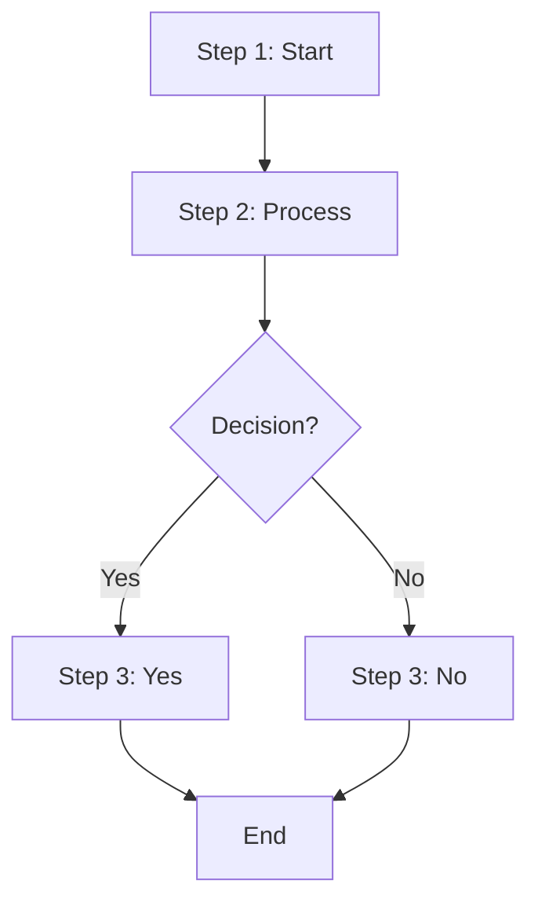
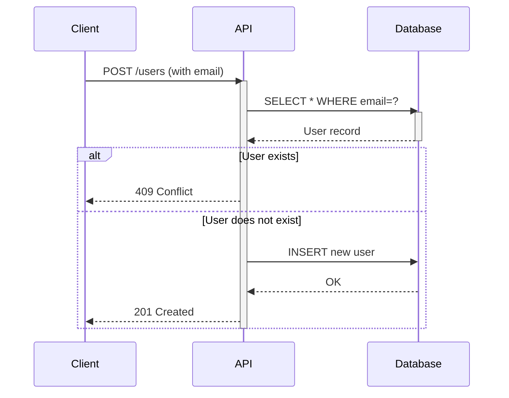
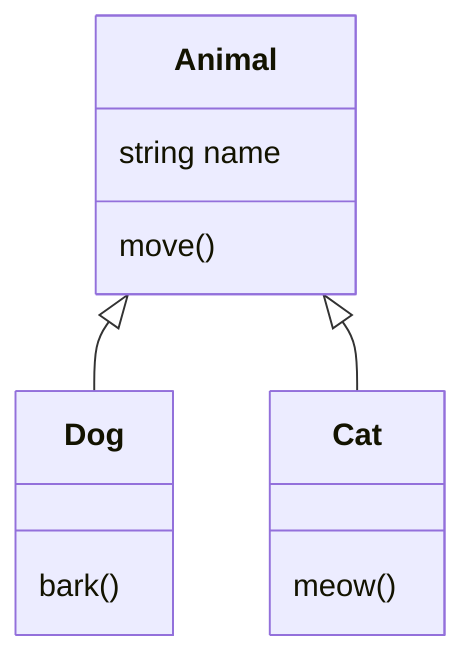
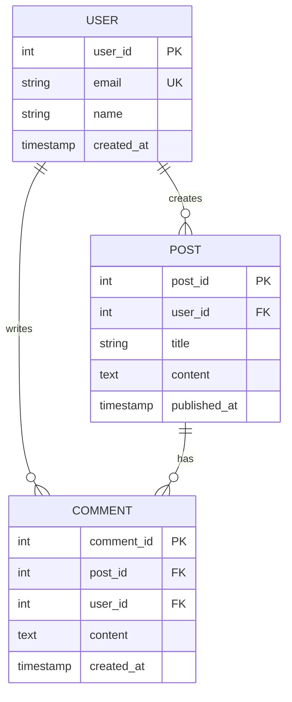

# Architecture Decision: Mermaid Diagrams Package Design

**By:** Morpheus (Lead)  
**Date:** 2026-03-25  
**Status:** Ready for implementation  
**Scope:** `mermaid-diagrams/` package architecture, `.squad/skills/mermaid-diagrams/SKILL.md`

---

## Executive Summary

The `mermaid-diagrams/` package will generate flowcharts, sequence diagrams, and other Mermaid-compatible diagrams from text prompts. This decision document establishes:

1. **Purpose & Scope** — A Python CLI + API that takes text prompts and renders Mermaid diagrams to PNG/SVF/PDF
2. **Stack** — Python 3.10+ with `mermaid-py` (thin wrapper) + Node.js `mmdc` subprocess rendering
3. **Interface** — CLI tool (`mermaid-gen`) and importable Python module
4. **Prompt Flow** — Three modes: (1) direct Mermaid syntax, (2) structured JSON templates, (3) optional AI-generated syntax (future enhancement)
5. **Skill Design** — `.squad/skills/mermaid-diagrams/SKILL.md` with patterns, templates, and rendering examples
6. **CI Integration** — New `workflows/test-mermaid-diagrams.yml`; diagram rendering validated in tests

This document covers architecture, rationale, and implementation roadmap.

---

## 1. Package Purpose & Scope

### 1.1 What It Does

`mermaid-diagrams` generates diagrams from text-based specifications. Core capability:

**Input** → Text prompt or Mermaid syntax  
**Processing** → Generate/validate Mermaid code  
**Output** → PNG/SVG/PDF files in `outputs/`

### 1.2 Who It's For

| Audience | Use Case |
|----------|----------|
| **Documentation authors** | Generate architecture diagrams from text descriptions; render flowcharts for process documentation |
| **Developers** | Embed diagram generation into scripts; automate diagram updates from version control |
| **Content creators** | Create consistent diagrams for blog posts, tutorials, and whitepapers |
| **Project leads** | Render project timelines, dependency graphs, and organizational charts |

### 1.3 What It Is NOT

- Not a GUI or web UI — CLI/API only
- Not a drawing tool — renders pre-defined Mermaid diagram types only
- Not a universal diagram generator — focused on text-to-Mermaid pipeline with best practices for common patterns

### 1.4 Supported Diagram Types

**Phase 1 (MVP):**
- Flowchart (graph LR/TD/etc.)
- Sequence diagram
- Class diagram
- ER (entity relationship) diagram

**Phase 2 (future):**
- Gantt chart
- State machine
- Pie chart
- Mind map
- Git graph

---

## 2. Stack Decision

### 2.1 Candidate Stacks

| Option | Stack | Pros | Cons |
|--------|-------|------|------|
| **A: Python + mmdc subprocess** | Python CLI + Node.js mmdc via subprocess | Matches project (image-generation is Python); minimal external dependencies; proven rendering | Node.js dependency; subprocess overhead; STDOUT/STDERR parsing required |
| **B: Python + mermaid-py** | Python 3.10+ with `mermaid-py` | Pure Python; single-dependency model; simple API | mermaid-py is just a thin `subprocess.run()` wrapper around mmdc; no real advantage over A |
| **C: Node.js package** | TypeScript/JS with `@mermaid-js/mermaid-cli` | Native ecosystem; best documentation; no subprocess overhead | Breaks project convention (Python-first); adds npm/Node.js maintenance burden; inconsistent with image-generation module |
| **D: MCP Server** | Python CLI that calls remote Mermaid MCP server | Stateless; decoupled rendering; enables distributed architecture | Network latency; MCP server deployment complexity; overkill for single-machine use |

### 2.2 DECISION: Option A — Python CLI + mmdc Subprocess

**Rationale:**

1. **Consistency** — Matches image-generation's Python-first approach. Both are local CLI tools for content generation.
2. **Minimal coupling** — mmdc is a standard Node.js package (12k weekly npm downloads). mmdc is the most mature Mermaid rendering engine; using it directly is less brittle than wrapping it.
3. **Simplicity** — No HTTP/RPC overhead; no network dependencies; renders on local machine only.
4. **Pragmatism** — mermaid-py adds zero value (it's literally `subprocess.run()`). Go straight to the source.
5. **Precedent** — Many Python projects shell out to specialized tools (GraphViz, pandoc, etc.) — this is standard practice.

**Trade-off accepted:** Project will require Node.js + `@mermaid-js/mermaid-cli` as a runtime dependency (documented in setup).

---

## 3. Architecture: Design & Components

### 3.1 File Structure

```
mermaid-diagrams/
├── README.md                      # Setup, usage, examples
├── CONTRIBUTING.md                # Dev guide, architecture notes
├── pyproject.toml                 # Package metadata, dependencies
├── setup.py                       # Minimal; most config in pyproject.toml
├── requirements.txt               # Runtime: Pillow (optional, for Python image validation)
├── requirements-dev.txt           # Dev: pytest, ruff, pytest-cov
├── ruff.toml                      # Lint config (inherit from repo root, override if needed)
├── mermaidgen/
│   ├── __init__.py               # Public API: MermaidGenerator, TemplateRegistry
│   ├── cli.py                    # CLI entry point (@click or argparse)
│   ├── generator.py              # Core: MermaidGenerator class (mmdc subprocess wrapper)
│   ├── templates.py              # Template registry (flowchart, sequence, class, ER)
│   ├── validators.py             # Syntax validators (basic regex; mmdc is the real validator)
│   ├── config.py                 # Config (output paths, mmdc binary, log level)
│   └── errors.py                 # Custom exceptions (MermaidSyntaxError, RenderError, etc.)
├── outputs/
│   └── .gitkeep                   # Placeholder for generated diagrams
├── tests/
│   ├── conftest.py               # pytest fixtures (mock mmdc, temp dirs)
│   ├── test_generator.py          # Unit tests for MermaidGenerator
│   ├── test_templates.py          # Template validation tests
│   ├── test_validators.py         # Validator tests
│   ├── test_cli.py                # CLI integration tests
│   ├── fixtures/
│   │   ├── valid_mermaid.mmd      # Sample valid Mermaid syntax files
│   │   ├── invalid_mermaid.mmd
│   │   └── expected_outputs/      # Expected PNG/SVG reference files (if snapshot testing)
│   └── integration/
│       └── test_end_to_end.py     # E2E: prompt → diagram file
├── docs/
│   ├── architecture.md            # Technical design (this decision + more)
│   ├── api-reference.md           # API docs (Python classes, methods)
│   └── examples.md                # Usage examples
└── .github/workflows/test-mermaid-diagrams.yml  # CI (shared with repo)
```

### 3.2 Core Components

#### **A. `MermaidGenerator` (generator.py)**

Main class handling the prompt → diagram pipeline.

```python
class MermaidGenerator:
    """
    Generates Mermaid diagrams from templates or direct syntax.
    
    Calls mmdc subprocess to render to PNG/SVG/PDF.
    Lazy-loads mmdc; raises clear error if not in PATH.
    """
    
    def __init__(self, output_dir: Path = "outputs", mmdc_binary: str = "mmdc"):
        """
        Args:
            output_dir: Directory for generated diagrams
            mmdc_binary: Path to mmdc CLI (default: searches PATH)
        """
        self.output_dir = Path(output_dir)
        self.mmdc_binary = mmdc_binary
        self._validate_mmdc_available()  # Fail fast if mmdc not found
    
    def from_syntax(self, syntax: str, output_path: str | Path, 
                    format: str = "png") -> Path:
        """
        Render Mermaid syntax directly to file.
        
        Args:
            syntax: Raw Mermaid diagram code
            output_path: Where to save the diagram
            format: "png", "svg", or "pdf"
        
        Returns:
            Path to rendered file
        
        Raises:
            MermaidSyntaxError: Invalid syntax
            RenderError: mmdc subprocess failed
        """
        # Validate syntax (optional; mmdc will catch errors too)
        MermaidValidator.validate(syntax)
        
        # Call mmdc subprocess
        mmd_file = self.output_dir / f"tmp_{uuid4().hex}.mmd"
        mmd_file.write_text(syntax)
        try:
            subprocess.run(
                [self.mmdc_binary, "-i", str(mmd_file), "-o", str(output_path), 
                 "-t", "default", "-f", format],
                check=True,
                capture_output=True,
                timeout=30
            )
        except subprocess.CalledProcessError as e:
            raise RenderError(f"mmdc failed: {e.stderr.decode()}") from e
        finally:
            mmd_file.unlink(missing_ok=True)
        
        return Path(output_path)
    
    def from_template(self, template_name: str, **kwargs) -> Path:
        """
        Generate diagram from a named template.
        
        Args:
            template_name: e.g., "flowchart_simple", "sequence_api_call"
            **kwargs: Template-specific parameters
        
        Returns:
            Path to rendered file
        """
        registry = TemplateRegistry()
        template = registry.get(template_name)
        if not template:
            raise ValueError(f"Unknown template: {template_name}")
        
        syntax = template.render(**kwargs)
        output_file = self.output_dir / template.suggest_filename(**kwargs)
        return self.from_syntax(syntax, output_file)
    
    def _validate_mmdc_available(self):
        """Fail if mmdc is not installed or in PATH."""
        try:
            subprocess.run(
                [self.mmdc_binary, "--version"],
                check=True,
                capture_output=True,
                timeout=5
            )
        except (FileNotFoundError, subprocess.TimeoutExpired):
            raise EnvironmentError(
                f"mmdc not found at '{self.mmdc_binary}'. "
                "Install with: npm install -g @mermaid-js/mermaid-cli"
            )
```

#### **B. `TemplateRegistry` (templates.py)**

Pre-built diagram templates for common use cases.

```python
class TemplateRegistry:
    """
    Central registry of reusable Mermaid templates.
    Each template is a jinja2 template or simple string with placeholders.
    """
    
    def __init__(self):
        self.templates = {
            "flowchart_simple": FlowchartTemplate(),
            "flowchart_decision": FlowchartDecisionTemplate(),
            "sequence_api": SequenceAPITemplate(),
            "class_inheritance": ClassInheritanceTemplate(),
            "er_database": ERDatabaseTemplate(),
            "gantt_project": GanttProjectTemplate(),  # Phase 2
        }
    
    def get(self, name: str) -> Template | None:
        return self.templates.get(name)
    
    def list_available(self) -> list[str]:
        return list(self.templates.keys())
```

Each template is a class with:
- `name: str` — Unique ID
- `title: str` — Human-readable name
- `description: str` — What it generates
- `parameters: dict[str, str]` — Required placeholders
- `render(**kwargs) -> str` — Generate Mermaid syntax

**Example template:**

```python
class FlowchartSimpleTemplate:
    name = "flowchart_simple"
    title = "Simple Flowchart"
    description = "Linear flowchart with 3-5 steps"
    parameters = {
        "title": "Diagram title",
        "steps": "List of step descriptions",
        "format": "mermaid (output: PNG, SVG, PDF)"
    }
    
    def render(self, title: str, steps: list[str], **kwargs) -> str:
        step_block = "\n    ".join(
            f'{i+1}["Step {i+1}: {step}"]' 
            for i, step in enumerate(steps)
        )
        edges = " --> ".join(f"{i+1}" for i in range(len(steps)))
        
        return f"""
flowchart TD
    {step_block}
    {edges}
"""
    
    def suggest_filename(self, title: str, **kwargs) -> str:
        safe_title = re.sub(r"[^a-z0-9_-]", "_", title.lower())[:20]
        return f"flowchart_{safe_title}.png"
```

#### **C. `MermaidValidator` (validators.py)**

Light syntax validation before passing to mmdc. (mmdc is the real validator.)

```python
class MermaidValidator:
    """
    Basic Mermaid syntax validation.
    Not exhaustive — mmdc will catch real errors.
    """
    
    @staticmethod
    def validate(syntax: str) -> None:
        """
        Check for obvious syntax errors.
        
        Raises:
            MermaidSyntaxError if validation fails
        """
        lines = syntax.strip().split("\n")
        if not lines:
            raise MermaidSyntaxError("Empty diagram")
        
        first_line = lines[0].strip().lower()
        valid_types = {"flowchart", "sequencediagram", "classDiagram", 
                       "erDiagram", "gantt", "stateDiagram"}
        
        # Check for diagram type declaration
        if not any(dtype in first_line for dtype in valid_types):
            raise MermaidSyntaxError(
                f"Missing diagram type. Must start with one of: {valid_types}"
            )
```

#### **D. CLI Entry Point (cli.py)**

Exposes `mermaid-gen` command.

```bash
# Direct syntax
$ mermaid-gen --syntax "flowchart TD\n  A --> B" --output my_diagram.png

# From template
$ mermaid-gen --template flowchart_simple \
    --param title="My Process" \
    --param steps="Step 1,Step 2,Step 3" \
    --format png

# List available templates
$ mermaid-gen --list-templates
```

### 3.3 Prompt Flow Modes

#### **Mode 1: Direct Mermaid Syntax (Simplest)**

```python
gen = MermaidGenerator()
mermaid_code = """
flowchart LR
    A["Python Script"] --> B["Mermaid Code"]
    B --> C["mmdc Subprocess"]
    C --> D["PNG Output"]
"""
gen.from_syntax(mermaid_code, "pipeline.png")
```

**When to use:** User already knows Mermaid syntax; just needs rendering.

#### **Mode 2: Structured Template (Most Common)**

```python
gen = MermaidGenerator()
output = gen.from_template(
    "flowchart_simple",
    title="Blog Publishing Pipeline",
    steps=[
        "Author writes post",
        "Editor reviews",
        "Generate illustrations",
        "Publish to site"
    ],
    format="png"
)
print(f"Generated: {output}")
```

**When to use:** User describes the process in English; template generates valid Mermaid syntax.

#### **Mode 3: LLM-Powered (Phase 2, Future)**

```python
gen = MermaidGenerator(model="gpt-4")
output = gen.from_prompt(
    prompt="Create a sequence diagram showing a REST API call to get a user profile",
    diagram_type="sequence",
    format="svg"
)
```

**When to use:** Natural language → LLM generates Mermaid → render. *Requires integration with Claude/GPT API.* **Not in MVP.**

---

## 4. Skill Design: `.squad/skills/mermaid-diagrams/SKILL.md`

The skill teaches agents how to write valid Mermaid diagrams, best practices for readability, and integration patterns.

### 4.1 Skill Content

Create `.squad/skills/mermaid-diagrams/SKILL.md`:

```markdown
---
name: "mermaid-diagrams"
description: "Generate diagrams from text using Mermaid syntax"
domain: "documentation, architecture"
confidence: "high"
source: "earned — Morpheus (Lead) mermaid-diagrams package design"
---

## Context

Use this skill when you need to:
- Document system architecture or workflows as diagrams
- Generate flowcharts from process descriptions
- Create sequence diagrams for API interactions
- Build entity-relationship diagrams for data models
- Include diagrams in blog posts or tutorials

The skill covers Mermaid syntax patterns, rendering to PNG/SVG/PDF, and integration with the mermaid-diagrams package.

## Patterns

### 1. Flowchart Syntax

Flowcharts show process flows, decision trees, and linear workflows.

**Basic syntax:**


**Best practices:**
- Use `["text"]` for rectangular nodes
- Use `{text}` for diamond (decision) nodes
- Use `|label|` for edge labels
- Keep step descriptions short (<50 chars)
- Limit depth to 5-7 levels (readability)
- Use consistent arrow directions (TD=top-down, LR=left-right)

**Anti-patterns:**
- Don't mix TD and LR in same diagram
- Avoid crossing edges (reorganize nodes instead)
- Don't put entire paragraphs in nodes

### 2. Sequence Diagram Syntax

Sequence diagrams show interactions between actors/services over time.



**Best practices:**
- Use `participant` to declare actors
- Use `->>`/`-->>` for sync/async messages
- Use `alt`/`else` for conditional flows
- Keep interactions 5-7 per diagram
- Label with actual messages (HTTP verbs, method names)

### 3. Class Diagram Syntax

Class diagrams show object-oriented structures and inheritance.



**Best practices:**
- Use `<|--` for inheritance
- Use `--` for association
- Use `*--` for composition
- Include key methods only (not trivial getters)

### 4. Entity-Relationship Diagram

ER diagrams model database schemas.



**Best practices:**
- Use `||--o{` for 1-to-many
- Use `||--||` for 1-to-1
- Mark PKs and FKs clearly
- Keep entity count to 4-6 (readability)

## Rendering

### Python API

```python
from mermaidgen import MermaidGenerator

# Create generator
gen = MermaidGenerator(output_dir="diagrams/")

# Render from syntax
mermaid_code = """
flowchart LR
    A --> B --> C
"""
output_path = gen.from_syntax(mermaid_code, "flow.png", format="png")

# Or use template
output_path = gen.from_template(
    "flowchart_simple",
    title="My Process",
    steps=["Step A", "Step B", "Step C"],
    format="svg"
)
```

### CLI

```bash
# Render from string
mermaid-gen --syntax "flowchart TD\n  A --> B" --output my_diagram.png

# Use template
mermaid-gen --template flowchart_simple \
    --param title="My Process" \
    --param steps="Step 1,Step 2" \
    --format png

# List templates
mermaid-gen --list-templates
```

### Formats

- **PNG** (default) — Raster, good for web/email, ~200-400KB per diagram
- **SVG** — Vector, scales infinitely, smaller file size, best for web
- **PDF** — Print-friendly, good for documentation

## Integration with mermaid-diagrams Package

### Adding Custom Templates

Edit `mermaidgen/templates.py`:

```python
class MyCustomTemplate:
    name = "my_custom"
    title = "My Custom Diagram"
    description = "..."
    parameters = {"param1": "Description", "param2": "Description"}
    
    def render(self, param1: str, param2: str, **kwargs) -> str:
        return f"""
flowchart TD
    A["Input: {param1}"]
    B["Process: {param2}"]
    A --> B
"""
```

### Testing Diagram Validity

```python
from mermaidgen.validators import MermaidValidator

try:
    MermaidValidator.validate(my_mermaid_code)
except MermaidSyntaxError as e:
    print(f"Syntax error: {e}")
```

## Common Use Cases

### 1. System Architecture

```
Describe: "5-service microservices architecture with API gateway"
→ Generate flowchart showing request flow
→ Render to PNG for README
```

### 2. Data Pipeline

```
Describe: "ETL pipeline: extract CSV → validate → transform → load DB"
→ Use flowchart_simple template
→ Render to SVG for documentation
```

### 3. User Workflow

```
Describe: "User signup: email → verify → create profile → confirm"
→ Generate flowchart with decision points
→ Render PNG for blog post
```

## Anti-Patterns

- **Don't:** Create diagrams with >8 nodes (hard to read)
- **Don't:** Mix diagram types in one file (use separate files instead)
- **Don't:** Use Mermaid for detailed architecture that needs Lucidchart precision (use Lucidchart instead)
- **Don't:** Render diagrams in CI for every commit (too slow; render once, check in PNG)

## CLI Cheat Sheet

```bash
# List available templates
mermaid-gen --list-templates

# Generate from template
mermaid-gen --template flowchart_simple \
    --param title="My Diagram" \
    --param steps="A,B,C" \
    --format svg

# Generate from inline syntax
mermaid-gen --syntax "flowchart LR\n  A-->B\n  B-->C" \
    --output diagram.png

# Generate from file
mermaid-gen --file my_diagram.mmd --output my_diagram.png
```

## Troubleshooting

### mmdc not found

```
Error: mmdc not found at '/usr/local/bin/mmdc'
Install with: npm install -g @mermaid-js/mermaid-cli
```

Solution: Install mermaid-cli globally.

### Invalid Mermaid syntax

Error message will include the line number and syntax error from mmdc.
Copy the Mermaid code to [mermaid.live](https://mermaid.live) to debug interactively.

### PDF rendering fails

Puppeteer (used by mmdc) may need X11 or xvfb on headless Linux.
Test: `mmdc -i diagram.mmd -o diagram.pdf -f pdf`
If fails, ensure Puppeteer dependencies are installed: `apt-get install libxss1 libappindicator1 libindicator7`
```

---

## 5. CI Integration: Tests & Workflow

### 5.1 Test Structure (`tests/`)

**Unit tests** (fast, mocked):
- `test_generator.py` — Verify `from_syntax()`, `from_template()` with mocked mmdc
- `test_templates.py` — Template rendering, parameter validation
- `test_validators.py` — Syntax validation logic
- `test_cli.py` — CLI argument parsing

**Integration tests** (slower, require mmdc):
- `tests/integration/test_end_to_end.py` — Real mmdc subprocess calls; generates actual PNGs

**Fixtures**:
- `.mermaid` files with valid/invalid syntax
- Mock subprocess responses

### 5.2 GitHub Workflow: `.github/workflows/test-mermaid-diagrams.yml`

```yaml
name: Test Mermaid Diagrams

on:
  pull_request:
    branches: [main, dev]
    paths:
      - "mermaid-diagrams/**"
      - ".github/workflows/test-mermaid-diagrams.yml"

jobs:
  test:
    runs-on: ubuntu-latest
    strategy:
      matrix:
        python-version: ["3.10", "3.11", "3.12"]
    
    steps:
      - uses: actions/checkout@v4
      
      - name: Set up Python
        uses: actions/setup-python@v4
        with:
          python-version: ${{ matrix.python-version }}
      
      - name: Set up Node (for mmdc)
        uses: actions/setup-node@v3
        with:
          node-version: "18"
      
      - name: Install mermaid-cli
        run: npm install -g @mermaid-js/mermaid-cli
      
      - name: Install dependencies
        working-directory: mermaid-diagrams
        run: |
          pip install -e .
          pip install -r requirements-dev.txt
      
      - name: Lint with ruff
        working-directory: mermaid-diagrams
        run: ruff check . --fix --diff
      
      - name: Run tests
        working-directory: mermaid-diagrams
        run: pytest tests/ -v --cov=mermaidgen --cov-report=xml
      
      - name: Upload coverage
        uses: codecov/codecov-action@v3
        with:
          files: ./mermaid-diagrams/coverage.xml
```

### 5.3 Test Coverage Targets

- Unit test coverage: ≥85% (generators, templates, validators)
- Integration test coverage: ≥60% (CLI, subprocess interactions)
- No code changes merge without new tests

---

## 6. Implementation Roadmap

### Phase 1 (MVP): Week 1

**What ships:**
- `MermaidGenerator` class (direct syntax + subprocess rendering)
- 4 templates: flowchart_simple, sequence_api, class_inheritance, er_database
- CLI entry point
- Unit + integration tests (coverage ≥80%)
- README + docs
- `.squad/skills/mermaid-diagrams/SKILL.md`
- GitHub Actions workflow

**Deliverables:**
- `mermaid-diagrams/` package ready for `pip install -e .`
- `mermaid-gen` CLI available after install
- Passing CI on PRs

### Phase 2 (Enhancement): Week 2-3

**What ships:**
- LLM mode (Claude/GPT generates Mermaid from English prompts)
- 3 more templates (gantt_project, state_machine, git_graph)
- Diagram validation API (check syntax before rendering)
- Batch rendering (process multiple .mmd files)
- Web-friendly presets (light/dark themes, custom colors)

**Deliverables:**
- Enhanced CLI with `--model gpt-4` option
- Batch processing: `mermaid-gen --batch diagrams/*.mmd --output-dir out/`

### Phase 3 (Polish): Week 4

**What ships:**
- Docker image for headless rendering (no local mmdc needed)
- Performance optimization (cache templates, parallel rendering)
- Documentation: architecture guide, API reference, troubleshooting

**Deliverables:**
- Stable public API
- Production-ready error handling
- Performance benchmarks

---

## 7. Decisions & Rationale

### 7.1 Why Python + mmdc (not pure JavaScript)?

**Decision:** Use Python 3.10+ with `mmdc` subprocess rendering.

**Rationale:**
1. **Consistency** — Project is Python-first (image-generation is Python).
2. **Simplicity** — mmdc is the de facto standard for Mermaid rendering; no alternative is significantly better.
3. **Pragmatism** — thin wrapper + subprocess is cleaner than Node.js package in a Python project.
4. **Precedent** — Python communities regularly shell out to specialized tools (GraphViz, pandoc, imagemagick).

**Trade-off:** Requires Node.js + mmdc globally installed (documented in setup).

### 7.2 Why Templates + Direct Syntax (not just LLM)?

**Decision:** Support both direct Mermaid syntax and pre-built templates; LLM is Phase 2.

**Rationale:**
1. **MVP speed** — Templates don't need LLM; they're instant and reliable.
2. **Deterministic** — Templates guarantee valid output; LLM output is probabilistic.
3. **Educational** — Templates teach users how to write Mermaid; LLM could enable bad habits.
4. **Cost** — LLM is optional; templates are free.
5. **Future-proof** — LLM mode can be added later without breaking existing APIs.

### 7.3 Why No Web UI (CLI/API only)?

**Decision:** CLI tool + Python API only; no web UI.

**Rationale:**
1. **MVP scope** — Web UI adds deployment complexity.
2. **Use case** — Users want automation (scripts, CI pipelines), not interactive tools.
3. **Future-proof** — API can serve a web UI later if needed.

### 7.4 Why mmdc Subprocess (not mermaid-py)?

**Decision:** Call mmdc directly; don't add mermaid-py wrapper.

**Rationale:**
1. **mermaid-py is trivial** — It's literally `subprocess.run(["mmdc", ...])`. Adding it adds zero value; it just adds a PyPI dependency.
2. **Direct control** — Subprocess call gives us full control over mmdc args, timeouts, error handling.
3. **Transparency** — Users can see what tool is being called; easier to debug.

### 7.5 CI Scope

**Decision:** mermaid-diagrams tests run separately; don't block image-generation tests.

**Rationale:**
1. **Separation of concerns** — Diagram package is independent of image-generation.
2. **Faster PR feedback** — image-generation CI stays fast (doesn't wait for Node.js setup).
3. **Optional dependency** — Project works fine without mermaid-diagrams.

---

## 8. Risk Mitigation

| Risk | Mitigation |
|------|-----------|
| mmdc not installed on user's machine | Clear error message with install instructions; CI validates presence |
| Mermaid syntax changes break templates | Templates have test fixtures; version pin mmdc in CI |
| Subprocess hangs (slow mmdc) | 30-second timeout on subprocess call; log warning if >10s |
| Node.js version conflicts | Document Node.js 16+ requirement; CI tests multiple versions |
| Invalid Mermaid syntax from templates | Validators + mmdc error messages; integration tests render all templates |
| Cross-platform path issues | Use `pathlib.Path` throughout; CI tests on Linux + macOS + Windows |

---

## 9. File Checklist

**To create:**
- `.squad/decisions/inbox/morpheus-mermaid-architecture.md` ✓ (this file)
- `.squad/skills/mermaid-diagrams/SKILL.md` (next)
- `mermaid-diagrams/pyproject.toml` (Python package metadata)
- `mermaid-diagrams/mermaidgen/__init__.py` (public API)
- `mermaid-diagrams/mermaidgen/generator.py` (core class)
- `mermaid-diagrams/mermaidgen/templates.py` (template registry)
- `mermaid-diagrams/mermaidgen/validators.py` (syntax validation)
- `mermaid-diagrams/mermaidgen/cli.py` (CLI)
- `mermaid-diagrams/mermaidgen/errors.py` (custom exceptions)
- `mermaid-diagrams/tests/conftest.py` (pytest fixtures)
- `mermaid-diagrams/tests/test_*.py` (unit + integration tests)
- `.github/workflows/test-mermaid-diagrams.yml` (CI workflow)

---

## 10. Next Steps

1. **Morpheus:** Approve this architecture decision document → commit to `.squad/decisions.md`
2. **Trinity:** Build Phase 1 implementation (generator, templates, CLI, tests)
3. **Neo:** Design & execute test coverage audit
4. **Squad:** First PR: mermaid-diagrams MVP with passing CI
5. **All:** Review + merge after sign-off

---

**END DECISION DOCUMENT**
