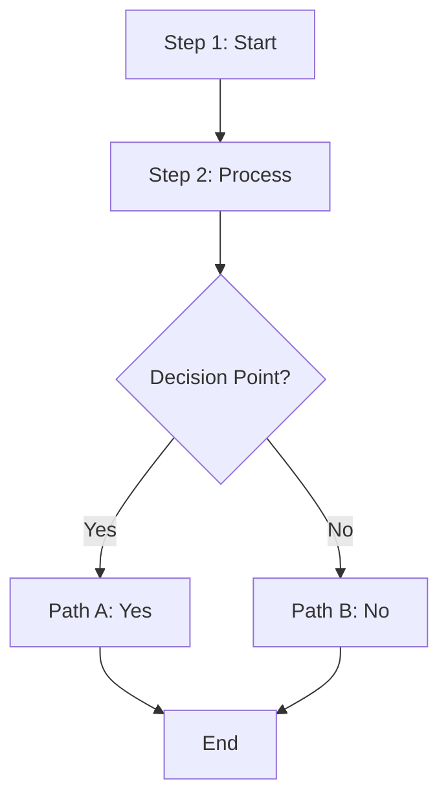
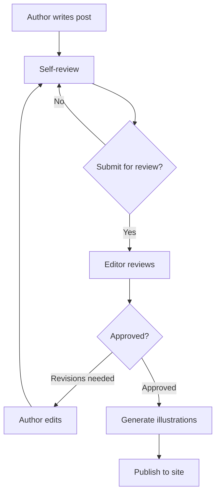
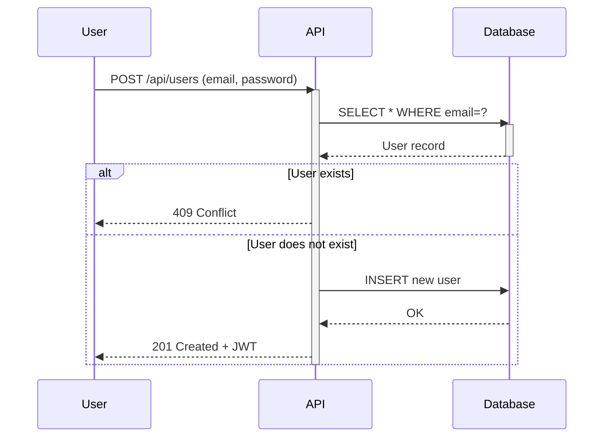
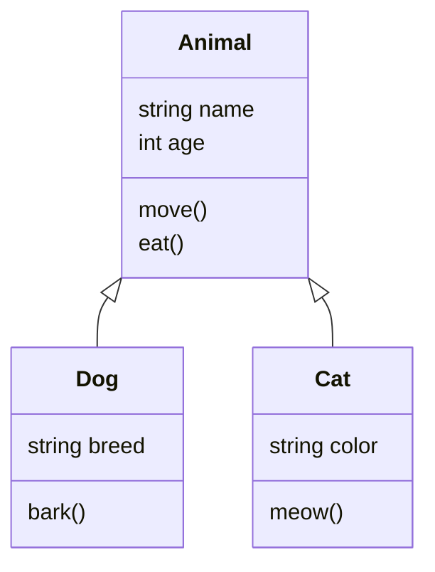
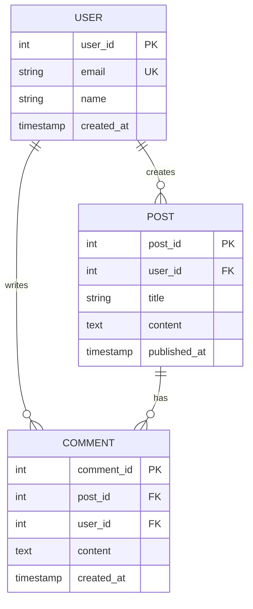
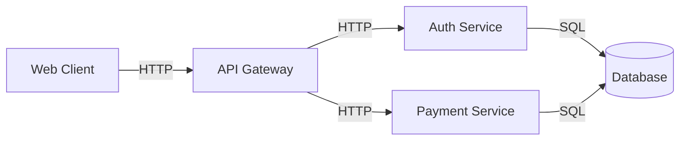
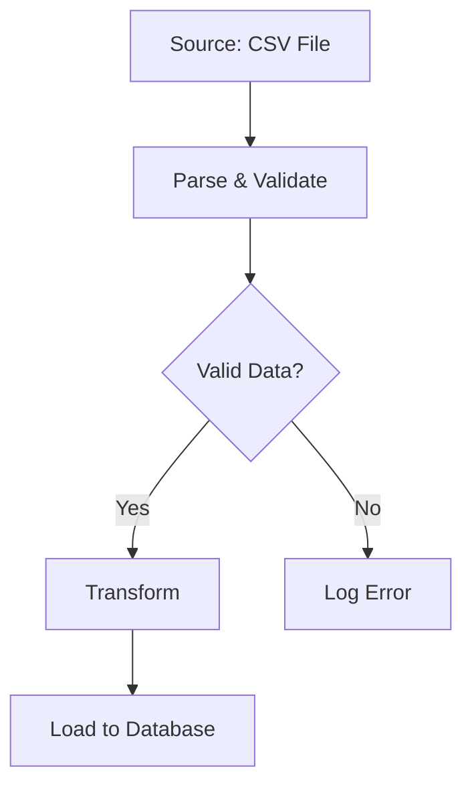
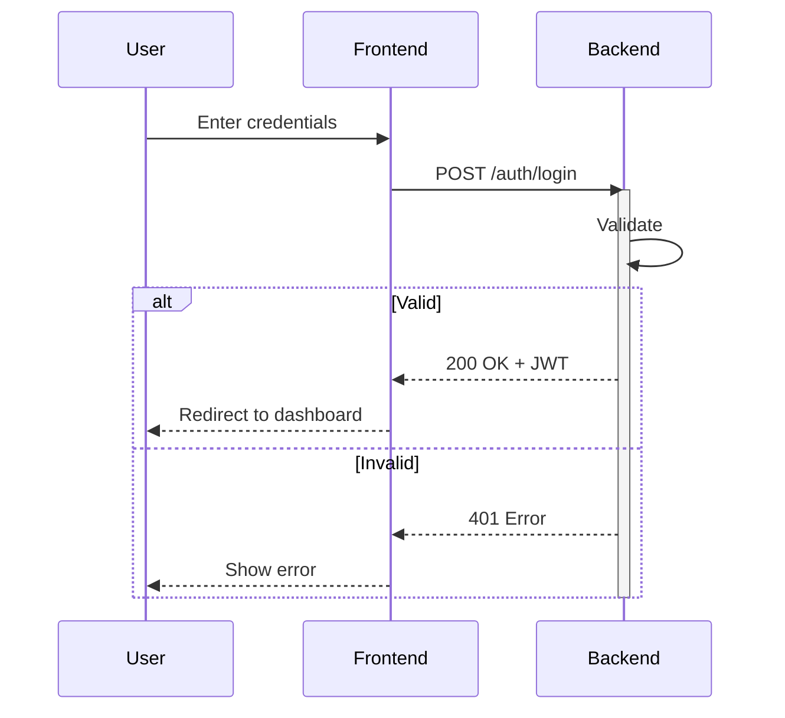

## Context

Use this skill when you need to:
- Document system architecture, workflows, or processes as diagrams
- Generate flowcharts from process descriptions
- Create sequence diagrams for API interactions or user flows
- Build entity-relationship diagrams for database schemas
- Model class hierarchies or organizational structures
- Include diagrams in blog posts, tutorials, or technical documentation

The skill covers Mermaid syntax patterns, best practices for readability, rendering to PNG/SVG/PDF, and integration with the mermaid-diagrams package.

---

## Patterns

### 1. Flowchart (Process Flows & Decision Trees)

Flowcharts show sequential workflows, conditional logic, and process decision points.

**Syntax:**


**Shape codes:**
- `["text"]` — Rectangle (process step)
- `{text}` — Diamond (decision/condition)
- `(text)` — Rounded (start/end)
- `[[text]]` — Subroutine
- `[/text/]` — Parallelogram
- `[(text)]` — Cylinder (database)

**Direction options:**
- `flowchart TD` — Top-Down (vertical)
- `flowchart LR` — Left-Right (horizontal)
- `flowchart RL` — Right-Left
- `flowchart BT` — Bottom-Top

**Best practices:**
- Keep step descriptions short (<50 characters)
- Use clear, imperative language ("Generate report" not "Report generation")
- Limit diagram depth to 5-7 levels for readability
- Use consistent arrow directions within a diagram
- Label conditional branches with `|Yes|` / `|No|` for clarity
- Group related steps at same depth (visual hierarchy)

**Anti-patterns:**
- ❌ Don't mix TD and LR in same diagram
- ❌ Avoid crossing edges — reorganize nodes instead
- ❌ Don't put paragraphs in nodes
- ❌ Don't create >8 interconnected nodes (use separate diagrams)

**Example: Blog Publishing Pipeline**


---

### 2. Sequence Diagram (Interactions & Messaging)

Sequence diagrams show interactions between actors (users, services, APIs) over time, emphasizing message order and timing.

**Syntax:**


**Message types:**
- `->>` — Synchronous call (solid arrow) — caller waits
- `-->>` — Asynchronous response (dashed arrow) — no wait

**Control flow:**
- `alt ... else ... end` — if/else conditional
- `loop ... end` — repeat block
- `par ... and ... end` — parallel flows
- `opt ... end` — optional block

**Best practices:**
- Declare `participant` in order (left to right)
- Use concise message labels ("GET /user" not "Request the user resource from the database")
- Limit participants to 3-4 (readability)
- Limit interactions to 5-7 per diagram
- Use `alt` to show error paths clearly
- Include HTTP methods/status codes for API flows

**Anti-patterns:**
- ❌ Don't show every detail (use separate diagrams for complex flows)
- ❌ Avoid deeply nested conditionals (>2 levels)
- ❌ Don't list implementation details in message labels

**Example: REST API Call**
```mermaid
sequenceDiagram
    participant Client as Web Client
    participant API as API Gateway
    participant Auth as Auth Service
    participant DB as Database
    
    Client->>API: POST /api/login (email, password)
    activate API
    
    API->>Auth: Validate credentials
    activate Auth
    Auth->>DB: Query user by email
    DB-->>Auth: User record
    Auth->>Auth: Hash password + compare
    
    alt Credentials valid
        Auth-->>API: JWT token
        deactivate Auth
        API-->>Client: 200 OK + JWT
    else Invalid
        Auth-->>API: Error
        deactivate Auth
        API-->>Client: 401 Unauthorized
    end
    deactivate API
```

---

### 3. Class Diagram (Object-Oriented Design)

Class diagrams show classes, attributes, methods, and relationships (inheritance, composition).

**Syntax:**


**Relationship symbols:**
- `<|--` — Inheritance (A inherits from B)
- `*--` — Composition (A owns B, B can't exist without A)
- `o--` — Aggregation (A contains B, B can exist independently)
- `-->` — Association (A uses B)

**Visibility markers:**
- `+` — Public (e.g., `+method()`)
- `-` — Private (e.g., `-privateField`)
- `#` — Protected (e.g., `#protectedField`)

**Best practices:**
- Include only key methods (not trivial getters/setters)
- Show inheritance hierarchies clearly
- Limit entities to 4-6 classes (readability)
- Group related classes visually
- Use clear, domain-specific names

---

### 4. Entity-Relationship Diagram (Database Schema)

ER diagrams model database tables, columns, and foreign key relationships.

**Syntax:**


**Cardinality symbols:**
- `||--||` — One-to-one
- `||--o{` — One-to-many
- `o{--o{` — Many-to-many

**Column markers:**
- `PK` — Primary key
- `FK` — Foreign key
- `UK` — Unique key

**Best practices:**
- Declare all `PK` and `FK` explicitly
- Keep entity count to 4-6 (readability)
- Use clear, singular entity names (USER not USERS)
- Show all foreign key relationships

---

## Rendering to PNG / SVG / PDF

### Using the Python API

```python
from mermaidgen import MermaidGenerator

# Initialize generator
gen = MermaidGenerator(output_dir="diagrams/")

# Render Mermaid code to PNG
mermaid_syntax = """
flowchart LR
    A["Input Data"]
    B["Process"]
    C["Output"]
    A --> B --> C
"""

output_path = gen.from_syntax(
    mermaid_syntax,
    output_path="pipeline.png",
    format="png"  # or "svg", "pdf"
)
print(f"Generated: {output_path}")
```

### Using the CLI

```bash
# Render from inline syntax
mermaid-gen --syntax "flowchart TD\n  A-->B\n  B-->C" \
    --output my_diagram.png

# Render from file
mermaid-gen --file diagram.mmd --output diagram.svg --format svg

# Use a template
mermaid-gen --template flowchart_simple \
    --param title="My Process" \
    --param steps="Step 1,Step 2,Step 3" \
    --format png \
    --output process.png

# List available templates
mermaid-gen --list-templates
```

### Format Selection

| Format | Use Case | Pros | Cons |
|--------|----------|------|------|
| **PNG** | Web, email, presentations | Universal support | Raster, larger files |
| **SVG** | Web, docs, version control | Vector, small files | Requires modern browser |
| **PDF** | Print, archival | Portable, print-optimized | Larger files |

---

## Common Use Cases

### Use Case 1: System Architecture

Identify components, relationships, and communication:


### Use Case 2: Data Processing Pipeline

Show extraction, transformation, loading:


### Use Case 3: User Authentication

Document login flow with success/error paths:


---

## Best Practices Checklist

- [ ] Diagram fits on one screen
- [ ] Labels are clear and concise (<50 chars)
- [ ] No crossing edges or hidden dependencies
- [ ] Diagram has a title or caption
- [ ] All abbreviations are defined
- [ ] Output is readable at intended zoom level
- [ ] File size is reasonable (<1MB PNG, <100KB SVG)

---

## Anti-Patterns to Avoid

| Anti-Pattern | Solution |
|--------------|----------|
| **>8 interconnected nodes** | Split into multiple diagrams |
| **Overly detailed (every method/field)** | Show only essential relationships |
| **Circular relationships** | Refactor to show clear dependencies |
| **Using Mermaid for precision UML** | Use Lucidchart or draw.io instead |

---

## Troubleshooting

### Error: "mmdc not found"

```bash
npm install -g @mermaid-js/mermaid-cli
mmdc --version
```

### Error: "Invalid Mermaid syntax"

Use [mermaid.live](https://mermaid.live) to debug interactively.

### PDF rendering fails on headless Linux

```bash
apt-get install libxss1 libappindicator1 libindicator7
mmdc -i diagram.mmd -o diagram.pdf -f pdf
```

---

## See Also

- [mermaid.live](https://mermaid.live) — Interactive editor
- [mermaid.js docs](https://mermaid.js.org) — Full reference
- `.squad/decisions/inbox/morpheus-mermaid-architecture.md` — Architecture decisions

