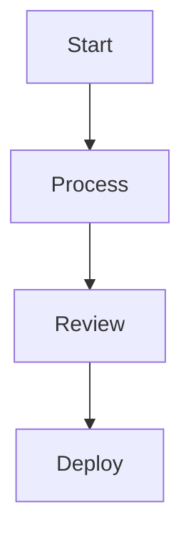

← [Back to Documentation Index](../README.md)

# User Guide — mermaid-diagrams

Turn Mermaid diagram syntax into professional PNG, SVG, and PDF images using the CLI or Python API.

## What This Tool Does

`mermaid-diagram` takes Mermaid syntax as input — raw text, a `.mmd` file, or a named template — validates it, and renders it to an image file via the `mmdc` binary. No need to open a browser or use an online editor.

## CLI Usage

The CLI is installed as the `mermaid-diagram` command.

### Input Methods

Input sources are mutually exclusive — use one at a time.

#### Raw syntax (`--syntax`)

Pass Mermaid syntax directly as a string:

```bash
mermaid-diagram --syntax "flowchart TD
    A[Start] --> B[Process]
    B --> C[End]"
```

#### From a file (`--file`)

Read syntax from a `.mmd` file:

```bash
mermaid-diagram --file my-diagram.mmd
```

```bash
mermaid-diagram --file my-diagram.mmd --format svg --output output.svg
```

#### From a template (`--template` + `--param`)

Use a built-in template with parameters:

```bash
mermaid-diagram --template flowchart_simple --param steps="Start,Process,End"
```

Parameters are passed as `KEY=VALUE` pairs. Comma-separated values are automatically split into lists.

Multiple parameters:

```bash
mermaid-diagram --template sequence_api \
    --param participants="Client,Server,Database" \
    --param messages="Client,Server,GET /api"
```

#### List available templates (`--list-templates`)

```bash
mermaid-diagram --list-templates
```

### Output Options

| Flag | Values | Default | Description |
|------|--------|---------|-------------|
| `--format` | `png`, `svg`, `pdf` | `png` | Output format |
| `--output` | file path | auto-generated | Output file path |

When `--output` is omitted, files are saved to `./outputs/` with auto-generated names.

### Full CLI Reference

```
mermaid-diagram [-h]
    [--syntax SYNTAX | --file FILE | --template TEMPLATE | --list-templates]
    [--param KEY=VALUE]
    [--output OUTPUT]
    [--format {png,svg,pdf}]
```

## Python API Usage

### MermaidGenerator

The core class for rendering diagrams:

```python
from mermaidgen import MermaidGenerator

gen = MermaidGenerator(output_dir="outputs")

# From raw syntax
path = gen.from_syntax(
    "flowchart TD\n    A[Start] --> B[End]",
    fmt="png"
)
print(f"Saved to: {path}")

# From syntax with explicit output path
path = gen.from_syntax(
    "sequenceDiagram\n    Alice->>Bob: Hello",
    output_filename="hello.svg",
    fmt="svg"
)

# From a template
path = gen.from_template(
    "flowchart_simple",
    params={"steps": ["Start", "Process", "Review", "End"]},
    fmt="png"
)
```

### MermaidValidator

Validate syntax before rendering:

```python
from mermaidgen import MermaidValidator
from mermaidgen.errors import MermaidSyntaxError

# Returns True if valid
MermaidValidator.validate("flowchart TD\n    A --> B")

# Raises MermaidSyntaxError if invalid
try:
    MermaidValidator.validate("this is not mermaid")
except MermaidSyntaxError as e:
    print(f"Invalid: {e}")
```

### Template Registry

Browse and use templates programmatically:

```python
from mermaidgen import default_registry

# List all templates
for t in default_registry.list_available():
    print(f"{t['name']}: {t['description']}")

# Get a specific template
tmpl = default_registry.get("flowchart_simple")
if tmpl:
    syntax = tmpl.render(steps=["Step 1", "Step 2", "Step 3"])
    print(syntax)
```

## Built-in Templates

| Name | Description | Required Parameters |
|------|-------------|---------------------|
| `flowchart_simple` | Linear top-down flowchart from a list of steps | `steps`: list of strings (≥2 items) |
| `sequence_api` | Sequence diagram with participants and messages | `participants`: list of strings; `messages`: list of `(from, to, label)` tuples |
| `class_inheritance` | Class diagram with parent and child classes | `parent`: string; `children`: list of strings |
| `er_database` | Entity-relationship diagram from entity definitions | `entities`: list of dicts with `name` (string) and `attributes` (list of strings) |

### Template Examples

#### flowchart_simple

```bash
mermaid-diagram --template flowchart_simple --param steps="Start,Process,Review,Deploy"
```

```python
gen.from_template("flowchart_simple", params={"steps": ["Start", "Process", "Review", "Deploy"]})
```

Produces:



#### sequence_api

```python
gen.from_template("sequence_api", params={
    "participants": ["Client", "Server", "Database"],
    "messages": [
        ("Client", "Server", "GET /api/users"),
        ("Server", "Database", "SELECT * FROM users"),
        ("Database", "Server", "Result set"),
        ("Server", "Client", "200 OK"),
    ]
})
```

#### class_inheritance

```bash
mermaid-diagram --template class_inheritance \
    --param parent=Animal \
    --param children="Dog,Cat,Bird"
```

```python
gen.from_template("class_inheritance", params={
    "parent": "Animal",
    "children": ["Dog", "Cat", "Bird"]
})
```

#### er_database

```python
gen.from_template("er_database", params={
    "entities": [
        {"name": "User", "attributes": ["id", "name", "email"]},
        {"name": "Post", "attributes": ["id", "title", "body"]},
        {"name": "Comment", "attributes": ["id", "text"]},
    ]
})
```

## Output Formats

| Format | Extension | Notes |
|--------|-----------|-------|
| PNG | `.png` | Default. Raster image, good for embedding in docs. |
| SVG | `.svg` | Vector format, scales without quality loss. |
| PDF | `.pdf` | Suitable for print or formal documentation. |

## Error Handling

The package uses a clean exception hierarchy:

| Exception | When it's raised |
|-----------|-----------------|
| `MermaidSyntaxError` | Input syntax is empty or missing a diagram type declaration |
| `MmcdNotFoundError` | The `mmdc` binary can't be found on the system PATH |
| `RenderError` | `mmdc` times out (30s default) or exits with a non-zero status |

All exceptions inherit from `MermaidError`, so you can catch them broadly:

```python
from mermaidgen.errors import MermaidError

try:
    gen.from_syntax(some_syntax)
except MermaidError as e:
    print(f"Diagram generation failed: {e}")
```
